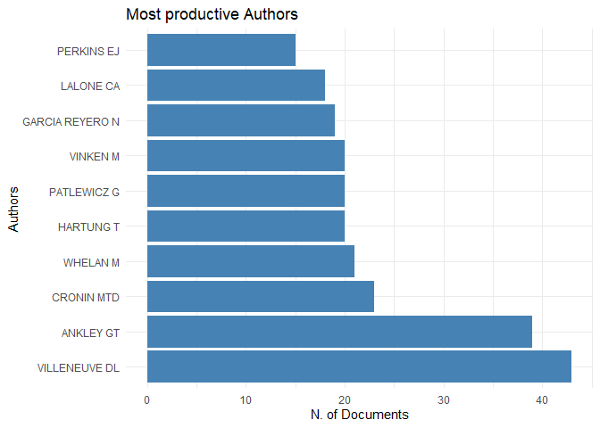
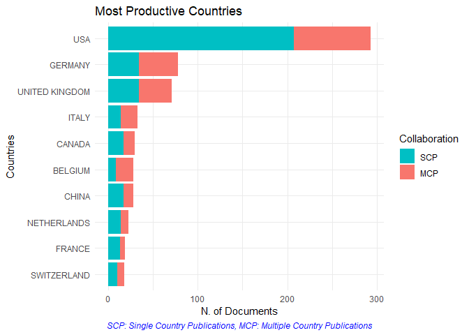
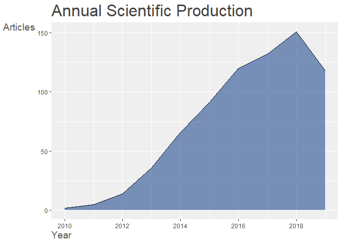
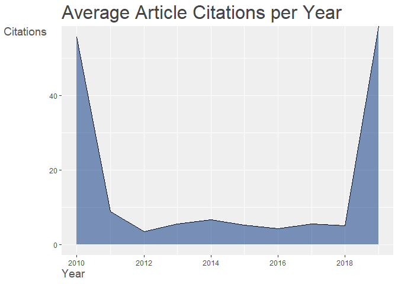
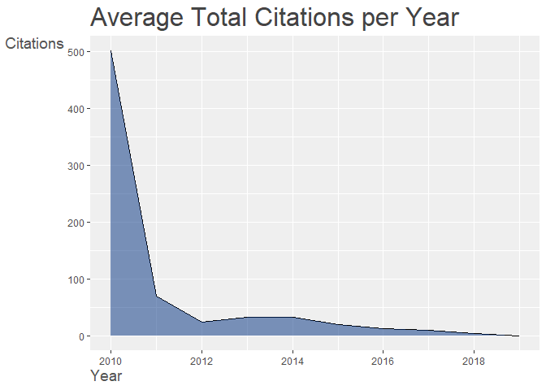
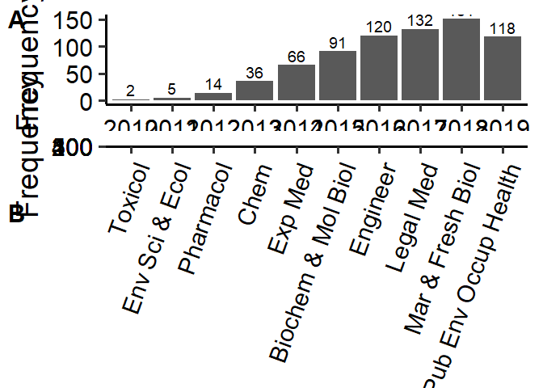

AOP bibliometric analysis
================
K. HIKI

### Read

``` r
require(bibliometrix)
require(ggplot2)
require(ggpubr)
require(igraph)
require(visNetwork)

D <- readFiles("WoS_1-500.txt","WoS_501-938.txt") #WoS...are text files taken from Web of Science
M <- convert2df(D, dbsource = "isi", format = "plaintext")
```

    ## 
    ## Converting your isi collection into a bibliographic dataframe
    ## 
    ## Articles extracted   100 
    ## Articles extracted   200 
    ## Articles extracted   300 
    ## Articles extracted   400 
    ## Articles extracted   500 
    ## Articles extracted   600 
    ## Articles extracted   700 
    ## Articles extracted   800 
    ## Articles extracted   900 
    ## Articles extracted   938 
    ## Done!
    ## 
    ## 
    ## Generating affiliation field tag AU_UN from C1:  Done!

``` r
dim(M)
```

    ## [1] 938  74

``` r
M<-M[M$PY != "2008",]
M<-M[M$PT != "R",] #exclude repository data 
dim(M)
```

    ## [1] 937  74

``` r
M<-M[M$DT != "MEETING ABSTRACT",] #exclude conference abstract
M<-M[M$DT != "PROCEEDINGS PAPER",]
M<-M[M$DT != "ARTICLE; PROCEEDINGS PAPER",]
M<-M[M$DT != "CORRECTION",]
M<-M[! is.na(M$DT) ,]
table(M$DT)
```

    ## 
    ##                          ARTICLE            ARTICLE; BOOK CHAPTER 
    ##                              510                               36 
    ##               EDITORIAL MATERIAL EDITORIAL MATERIAL; BOOK CHAPTER 
    ##                               36                                1 
    ##                           LETTER                        NEWS ITEM 
    ##                                8                                3 
    ##                           REVIEW             REVIEW; BOOK CHAPTER 
    ##                              140                                1

``` r
M[M$DT =="ARTICLE; BOOK CHAPTER","DT"] <- rep("ARTICLE",36)
M[M$DT =="ARTICLE; EARLY ACCESS","DT"] <- rep("ARTICLE",1)
M[M$DT =="REVIEW; BOOK CHAPTER","DT"] <- rep("REVIEW",1)
M[M$DT =="EDITORIAL MATERIAL","DT"] <- rep("OTHERS",36)
M[M$DT =="EDITORIAL MATERIAL; EARLY ACCESS","DT"] <- rep("OTHERS",1)
M[M$DT =="EDITORIAL MATERIAL; BOOK CHAPTER","DT"] <- rep("OTHERS",1)
M[M$DT =="NEWS ITEM","DT"] <- rep("OTHERS",3)
M[M$DT =="LETTER","DT"] <- rep("OTHERS",8)

table(M$DT)
```

    ## 
    ## ARTICLE  OTHERS  REVIEW 
    ##     546      48     141

``` r
dim(M)
```

    ## [1] 735  74

``` r
results <- biblioAnalysis(M, sep = ";")
plot(x = results, k = 10, pause = FALSE)
```

<!-- --><!-- --><!-- --><!-- --><!-- -->

``` r
# Top 5 papers
cbind(results$MostCitedPapers[1:5,],
DOI=M[as.numeric(rownames( results$MostCitedPapers[1:5,] )),"DI",],
DocumentType=M[as.numeric(rownames( results$MostCitedPapers[1:5,] )),"DT",],
Title=M[as.numeric(rownames( results$MostCitedPapers[1:5,] )),"DT",])  
```

    ##                              Paper           TC TCperYear
    ## 734   ANKLEY GT, 2010, ENVIRON TOXICOL CHEM 981  98.10000
    ## 618        VILLENEUVE DL, 2014, TOXICOL SCI 190  31.66667
    ## 689              VINKEN M, 2013, TOXICOLOGY 168  24.00000
    ## 732     SIPES NS, 2011, BIRTH DEFECTS RES C 144  16.00000
    ## 617 TOLLEFSEN KE, 2014, REGUL TOXICOL PHARM 122  20.33333
    ##                             DOI DocumentType   Title
    ## 734              10.1002/ETC.34      ARTICLE ARTICLE
    ## 618       10.1093/TOXSCI/KFU199      ARTICLE ARTICLE
    ## 689   10.1016/J.TOX.2013.08.011       REVIEW  REVIEW
    ## 732          10.1002/BDRC.20214       REVIEW  REVIEW
    ## 617 10.1016/J.YRTPH.2014.09.009      ARTICLE ARTICLE

``` r
results$Documents
```

    ## ARTICLE      OTHERS       REVIEW       
    ##          546           48          141

``` r
results$DE [1:10] # top 10 author's keywords 
```

    ## Tab
    ##     ADVERSE OUTCOME PATHWAY             RISK ASSESSMENT 
    ##                         163                          72 
    ##    ADVERSE OUTCOME PATHWAYS              MODE OF ACTION 
    ##                          52                          42 
    ##          SKIN SENSITIZATION ADVERSE OUTCOME PATHWAY AOP 
    ##                          37                          25 
    ##                         AOP                    IN VITRO 
    ##                          21                          21 
    ##       PREDICTIVE TOXICOLOGY        ENDOCRINE DISRUPTION 
    ##                          21                          18

``` r
par (mar = c(4,4,4,1))
Year <- data.frame( table( M$PY ) )
colnames(Year) <- c("Year","Frequency")
Year_plot <-  ggplot (Year) +geom_bar(aes(x=Year,y=Frequency),stat = "identity", position = "dodge")+  theme_classic(base_size = 10)+ theme(axis.text=element_text(colour = "grey"),legend.position = c(0.01, 1), legend.justification = c(0, 1))+labs(fill = "") + geom_text( aes(x=Year, y=Frequency,label=Frequency),vjust=-0.3,size=2,col="black")


par (mar = c(4,4,4,1))
YearDT <- data.frame( table( M$PY,M$DT ) )
colnames(YearDT) <-c("Year","Document","Frequency")
YearDT$Document <- factor(YearDT$Document, levels = c("ARTICLE","REVIEW","OTHERS") )
YearDT_plot <-  ggplot (YearDT) +geom_bar(aes(x=Year,y=Frequency,fill=Document),stat = "identity")+  theme_classic(base_size = 28)+ theme(axis.text=element_text(colour = "black"),legend.position = c(0.01, 1), legend.justification = c(0, 1))+labs(fill = "") + 
 scale_x_discrete(limits=c("2010", "2011", "2012", "2013","2014","2015","2016","2017","2018","2019"))


Area <- data.frame( sort(table( unlist(strsplit(M$SC,"; ") )) ,decreasing=TRUE))
colnames(Area) <- c("Category","Frequency")
Area[,1] <-as.character(Area[,1])
Area[1:10,1] <-  c("Toxicol","Env Sci & Ecol","Pharmacol","Chem","Exp Med","Biochem & Mol Biol","Engineer","Legal Med","Mar & Fresh Biol","Pub Env Occup Health") 
Area[,1] <-as.factor(Area[,1])
Area2 <- transform (Area, Category = factor(Category,levels=c("Toxicol","Env Sci & Ecol","Pharmacol","Chem","Exp Med","Biochem & Mol Biol","Engineer","Legal Med","Mar & Fresh Biol","Pub Env Occup Health")))
Area_plot <-  ggplot (Area2[1:10,]) + 
  geom_bar(aes(x=Category,y=Frequency),stat = "identity", position = "dodge")+
  theme_classic(base_size = 10)+
  theme( axis.text=element_text(colour = "grey"),axis.text.x=element_text(angle=70,hjust=1 ),legend.position = c(0.01, 1), legend.justification = c(0, 1) ) +
  labs(fill = "") + 
  ylim(0,500)+
  geom_text( aes(x=Category, y=Frequency, label=Frequency),vjust=-0.3,size=2,col="black")
 

 
Journal <- data.frame( results$Sources ) 
colnames(Journal) <-c("Journal","Frequency")
Journal[,1] <-as.character(Journal[,1])
Journal[1:10,1] <-  c("ETC","RTP","TS","Arch Toxicol","EST","ALTEX","Aquat Toxicol","CRT","Tiv","ALTA") 
Journal[,1] <-as.factor(Journal[,1])
Journal2 <- transform (Journal, Journal = factor(Journal,levels=c("ETC","RTP","TS","Arch Toxicol","EST","ALTEX","Aquat Toxicol","CRT","Tiv","ALTA")))

Journal_plot <- ggplot (Journal2[1:10,]) +geom_bar(aes(x=Journal,y=Frequency),stat = "identity", position = "dodge")+  theme_classic(base_size = 10)+ theme(axis.text=element_text(colour = "grey"),axis.text.x=element_text(angle=70,hjust=1 ),legend.position = c(0.01, 1), legend.justification = c(0, 1))+labs(fill = "")+
 geom_text( aes(x=Journal, y=Frequency, label=Frequency),vjust=-0.3,size=2,col="black")


ggpubr::ggarrange(Year_plot, Area_plot, nrow=2,ncol=1,labels=LETTERS, font.label=list(size=5))
```

<!-- -->

``` r
# Author coupling network
NetMatrix <- biblioNetwork(M, analysis = "coupling", network = "authors", sep = ";")
#net <- networkPlot(NetMatrix,  normalize = "salton", weighted=NULL, n = 100, Title = "Authors' Coupling", type = "fruchterman",size=5,size.cex=T,remove.multiple=TRUE,labelsize=0.8,label.n=10,label.cex=F) 


# Co-citation network
NetMatrix_co_cit <- biblioNetwork(M, analysis = "co-citation", network = "references", sep = ";")
net_co_cit <- networkPlot(NetMatrix_co_cit , n = 30, Title = "Co-Citation Network", type = "fruchterman", size=T, remove.multiple=FALSE, labelsize=0.75,edgesize = 3)
```

<!-- -->

``` r
#netstat_co_cit <- networkStat(NetMatrix_co_cit)
#summary(netstat_co_cit, k=10)

#Co-occurrences network
NetMatrix_co_occ <- biblioNetwork(M, analysis = "co-occurrences", network = "keywords", sep = ";")
net_co_occ <-  networkPlot(NetMatrix_co_occ , normalize="association", weighted=T, n = 47, Title = "Keyword Co-occurrences", type = "auto", size=T,edgesize = 3,labelsize=1.2)
```

<!-- -->

``` r
#plot using visNetwork
g <- net_co_occ$graph
V(g)$size<-V(g)$size*3
V(g)$label.color <- V(g)$color
V(g)$label.font <-2
visIgraph(g)
```

<!--html_preserve-->

<div id="htmlwidget-3b3416095d7d6f64c95a" class="visNetwork html-widget" style="width:672px;height:480px;">

</div>

<script type="application/json" data-for="htmlwidget-3b3416095d7d6f64c95a">{"x":{"nodes":{"id":["adverse outcome pathways","oxidative stress","exposure","toxicity","polycyclic aromatic-hydrocarbons","developmental toxicity","in-vitro","bisphenol-a","activation","mechanisms","risk-assessment","adverse outcome pathway","model","identification","metabolism","waste-water","fathead minnow","expression","lymph-node assay","models","read-across","prediction","framework","fish","conceptual-framework","skin sensitization","zebrafish danio-rerio","daphnia-magna","ecotoxicology","induced liver-injury","gene-expression","chemicals","responses","silver nanoparticles","test h-clat","peptide reactivity","toxicology","environmental chemicals","endocrine-disrupting chemicals","rainbow-trout","aryl-hydrocarbon receptor","cell-line","estrogen-receptor","in-vivo","mode","ipcs framework","pimephales-promelas"],"deg":[932,412,323,505,113,182,481,165,138,241,674,202,140,215,109,132,144,294,164,115,120,173,235,137,247,160,190,118,173,111,481,241,124,110,105,102,161,162,107,116,127,108,108,128,106,109,101],"size":[60,26.5236051502146,20.793991416309,32.5107296137339,7.27467811158798,11.7167381974249,30.9656652360515,10.6223175965665,8.88412017167382,15.5150214592275,43.3905579399142,13.0042918454936,9.01287553648069,13.8412017167382,7.01716738197425,8.49785407725322,9.27038626609442,18.9270386266094,10.5579399141631,7.40343347639485,7.72532188841202,11.137339055794,15.1287553648069,8.81974248927039,15.9012875536481,10.3004291845494,12.2317596566524,7.59656652360515,11.137339055794,7.14592274678112,30.9656652360515,15.5150214592275,7.98283261802575,7.08154506437768,6.75965665236052,6.56652360515022,10.3648068669528,10.4291845493562,6.88841201716738,7.46781115879828,8.17596566523605,6.95278969957081,6.95278969957081,8.24034334763948,6.82403433476395,7.01716738197425,6.50214592274678],"font.size":[48,48,48,48,48,48,48,48,48,48,48,48,48,48,48,48,48,48,48,48,48,48,48,48,48,48,48,48,48,48,48,48,48,48,48,48,48,48,48,48,48,48,48,48,48,48,48],"color":["#4DAF4A","#4DAF4A","#4DAF4A","#E41A1C","#4DAF4A","#4DAF4A","#E41A1C","#4DAF4A","#377EB8","#E41A1C","#E41A1C","#377EB8","#E41A1C","#E41A1C","#E41A1C","#4DAF4A","#4DAF4A","#4DAF4A","#377EB8","#E41A1C","#E41A1C","#E41A1C","#E41A1C","#4DAF4A","#E41A1C","#E41A1C","#4DAF4A","#4DAF4A","#E41A1C","#E41A1C","#4DAF4A","#E41A1C","#4DAF4A","#4DAF4A","#377EB8","#377EB8","#E41A1C","#E41A1C","#4DAF4A","#4DAF4A","#4DAF4A","#377EB8","#4DAF4A","#4DAF4A","#E41A1C","#E41A1C","#4DAF4A"],"community":[3,3,3,1,3,3,1,3,2,1,1,2,1,1,1,3,3,3,2,1,1,1,1,3,1,1,3,3,1,1,3,1,3,3,2,2,1,1,3,3,3,2,3,3,1,1,3],"font.color":["#4DAF4A","#4DAF4A","#4DAF4A","#E41A1C","#4DAF4A","#4DAF4A","#E41A1C","#4DAF4A","#377EB8","#E41A1C","#E41A1C","#377EB8","#E41A1C","#E41A1C","#E41A1C","#4DAF4A","#4DAF4A","#4DAF4A","#377EB8","#E41A1C","#E41A1C","#E41A1C","#E41A1C","#4DAF4A","#E41A1C","#E41A1C","#4DAF4A","#4DAF4A","#E41A1C","#E41A1C","#4DAF4A","#E41A1C","#4DAF4A","#4DAF4A","#377EB8","#377EB8","#E41A1C","#E41A1C","#4DAF4A","#4DAF4A","#4DAF4A","#377EB8","#4DAF4A","#4DAF4A","#E41A1C","#E41A1C","#4DAF4A"],"label.font":[2,2,2,2,2,2,2,2,2,2,2,2,2,2,2,2,2,2,2,2,2,2,2,2,2,2,2,2,2,2,2,2,2,2,2,2,2,2,2,2,2,2,2,2,2,2,2],"label":["adverse outcome pathways","oxidative stress","exposure","toxicity","polycyclic aromatic-hydrocarbons","developmental toxicity","in-vitro","bisphenol-a","activation","mechanisms","risk-assessment","adverse outcome pathway","model","identification","metabolism","waste-water","fathead minnow","expression","lymph-node assay","models","read-across","prediction","framework","fish","conceptual-framework","skin sensitization","zebrafish danio-rerio","daphnia-magna","ecotoxicology","induced liver-injury","gene-expression","chemicals","responses","silver nanoparticles","test h-clat","peptide reactivity","toxicology","environmental chemicals","endocrine-disrupting chemicals","rainbow-trout","aryl-hydrocarbon receptor","cell-line","estrogen-receptor","in-vivo","mode","ipcs framework","pimephales-promelas"],"x":[0.256257685763968,0.0724771870311427,0.492386832706157,0.103619869184692,0.183767923086668,-0.114786150386119,0.0427910463270316,0.326758143049757,-0.541695119057335,-0.155980511117065,0.0966514650197028,-0.461139804044714,-0.381647612423172,-0.128872780012637,0.206745284041201,0.941386326559456,0.603985601361278,0.381350415240666,-0.651889307793142,-0.140978095097856,-0.399934366404754,-0.493020125658659,0.0536238776334879,0.782075076067586,0.314858615439116,-0.305737234822712,0.446308626089677,0.776035418445743,0.523435671594058,-0.339720120040173,-0.0756059619773461,0.0189890421128545,0.720779575620603,-0.0766903420094006,-1,-0.741237064168312,-0.0865333609472035,0.224143656848782,0.416272365180067,0.632059018475458,0.232031633809631,-0.319889695608307,0.746155222757844,-0.176310131496063,0.412503977390653,0.639358613509338,1],"y":[-0.102626202641739,0.359082712083255,-0.0819324483898598,-0.140393506754014,0.957489215849883,0.654348967045135,0.164920864361354,0.257233716402234,0.312899935603892,-0.35704402413346,0.0108478746770937,-0.118252911770774,0.0891630022918237,-0.139237846350903,-0.671490435148765,0.305834737003212,0.273044504462888,0.0538632853291401,0.0390174092998059,-0.836424914021838,-0.608740358807359,-0.319676203403284,-0.562480802704798,-0.400330534184605,-0.293254942049905,-0.262303366311135,0.477530195731655,0.473890800213152,-0.443112537617516,-0.936343503910526,0.145532338685652,-0.316035515146476,-0.18705322141456,1,-0.267902286864285,-0.535615809984512,-0.675375231314651,-0.480419054918241,0.820090259352567,0.65560878861402,0.492293934922702,0.348924608742127,0.100774287483023,0.506325969023773,-1,-0.734989638321257,-0.100026069371776]},"edges":{"from":["adverse outcome pathways","adverse outcome pathways","adverse outcome pathways","adverse outcome pathways","adverse outcome pathways","adverse outcome pathways","adverse outcome pathways","adverse outcome pathways","adverse outcome pathways","adverse outcome pathways","adverse outcome pathways","adverse outcome pathways","adverse outcome pathways","adverse outcome pathways","adverse outcome pathways","adverse outcome pathways","adverse outcome pathways","adverse outcome pathways","adverse outcome pathways","adverse outcome pathways","adverse outcome pathways","adverse outcome pathways","adverse outcome pathways","adverse outcome pathways","adverse outcome pathways","adverse outcome pathways","adverse outcome pathways","adverse outcome pathways","adverse outcome pathways","adverse outcome pathways","adverse outcome pathways","adverse outcome pathways","adverse outcome pathways","adverse outcome pathways","adverse outcome pathways","adverse outcome pathways","adverse outcome pathways","adverse outcome pathways","adverse outcome pathways","adverse outcome pathways","adverse outcome pathways","adverse outcome pathways","adverse outcome pathways","oxidative stress","oxidative stress","oxidative stress","oxidative stress","oxidative stress","oxidative stress","oxidative stress","oxidative stress","oxidative stress","oxidative stress","oxidative stress","oxidative stress","oxidative stress","oxidative stress","oxidative stress","oxidative stress","oxidative stress","oxidative stress","oxidative stress","oxidative stress","oxidative stress","oxidative stress","oxidative stress","oxidative stress","oxidative stress","oxidative stress","oxidative stress","oxidative stress","oxidative stress","oxidative stress","oxidative stress","oxidative stress","oxidative stress","oxidative stress","exposure","exposure","exposure","exposure","exposure","exposure","exposure","exposure","exposure","exposure","exposure","exposure","exposure","exposure","exposure","exposure","exposure","exposure","exposure","exposure","exposure","exposure","exposure","exposure","exposure","exposure","exposure","exposure","exposure","exposure","exposure","exposure","exposure","toxicity","toxicity","toxicity","toxicity","toxicity","toxicity","toxicity","toxicity","toxicity","toxicity","toxicity","toxicity","toxicity","toxicity","toxicity","toxicity","toxicity","toxicity","toxicity","toxicity","toxicity","toxicity","toxicity","toxicity","toxicity","toxicity","toxicity","toxicity","toxicity","toxicity","toxicity","toxicity","toxicity","toxicity","toxicity","toxicity","toxicity","toxicity","polycyclic aromatic-hydrocarbons","polycyclic aromatic-hydrocarbons","polycyclic aromatic-hydrocarbons","polycyclic aromatic-hydrocarbons","polycyclic aromatic-hydrocarbons","polycyclic aromatic-hydrocarbons","polycyclic aromatic-hydrocarbons","polycyclic aromatic-hydrocarbons","polycyclic aromatic-hydrocarbons","polycyclic aromatic-hydrocarbons","polycyclic aromatic-hydrocarbons","polycyclic aromatic-hydrocarbons","polycyclic aromatic-hydrocarbons","polycyclic aromatic-hydrocarbons","developmental toxicity","developmental toxicity","developmental toxicity","developmental toxicity","developmental toxicity","developmental toxicity","developmental toxicity","developmental toxicity","developmental toxicity","developmental toxicity","developmental toxicity","developmental toxicity","developmental toxicity","developmental toxicity","developmental toxicity","developmental toxicity","developmental toxicity","developmental toxicity","in-vitro","in-vitro","in-vitro","in-vitro","in-vitro","in-vitro","in-vitro","in-vitro","in-vitro","in-vitro","in-vitro","in-vitro","in-vitro","in-vitro","in-vitro","in-vitro","in-vitro","in-vitro","in-vitro","in-vitro","in-vitro","in-vitro","in-vitro","in-vitro","in-vitro","in-vitro","in-vitro","in-vitro","in-vitro","in-vitro","in-vitro","in-vitro","in-vitro","in-vitro","in-vitro","bisphenol-a","bisphenol-a","bisphenol-a","bisphenol-a","bisphenol-a","bisphenol-a","bisphenol-a","bisphenol-a","bisphenol-a","bisphenol-a","bisphenol-a","bisphenol-a","bisphenol-a","bisphenol-a","bisphenol-a","bisphenol-a","bisphenol-a","bisphenol-a","bisphenol-a","bisphenol-a","bisphenol-a","bisphenol-a","bisphenol-a","bisphenol-a","activation","activation","activation","activation","activation","activation","activation","activation","activation","activation","activation","activation","activation","activation","activation","activation","mechanisms","mechanisms","mechanisms","mechanisms","mechanisms","mechanisms","mechanisms","mechanisms","mechanisms","mechanisms","mechanisms","mechanisms","mechanisms","mechanisms","mechanisms","mechanisms","mechanisms","mechanisms","mechanisms","mechanisms","mechanisms","mechanisms","mechanisms","mechanisms","mechanisms","mechanisms","risk-assessment","risk-assessment","risk-assessment","risk-assessment","risk-assessment","risk-assessment","risk-assessment","risk-assessment","risk-assessment","risk-assessment","risk-assessment","risk-assessment","risk-assessment","risk-assessment","risk-assessment","risk-assessment","risk-assessment","risk-assessment","risk-assessment","risk-assessment","risk-assessment","risk-assessment","risk-assessment","risk-assessment","risk-assessment","risk-assessment","risk-assessment","risk-assessment","risk-assessment","risk-assessment","risk-assessment","risk-assessment","risk-assessment","risk-assessment","risk-assessment","risk-assessment","adverse outcome pathway","adverse outcome pathway","adverse outcome pathway","adverse outcome pathway","adverse outcome pathway","adverse outcome pathway","adverse outcome pathway","adverse outcome pathway","adverse outcome pathway","adverse outcome pathway","adverse outcome pathway","adverse outcome pathway","adverse outcome pathway","adverse outcome pathway","adverse outcome pathway","adverse outcome pathway","adverse outcome pathway","adverse outcome pathway","adverse outcome pathway","adverse outcome pathway","adverse outcome pathway","adverse outcome pathway","model","model","model","model","model","model","model","model","model","model","model","model","model","model","model","model","model","identification","identification","identification","identification","identification","identification","identification","identification","identification","identification","identification","identification","identification","identification","identification","identification","identification","identification","identification","identification","identification","identification","identification","metabolism","metabolism","metabolism","metabolism","metabolism","metabolism","metabolism","metabolism","metabolism","metabolism","metabolism","metabolism","metabolism","metabolism","metabolism","waste-water","waste-water","waste-water","waste-water","waste-water","waste-water","waste-water","waste-water","waste-water","waste-water","waste-water","waste-water","fathead minnow","fathead minnow","fathead minnow","fathead minnow","fathead minnow","fathead minnow","fathead minnow","fathead minnow","fathead minnow","fathead minnow","fathead minnow","fathead minnow","fathead minnow","fathead minnow","fathead minnow","fathead minnow","fathead minnow","fathead minnow","expression","expression","expression","expression","expression","expression","expression","expression","expression","expression","expression","expression","expression","expression","expression","expression","expression","expression","expression","lymph-node assay","lymph-node assay","lymph-node assay","lymph-node assay","lymph-node assay","lymph-node assay","lymph-node assay","lymph-node assay","lymph-node assay","lymph-node assay","lymph-node assay","lymph-node assay","models","models","models","models","models","models","models","models","models","models","models","models","models","models","read-across","read-across","read-across","read-across","read-across","read-across","read-across","read-across","read-across","read-across","read-across","read-across","read-across","prediction","prediction","prediction","prediction","prediction","prediction","prediction","prediction","prediction","prediction","prediction","prediction","framework","framework","framework","framework","framework","framework","framework","framework","framework","framework","framework","framework","framework","fish","fish","fish","fish","fish","fish","fish","fish","fish","fish","conceptual-framework","conceptual-framework","conceptual-framework","conceptual-framework","conceptual-framework","conceptual-framework","conceptual-framework","conceptual-framework","conceptual-framework","conceptual-framework","conceptual-framework","conceptual-framework","conceptual-framework","conceptual-framework","conceptual-framework","conceptual-framework","conceptual-framework","skin sensitization","skin sensitization","skin sensitization","skin sensitization","skin sensitization","skin sensitization","skin sensitization","skin sensitization","skin sensitization","skin sensitization","skin sensitization","skin sensitization","zebrafish danio-rerio","zebrafish danio-rerio","zebrafish danio-rerio","zebrafish danio-rerio","zebrafish danio-rerio","zebrafish danio-rerio","zebrafish danio-rerio","zebrafish danio-rerio","zebrafish danio-rerio","zebrafish danio-rerio","zebrafish danio-rerio","daphnia-magna","daphnia-magna","daphnia-magna","daphnia-magna","daphnia-magna","daphnia-magna","daphnia-magna","daphnia-magna","daphnia-magna","ecotoxicology","ecotoxicology","ecotoxicology","ecotoxicology","ecotoxicology","ecotoxicology","ecotoxicology","ecotoxicology","ecotoxicology","ecotoxicology","induced liver-injury","induced liver-injury","induced liver-injury","induced liver-injury","gene-expression","gene-expression","gene-expression","gene-expression","gene-expression","gene-expression","gene-expression","gene-expression","gene-expression","gene-expression","gene-expression","gene-expression","gene-expression","chemicals","chemicals","chemicals","chemicals","chemicals","chemicals","chemicals","chemicals","chemicals","chemicals","responses","responses","responses","responses","silver nanoparticles","silver nanoparticles","silver nanoparticles","silver nanoparticles","test h-clat","test h-clat","test h-clat","peptide reactivity","toxicology","toxicology","toxicology","environmental chemicals","environmental chemicals","environmental chemicals","environmental chemicals","endocrine-disrupting chemicals","endocrine-disrupting chemicals","rainbow-trout","rainbow-trout","rainbow-trout","rainbow-trout","rainbow-trout","aryl-hydrocarbon receptor","aryl-hydrocarbon receptor","aryl-hydrocarbon receptor","aryl-hydrocarbon receptor","cell-line","in-vivo","mode"],"to":["oxidative stress","exposure","toxicity","polycyclic aromatic-hydrocarbons","developmental toxicity","in-vitro","bisphenol-a","activation","mechanisms","risk-assessment","model","identification","metabolism","waste-water","fathead minnow","expression","lymph-node assay","models","read-across","prediction","framework","fish","conceptual-framework","skin sensitization","zebrafish danio-rerio","daphnia-magna","ecotoxicology","induced liver-injury","gene-expression","chemicals","responses","peptide reactivity","toxicology","environmental chemicals","endocrine-disrupting chemicals","rainbow-trout","aryl-hydrocarbon receptor","cell-line","estrogen-receptor","in-vivo","mode","ipcs framework","pimephales-promelas","exposure","toxicity","polycyclic aromatic-hydrocarbons","developmental toxicity","in-vitro","bisphenol-a","activation","mechanisms","risk-assessment","adverse outcome pathway","model","identification","metabolism","waste-water","expression","lymph-node assay","read-across","framework","conceptual-framework","skin sensitization","zebrafish danio-rerio","daphnia-magna","induced liver-injury","gene-expression","responses","silver nanoparticles","environmental chemicals","endocrine-disrupting chemicals","rainbow-trout","aryl-hydrocarbon receptor","cell-line","estrogen-receptor","in-vivo","pimephales-promelas","toxicity","developmental toxicity","in-vitro","bisphenol-a","activation","mechanisms","risk-assessment","adverse outcome pathway","identification","metabolism","waste-water","fathead minnow","expression","models","prediction","framework","fish","conceptual-framework","zebrafish danio-rerio","daphnia-magna","ecotoxicology","gene-expression","chemicals","responses","silver nanoparticles","toxicology","environmental chemicals","endocrine-disrupting chemicals","rainbow-trout","aryl-hydrocarbon receptor","mode","ipcs framework","pimephales-promelas","polycyclic aromatic-hydrocarbons","in-vitro","bisphenol-a","activation","mechanisms","risk-assessment","adverse outcome pathway","model","identification","metabolism","waste-water","fathead minnow","expression","lymph-node assay","models","read-across","prediction","framework","fish","conceptual-framework","skin sensitization","zebrafish danio-rerio","daphnia-magna","ecotoxicology","induced liver-injury","gene-expression","chemicals","responses","silver nanoparticles","peptide reactivity","toxicology","environmental chemicals","rainbow-trout","cell-line","estrogen-receptor","in-vivo","mode","ipcs framework","developmental toxicity","in-vitro","risk-assessment","adverse outcome pathway","fathead minnow","prediction","zebrafish danio-rerio","daphnia-magna","gene-expression","responses","silver nanoparticles","endocrine-disrupting chemicals","rainbow-trout","aryl-hydrocarbon receptor","in-vitro","bisphenol-a","mechanisms","risk-assessment","adverse outcome pathway","model","waste-water","lymph-node assay","conceptual-framework","skin sensitization","zebrafish danio-rerio","daphnia-magna","gene-expression","chemicals","toxicology","environmental chemicals","aryl-hydrocarbon receptor","in-vivo","bisphenol-a","activation","mechanisms","risk-assessment","adverse outcome pathway","model","identification","metabolism","waste-water","fathead minnow","expression","lymph-node assay","read-across","prediction","framework","conceptual-framework","skin sensitization","zebrafish danio-rerio","daphnia-magna","ecotoxicology","induced liver-injury","gene-expression","chemicals","responses","silver nanoparticles","test h-clat","peptide reactivity","toxicology","environmental chemicals","endocrine-disrupting chemicals","rainbow-trout","aryl-hydrocarbon receptor","cell-line","estrogen-receptor","pimephales-promelas","activation","mechanisms","risk-assessment","model","identification","metabolism","waste-water","fathead minnow","expression","models","prediction","framework","fish","conceptual-framework","zebrafish danio-rerio","daphnia-magna","gene-expression","chemicals","environmental chemicals","endocrine-disrupting chemicals","rainbow-trout","aryl-hydrocarbon receptor","cell-line","estrogen-receptor","mechanisms","adverse outcome pathway","model","identification","metabolism","expression","lymph-node assay","skin sensitization","gene-expression","chemicals","test h-clat","peptide reactivity","environmental chemicals","endocrine-disrupting chemicals","cell-line","estrogen-receptor","risk-assessment","adverse outcome pathway","model","identification","metabolism","fathead minnow","expression","lymph-node assay","models","read-across","prediction","framework","fish","conceptual-framework","skin sensitization","ecotoxicology","gene-expression","chemicals","responses","silver nanoparticles","test h-clat","toxicology","environmental chemicals","in-vivo","mode","ipcs framework","adverse outcome pathway","model","identification","metabolism","waste-water","fathead minnow","expression","lymph-node assay","models","read-across","prediction","framework","fish","conceptual-framework","skin sensitization","zebrafish danio-rerio","daphnia-magna","ecotoxicology","induced liver-injury","gene-expression","chemicals","responses","silver nanoparticles","test h-clat","peptide reactivity","toxicology","environmental chemicals","endocrine-disrupting chemicals","rainbow-trout","aryl-hydrocarbon receptor","cell-line","estrogen-receptor","in-vivo","mode","ipcs framework","pimephales-promelas","model","identification","metabolism","expression","lymph-node assay","models","read-across","prediction","framework","conceptual-framework","skin sensitization","zebrafish danio-rerio","induced liver-injury","gene-expression","chemicals","test h-clat","peptide reactivity","toxicology","environmental chemicals","cell-line","in-vivo","ipcs framework","identification","metabolism","expression","read-across","prediction","framework","conceptual-framework","zebrafish danio-rerio","ecotoxicology","induced liver-injury","gene-expression","chemicals","silver nanoparticles","toxicology","environmental chemicals","aryl-hydrocarbon receptor","cell-line","metabolism","waste-water","expression","lymph-node assay","read-across","prediction","framework","conceptual-framework","skin sensitization","zebrafish danio-rerio","ecotoxicology","gene-expression","chemicals","responses","test h-clat","peptide reactivity","toxicology","environmental chemicals","rainbow-trout","aryl-hydrocarbon receptor","cell-line","mode","ipcs framework","expression","lymph-node assay","read-across","prediction","framework","fish","conceptual-framework","daphnia-magna","ecotoxicology","gene-expression","chemicals","peptide reactivity","toxicology","ipcs framework","pimephales-promelas","fathead minnow","expression","fish","conceptual-framework","zebrafish danio-rerio","ecotoxicology","gene-expression","chemicals","endocrine-disrupting chemicals","rainbow-trout","estrogen-receptor","pimephales-promelas","expression","lymph-node assay","fish","conceptual-framework","skin sensitization","zebrafish danio-rerio","daphnia-magna","ecotoxicology","gene-expression","chemicals","responses","endocrine-disrupting chemicals","rainbow-trout","cell-line","estrogen-receptor","in-vivo","ipcs framework","pimephales-promelas","models","prediction","framework","fish","conceptual-framework","zebrafish danio-rerio","ecotoxicology","responses","silver nanoparticles","toxicology","environmental chemicals","endocrine-disrupting chemicals","rainbow-trout","aryl-hydrocarbon receptor","cell-line","estrogen-receptor","in-vivo","mode","pimephales-promelas","models","read-across","prediction","framework","conceptual-framework","skin sensitization","gene-expression","chemicals","test h-clat","peptide reactivity","endocrine-disrupting chemicals","cell-line","read-across","prediction","framework","fish","skin sensitization","ecotoxicology","induced liver-injury","gene-expression","chemicals","responses","test h-clat","peptide reactivity","toxicology","in-vivo","prediction","framework","fish","conceptual-framework","skin sensitization","ecotoxicology","induced liver-injury","gene-expression","chemicals","toxicology","environmental chemicals","aryl-hydrocarbon receptor","cell-line","framework","conceptual-framework","skin sensitization","ecotoxicology","gene-expression","chemicals","test h-clat","peptide reactivity","toxicology","environmental chemicals","cell-line","in-vivo","fish","skin sensitization","zebrafish danio-rerio","ecotoxicology","chemicals","responses","peptide reactivity","toxicology","environmental chemicals","aryl-hydrocarbon receptor","cell-line","estrogen-receptor","mode","conceptual-framework","zebrafish danio-rerio","daphnia-magna","ecotoxicology","gene-expression","chemicals","responses","rainbow-trout","cell-line","pimephales-promelas","skin sensitization","zebrafish danio-rerio","daphnia-magna","ecotoxicology","induced liver-injury","gene-expression","chemicals","responses","peptide reactivity","toxicology","environmental chemicals","endocrine-disrupting chemicals","cell-line","estrogen-receptor","mode","ipcs framework","pimephales-promelas","ecotoxicology","chemicals","test h-clat","peptide reactivity","toxicology","environmental chemicals","endocrine-disrupting chemicals","aryl-hydrocarbon receptor","cell-line","estrogen-receptor","mode","ipcs framework","daphnia-magna","ecotoxicology","gene-expression","silver nanoparticles","toxicology","endocrine-disrupting chemicals","rainbow-trout","aryl-hydrocarbon receptor","estrogen-receptor","in-vivo","pimephales-promelas","ecotoxicology","gene-expression","silver nanoparticles","rainbow-trout","aryl-hydrocarbon receptor","cell-line","estrogen-receptor","ipcs framework","pimephales-promelas","gene-expression","chemicals","responses","toxicology","environmental chemicals","rainbow-trout","aryl-hydrocarbon receptor","mode","ipcs framework","pimephales-promelas","gene-expression","toxicology","environmental chemicals","pimephales-promelas","chemicals","responses","silver nanoparticles","test h-clat","peptide reactivity","environmental chemicals","endocrine-disrupting chemicals","rainbow-trout","aryl-hydrocarbon receptor","cell-line","estrogen-receptor","in-vivo","pimephales-promelas","responses","test h-clat","peptide reactivity","toxicology","rainbow-trout","cell-line","estrogen-receptor","in-vivo","mode","ipcs framework","toxicology","aryl-hydrocarbon receptor","in-vivo","pimephales-promelas","rainbow-trout","aryl-hydrocarbon receptor","cell-line","in-vivo","peptide reactivity","toxicology","cell-line","cell-line","environmental chemicals","estrogen-receptor","mode","aryl-hydrocarbon receptor","estrogen-receptor","mode","pimephales-promelas","estrogen-receptor","pimephales-promelas","aryl-hydrocarbon receptor","cell-line","estrogen-receptor","in-vivo","pimephales-promelas","cell-line","estrogen-receptor","in-vivo","mode","in-vivo","ipcs framework","ipcs framework"],"weight":[13,16,27,5,8,22,3,2,9,42,9,5,3,10,9,10,4,4,2,7,17,5,18,3,12,5,12,6,17,16,4,2,4,12,3,5,7,2,3,3,5,5,7,7,10,1,1,8,2,4,3,5,2,1,1,3,2,8,1,1,1,2,1,4,1,2,11,2,7,1,2,1,1,1,2,2,1,14,1,6,6,1,4,7,1,2,3,3,2,8,2,1,6,4,2,1,1,5,6,4,4,1,3,1,2,2,2,2,1,1,1,13,1,1,9,30,4,9,8,5,2,3,7,2,4,6,8,13,3,8,7,3,1,8,4,7,8,2,3,1,14,4,2,1,2,3,7,4,3,2,2,1,1,1,3,2,1,1,1,1,1,1,6,3,2,5,1,1,1,1,2,1,2,1,4,2,1,1,1,1,5,2,6,24,5,1,3,2,2,4,1,6,6,6,5,3,4,2,2,3,2,10,5,1,2,2,6,5,5,1,3,3,2,3,2,2,1,6,1,1,1,1,2,3,1,1,2,1,1,2,1,8,1,1,2,1,1,1,4,3,5,1,2,1,2,3,1,1,1,4,3,1,1,3,1,7,4,2,4,2,1,6,1,2,1,2,3,2,3,2,2,1,4,2,3,1,2,1,1,2,3,5,4,3,2,3,5,4,6,2,4,6,11,2,14,9,1,3,8,3,3,16,2,1,4,4,10,11,2,5,3,5,4,2,8,8,4,1,2,1,1,6,1,2,1,2,1,2,1,1,1,1,4,2,2,1,2,1,1,3,2,1,1,1,2,2,1,3,1,2,3,1,2,1,1,1,3,1,1,5,1,6,4,2,3,1,2,1,10,1,3,2,4,1,1,1,2,2,1,5,2,1,1,3,1,1,1,1,2,1,1,1,1,1,4,3,3,2,1,2,4,1,1,1,2,2,2,1,4,3,1,2,5,1,3,2,1,1,3,1,2,1,2,2,1,1,3,5,2,5,3,2,1,2,2,1,1,1,1,1,1,1,3,1,1,4,1,1,5,3,7,6,10,1,2,3,3,1,1,1,1,2,1,4,2,1,1,2,1,4,3,1,1,4,1,3,2,1,2,1,1,1,3,1,5,1,1,7,2,3,3,4,1,1,2,4,1,5,8,2,1,7,1,1,1,1,4,2,2,1,4,2,1,1,2,1,2,7,2,2,5,1,4,2,1,1,2,3,1,1,1,6,7,4,1,3,2,3,4,2,1,1,4,1,2,1,2,1,5,1,1,1,5,2,1,1,2,2,2,1,1,1,1,1,2,1,1,2,1,3,1,1,1,2,3,1,2,1,2,1,3,2,4,1,1,4,4,5,2,1,7,1,3,1,5,3,4,2,1,2,1,1,2,2,1,2,1,1,1,1,3,4,1,2,5,1,1,2,1,1,1,1,1,2,1,1,1,1,1,1,1,1,1,1,1,10],"color":["#4DAF4A","#4DAF4A","gray70","#4DAF4A","#4DAF4A","gray70","#4DAF4A","gray70","gray70","gray70","gray70","gray70","gray70","#4DAF4A","#4DAF4A","#4DAF4A","gray70","gray70","gray70","gray70","gray70","#4DAF4A","gray70","gray70","#4DAF4A","#4DAF4A","gray70","gray70","#4DAF4A","gray70","#4DAF4A","gray70","gray70","gray70","#4DAF4A","#4DAF4A","#4DAF4A","gray70","#4DAF4A","#4DAF4A","gray70","gray70","#4DAF4A","#4DAF4A","gray70","#4DAF4A","#4DAF4A","gray70","#4DAF4A","gray70","gray70","gray70","gray70","gray70","gray70","gray70","#4DAF4A","#4DAF4A","gray70","gray70","gray70","gray70","gray70","#4DAF4A","#4DAF4A","gray70","#4DAF4A","#4DAF4A","#4DAF4A","gray70","#4DAF4A","#4DAF4A","#4DAF4A","gray70","#4DAF4A","#4DAF4A","#4DAF4A","gray70","#4DAF4A","gray70","#4DAF4A","gray70","gray70","gray70","gray70","gray70","gray70","#4DAF4A","#4DAF4A","#4DAF4A","gray70","gray70","gray70","#4DAF4A","gray70","#4DAF4A","#4DAF4A","gray70","#4DAF4A","gray70","#4DAF4A","#4DAF4A","gray70","gray70","#4DAF4A","#4DAF4A","#4DAF4A","gray70","gray70","#4DAF4A","gray70","#E41A1C","gray70","gray70","#E41A1C","#E41A1C","gray70","#E41A1C","#E41A1C","#E41A1C","gray70","gray70","gray70","gray70","#E41A1C","#E41A1C","#E41A1C","#E41A1C","gray70","#E41A1C","#E41A1C","gray70","gray70","#E41A1C","#E41A1C","gray70","#E41A1C","gray70","gray70","gray70","#E41A1C","#E41A1C","gray70","gray70","gray70","gray70","#E41A1C","#E41A1C","#4DAF4A","gray70","gray70","gray70","#4DAF4A","gray70","#4DAF4A","#4DAF4A","#4DAF4A","#4DAF4A","#4DAF4A","#4DAF4A","#4DAF4A","#4DAF4A","gray70","#4DAF4A","gray70","gray70","gray70","gray70","#4DAF4A","gray70","gray70","gray70","#4DAF4A","#4DAF4A","#4DAF4A","gray70","gray70","gray70","#4DAF4A","#4DAF4A","gray70","gray70","#E41A1C","#E41A1C","gray70","#E41A1C","#E41A1C","#E41A1C","gray70","gray70","gray70","gray70","#E41A1C","#E41A1C","#E41A1C","#E41A1C","#E41A1C","gray70","gray70","#E41A1C","#E41A1C","gray70","#E41A1C","gray70","gray70","gray70","gray70","#E41A1C","#E41A1C","gray70","gray70","gray70","gray70","gray70","gray70","gray70","gray70","gray70","gray70","gray70","gray70","#4DAF4A","#4DAF4A","#4DAF4A","gray70","gray70","gray70","#4DAF4A","gray70","#4DAF4A","#4DAF4A","#4DAF4A","gray70","gray70","#4DAF4A","#4DAF4A","#4DAF4A","gray70","#4DAF4A","gray70","#377EB8","gray70","gray70","gray70","gray70","#377EB8","gray70","gray70","gray70","#377EB8","#377EB8","gray70","gray70","#377EB8","gray70","#E41A1C","gray70","#E41A1C","#E41A1C","#E41A1C","gray70","gray70","gray70","#E41A1C","#E41A1C","#E41A1C","#E41A1C","gray70","#E41A1C","#E41A1C","#E41A1C","gray70","#E41A1C","gray70","gray70","gray70","#E41A1C","#E41A1C","gray70","#E41A1C","#E41A1C","gray70","#E41A1C","#E41A1C","#E41A1C","gray70","gray70","gray70","gray70","#E41A1C","#E41A1C","#E41A1C","#E41A1C","gray70","#E41A1C","#E41A1C","gray70","gray70","#E41A1C","#E41A1C","gray70","#E41A1C","gray70","gray70","gray70","gray70","#E41A1C","#E41A1C","gray70","gray70","gray70","gray70","gray70","gray70","#E41A1C","#E41A1C","gray70","gray70","gray70","gray70","gray70","#377EB8","gray70","gray70","gray70","gray70","gray70","gray70","gray70","gray70","gray70","gray70","#377EB8","#377EB8","gray70","gray70","#377EB8","gray70","gray70","#E41A1C","#E41A1C","gray70","#E41A1C","#E41A1C","#E41A1C","#E41A1C","gray70","#E41A1C","#E41A1C","gray70","#E41A1C","gray70","#E41A1C","#E41A1C","gray70","gray70","#E41A1C","gray70","gray70","gray70","#E41A1C","#E41A1C","#E41A1C","#E41A1C","#E41A1C","gray70","#E41A1C","gray70","#E41A1C","gray70","gray70","gray70","#E41A1C","#E41A1C","gray70","gray70","gray70","#E41A1C","#E41A1C","gray70","gray70","#E41A1C","#E41A1C","#E41A1C","gray70","#E41A1C","gray70","#E41A1C","gray70","#E41A1C","gray70","#E41A1C","#E41A1C","gray70","#4DAF4A","#4DAF4A","#4DAF4A","gray70","#4DAF4A","gray70","#4DAF4A","gray70","#4DAF4A","#4DAF4A","#4DAF4A","#4DAF4A","#4DAF4A","gray70","#4DAF4A","gray70","gray70","#4DAF4A","#4DAF4A","gray70","#4DAF4A","gray70","#4DAF4A","#4DAF4A","#4DAF4A","gray70","#4DAF4A","#4DAF4A","gray70","#4DAF4A","gray70","gray70","gray70","#4DAF4A","gray70","#4DAF4A","gray70","#4DAF4A","#4DAF4A","gray70","gray70","#4DAF4A","#4DAF4A","#4DAF4A","gray70","#4DAF4A","#4DAF4A","gray70","#4DAF4A","gray70","gray70","gray70","gray70","gray70","gray70","gray70","gray70","#377EB8","#377EB8","gray70","#377EB8","#E41A1C","#E41A1C","#E41A1C","gray70","#E41A1C","#E41A1C","#E41A1C","gray70","#E41A1C","gray70","gray70","gray70","#E41A1C","gray70","#E41A1C","#E41A1C","gray70","#E41A1C","#E41A1C","#E41A1C","#E41A1C","gray70","#E41A1C","#E41A1C","#E41A1C","gray70","gray70","#E41A1C","#E41A1C","#E41A1C","#E41A1C","gray70","#E41A1C","gray70","gray70","#E41A1C","#E41A1C","gray70","gray70","gray70","#E41A1C","gray70","#E41A1C","#E41A1C","gray70","gray70","#E41A1C","#E41A1C","gray70","gray70","gray70","#E41A1C","gray70","#4DAF4A","#4DAF4A","gray70","#4DAF4A","gray70","#4DAF4A","#4DAF4A","gray70","#4DAF4A","#E41A1C","gray70","gray70","#E41A1C","#E41A1C","gray70","#E41A1C","gray70","gray70","#E41A1C","#E41A1C","gray70","gray70","gray70","#E41A1C","#E41A1C","gray70","#E41A1C","#E41A1C","gray70","gray70","#E41A1C","#E41A1C","gray70","gray70","gray70","gray70","#E41A1C","#E41A1C","#4DAF4A","gray70","#4DAF4A","#4DAF4A","gray70","#4DAF4A","#4DAF4A","#4DAF4A","#4DAF4A","#4DAF4A","#4DAF4A","gray70","#4DAF4A","#4DAF4A","#4DAF4A","#4DAF4A","gray70","#4DAF4A","gray70","#4DAF4A","gray70","#E41A1C","gray70","#E41A1C","#E41A1C","gray70","gray70","#E41A1C","#E41A1C","gray70","gray70","#E41A1C","#E41A1C","gray70","gray70","#4DAF4A","#4DAF4A","gray70","gray70","gray70","#4DAF4A","#4DAF4A","#4DAF4A","gray70","#4DAF4A","#4DAF4A","#4DAF4A","gray70","gray70","gray70","#E41A1C","gray70","gray70","gray70","gray70","#E41A1C","#E41A1C","gray70","#4DAF4A","#4DAF4A","#4DAF4A","#4DAF4A","#4DAF4A","gray70","#4DAF4A","#377EB8","gray70","#377EB8","#377EB8","#E41A1C","gray70","#E41A1C","gray70","gray70","#E41A1C","gray70","#4DAF4A","#4DAF4A","#4DAF4A","gray70","#4DAF4A","#4DAF4A","#4DAF4A","gray70","#4DAF4A","#4DAF4A","gray70","gray70","gray70","#E41A1C"],"lty":[1,1,5,1,1,5,1,5,5,5,5,5,5,1,1,1,5,5,5,5,5,1,5,5,1,1,5,5,1,5,1,5,5,5,1,1,1,5,1,1,5,5,1,1,5,1,1,5,1,5,5,5,5,5,5,5,1,1,5,5,5,5,5,1,1,5,1,1,1,5,1,1,1,5,1,1,1,5,1,5,1,5,5,5,5,5,5,1,1,1,5,5,5,1,5,1,1,5,1,5,1,1,5,5,1,1,1,5,5,1,5,1,5,5,1,1,5,1,1,1,5,5,5,5,1,1,1,1,5,1,1,5,5,1,1,5,1,5,5,5,1,1,5,5,5,5,1,1,1,5,5,5,1,5,1,1,1,1,1,1,1,1,5,1,5,5,5,5,1,5,5,5,1,1,1,5,5,5,1,1,5,5,1,1,5,1,1,1,5,5,5,5,1,1,1,1,1,5,5,1,1,5,1,5,5,5,5,1,1,5,5,5,5,5,5,5,5,5,5,5,5,1,1,1,5,5,5,1,5,1,1,1,5,5,1,1,1,5,1,5,1,5,5,5,5,1,5,5,5,1,1,5,5,1,5,1,5,1,1,1,5,5,5,1,1,1,1,5,1,1,1,5,1,5,5,5,1,1,5,1,1,5,1,1,1,5,5,5,5,1,1,1,1,5,1,1,5,5,1,1,5,1,5,5,5,5,1,1,5,5,5,5,5,5,1,1,5,5,5,5,5,1,5,5,5,5,5,5,5,5,5,5,1,1,5,5,1,5,5,1,1,5,1,1,1,1,5,1,1,5,1,5,1,1,5,5,1,5,5,5,1,1,1,1,1,5,1,5,1,5,5,5,1,1,5,5,5,1,1,5,5,1,1,1,5,1,5,1,5,1,5,1,1,5,1,1,1,5,1,5,1,5,1,1,1,1,1,5,1,5,5,1,1,5,1,5,1,1,1,5,1,1,5,1,5,5,5,1,5,1,5,1,1,5,5,1,1,1,5,1,1,5,1,5,5,5,5,5,5,5,5,1,1,5,1,1,1,1,5,1,1,1,5,1,5,5,5,1,5,1,1,5,1,1,1,1,5,1,1,1,5,5,1,1,1,1,5,1,5,5,1,1,5,5,5,1,5,1,1,5,5,1,1,5,5,5,1,5,1,1,5,1,5,1,1,5,1,1,5,5,1,1,5,1,5,5,1,1,5,5,5,1,1,5,1,1,5,5,1,1,5,5,5,5,1,1,1,5,1,1,5,1,1,1,1,1,1,5,1,1,1,1,5,1,5,1,5,1,5,1,1,5,5,1,1,5,5,1,1,5,5,1,1,5,5,5,1,1,1,5,1,1,1,5,5,5,1,5,5,5,5,1,1,5,1,1,1,1,1,5,1,1,5,1,1,1,5,1,5,5,1,5,1,1,1,5,1,1,1,5,1,1,5,5,5,1],"num":[1,1,1,1,1,1,1,1,1,1,1,1,1,1,1,1,1,1,1,1,1,1,1,1,1,1,1,1,1,1,1,1,1,1,1,1,1,1,1,1,1,1,1,1,1,1,1,1,1,1,1,1,1,1,1,1,1,1,1,1,1,1,1,1,1,1,1,1,1,1,1,1,1,1,1,1,1,1,1,1,1,1,1,1,1,1,1,1,1,1,1,1,1,1,1,1,1,1,1,1,1,1,1,1,1,1,1,1,1,1,1,1,1,1,1,1,1,1,1,1,1,1,1,1,1,1,1,1,1,1,1,1,1,1,1,1,1,1,1,1,1,1,1,1,1,1,1,1,1,1,1,1,1,1,1,1,1,1,1,1,1,1,1,1,1,1,1,1,1,1,1,1,1,1,1,1,1,1,1,1,1,1,1,1,1,1,1,1,1,1,1,1,1,1,1,1,1,1,1,1,1,1,1,1,1,1,1,1,1,1,1,1,1,1,1,1,1,1,1,1,1,1,1,1,1,1,1,1,1,1,1,1,1,1,1,1,1,1,1,1,1,1,1,1,1,1,1,1,1,1,1,1,1,1,1,1,1,1,1,1,1,1,1,1,1,1,1,1,1,1,1,1,1,1,1,1,1,1,1,1,1,1,1,1,1,1,1,1,1,1,1,1,1,1,1,1,1,1,1,1,1,1,1,1,1,1,1,1,1,1,1,1,1,1,1,1,1,1,1,1,1,1,1,1,1,1,1,1,1,1,1,1,1,1,1,1,1,1,1,1,1,1,1,1,1,1,1,1,1,1,1,1,1,1,1,1,1,1,1,1,1,1,1,1,1,1,1,1,1,1,1,1,1,1,1,1,1,1,1,1,1,1,1,1,1,1,1,1,1,1,1,1,1,1,1,1,1,1,1,1,1,1,1,1,1,1,1,1,1,1,1,1,1,1,1,1,1,1,1,1,1,1,1,1,1,1,1,1,1,1,1,1,1,1,1,1,1,1,1,1,1,1,1,1,1,1,1,1,1,1,1,1,1,1,1,1,1,1,1,1,1,1,1,1,1,1,1,1,1,1,1,1,1,1,1,1,1,1,1,1,1,1,1,1,1,1,1,1,1,1,1,1,1,1,1,1,1,1,1,1,1,1,1,1,1,1,1,1,1,1,1,1,1,1,1,1,1,1,1,1,1,1,1,1,1,1,1,1,1,1,1,1,1,1,1,1,1,1,1,1,1,1,1,1,1,1,1,1,1,1,1,1,1,1,1,1,1,1,1,1,1,1,1,1,1,1,1,1,1,1,1,1,1,1,1,1,1,1,1,1,1,1,1,1,1,1,1,1,1,1,1,1,1,1,1,1,1,1,1,1,1,1,1,1,1,1,1,1,1,1,1,1,1,1,1,1,1,1,1,1,1,1,1,1,1,1,1,1,1,1,1,1,1,1,1,1],"width":[0.976744186046512,1.18604651162791,1.95348837209302,0.418604651162791,0.627906976744186,1.6046511627907,0.27906976744186,0.209302325581395,0.697674418604651,3,0.697674418604651,0.418604651162791,0.27906976744186,0.767441860465116,0.697674418604651,0.767441860465116,0.348837209302326,0.348837209302326,0.209302325581395,0.558139534883721,1.25581395348837,0.418604651162791,1.32558139534884,0.27906976744186,0.906976744186046,0.418604651162791,0.906976744186046,0.488372093023256,1.25581395348837,1.18604651162791,0.348837209302326,0.209302325581395,0.348837209302326,0.906976744186046,0.27906976744186,0.418604651162791,0.558139534883721,0.209302325581395,0.27906976744186,0.27906976744186,0.418604651162791,0.418604651162791,0.558139534883721,0.558139534883721,0.767441860465116,0.13953488372093,0.13953488372093,0.627906976744186,0.209302325581395,0.348837209302326,0.27906976744186,0.418604651162791,0.209302325581395,0.13953488372093,0.13953488372093,0.27906976744186,0.209302325581395,0.627906976744186,0.13953488372093,0.13953488372093,0.13953488372093,0.209302325581395,0.13953488372093,0.348837209302326,0.13953488372093,0.209302325581395,0.837209302325581,0.209302325581395,0.558139534883721,0.13953488372093,0.209302325581395,0.13953488372093,0.13953488372093,0.13953488372093,0.209302325581395,0.209302325581395,0.13953488372093,1.04651162790698,0.13953488372093,0.488372093023256,0.488372093023256,0.13953488372093,0.348837209302326,0.558139534883721,0.13953488372093,0.209302325581395,0.27906976744186,0.27906976744186,0.209302325581395,0.627906976744186,0.209302325581395,0.13953488372093,0.488372093023256,0.348837209302326,0.209302325581395,0.13953488372093,0.13953488372093,0.418604651162791,0.488372093023256,0.348837209302326,0.348837209302326,0.13953488372093,0.27906976744186,0.13953488372093,0.209302325581395,0.209302325581395,0.209302325581395,0.209302325581395,0.13953488372093,0.13953488372093,0.13953488372093,0.976744186046512,0.13953488372093,0.13953488372093,0.697674418604651,2.16279069767442,0.348837209302326,0.697674418604651,0.627906976744186,0.418604651162791,0.209302325581395,0.27906976744186,0.558139534883721,0.209302325581395,0.348837209302326,0.488372093023256,0.627906976744186,0.976744186046512,0.27906976744186,0.627906976744186,0.558139534883721,0.27906976744186,0.13953488372093,0.627906976744186,0.348837209302326,0.558139534883721,0.627906976744186,0.209302325581395,0.27906976744186,0.13953488372093,1.04651162790698,0.348837209302326,0.209302325581395,0.13953488372093,0.209302325581395,0.27906976744186,0.558139534883721,0.348837209302326,0.27906976744186,0.209302325581395,0.209302325581395,0.13953488372093,0.13953488372093,0.13953488372093,0.27906976744186,0.209302325581395,0.13953488372093,0.13953488372093,0.13953488372093,0.13953488372093,0.13953488372093,0.13953488372093,0.488372093023256,0.27906976744186,0.209302325581395,0.418604651162791,0.13953488372093,0.13953488372093,0.13953488372093,0.13953488372093,0.209302325581395,0.13953488372093,0.209302325581395,0.13953488372093,0.348837209302326,0.209302325581395,0.13953488372093,0.13953488372093,0.13953488372093,0.13953488372093,0.418604651162791,0.209302325581395,0.488372093023256,1.74418604651163,0.418604651162791,0.13953488372093,0.27906976744186,0.209302325581395,0.209302325581395,0.348837209302326,0.13953488372093,0.488372093023256,0.488372093023256,0.488372093023256,0.418604651162791,0.27906976744186,0.348837209302326,0.209302325581395,0.209302325581395,0.27906976744186,0.209302325581395,0.767441860465116,0.418604651162791,0.13953488372093,0.209302325581395,0.209302325581395,0.488372093023256,0.418604651162791,0.418604651162791,0.13953488372093,0.27906976744186,0.27906976744186,0.209302325581395,0.27906976744186,0.209302325581395,0.209302325581395,0.13953488372093,0.488372093023256,0.13953488372093,0.13953488372093,0.13953488372093,0.13953488372093,0.209302325581395,0.27906976744186,0.13953488372093,0.13953488372093,0.209302325581395,0.13953488372093,0.13953488372093,0.209302325581395,0.13953488372093,0.627906976744186,0.13953488372093,0.13953488372093,0.209302325581395,0.13953488372093,0.13953488372093,0.13953488372093,0.348837209302326,0.27906976744186,0.418604651162791,0.13953488372093,0.209302325581395,0.13953488372093,0.209302325581395,0.27906976744186,0.13953488372093,0.13953488372093,0.13953488372093,0.348837209302326,0.27906976744186,0.13953488372093,0.13953488372093,0.27906976744186,0.13953488372093,0.558139534883721,0.348837209302326,0.209302325581395,0.348837209302326,0.209302325581395,0.13953488372093,0.488372093023256,0.13953488372093,0.209302325581395,0.13953488372093,0.209302325581395,0.27906976744186,0.209302325581395,0.27906976744186,0.209302325581395,0.209302325581395,0.13953488372093,0.348837209302326,0.209302325581395,0.27906976744186,0.13953488372093,0.209302325581395,0.13953488372093,0.13953488372093,0.209302325581395,0.27906976744186,0.418604651162791,0.348837209302326,0.27906976744186,0.209302325581395,0.27906976744186,0.418604651162791,0.348837209302326,0.488372093023256,0.209302325581395,0.348837209302326,0.488372093023256,0.837209302325581,0.209302325581395,1.04651162790698,0.697674418604651,0.13953488372093,0.27906976744186,0.627906976744186,0.27906976744186,0.27906976744186,1.18604651162791,0.209302325581395,0.13953488372093,0.348837209302326,0.348837209302326,0.767441860465116,0.837209302325581,0.209302325581395,0.418604651162791,0.27906976744186,0.418604651162791,0.348837209302326,0.209302325581395,0.627906976744186,0.627906976744186,0.348837209302326,0.13953488372093,0.209302325581395,0.13953488372093,0.13953488372093,0.488372093023256,0.13953488372093,0.209302325581395,0.13953488372093,0.209302325581395,0.13953488372093,0.209302325581395,0.13953488372093,0.13953488372093,0.13953488372093,0.13953488372093,0.348837209302326,0.209302325581395,0.209302325581395,0.13953488372093,0.209302325581395,0.13953488372093,0.13953488372093,0.27906976744186,0.209302325581395,0.13953488372093,0.13953488372093,0.13953488372093,0.209302325581395,0.209302325581395,0.13953488372093,0.27906976744186,0.13953488372093,0.209302325581395,0.27906976744186,0.13953488372093,0.209302325581395,0.13953488372093,0.13953488372093,0.13953488372093,0.27906976744186,0.13953488372093,0.13953488372093,0.418604651162791,0.13953488372093,0.488372093023256,0.348837209302326,0.209302325581395,0.27906976744186,0.13953488372093,0.209302325581395,0.13953488372093,0.767441860465116,0.13953488372093,0.27906976744186,0.209302325581395,0.348837209302326,0.13953488372093,0.13953488372093,0.13953488372093,0.209302325581395,0.209302325581395,0.13953488372093,0.418604651162791,0.209302325581395,0.13953488372093,0.13953488372093,0.27906976744186,0.13953488372093,0.13953488372093,0.13953488372093,0.13953488372093,0.209302325581395,0.13953488372093,0.13953488372093,0.13953488372093,0.13953488372093,0.13953488372093,0.348837209302326,0.27906976744186,0.27906976744186,0.209302325581395,0.13953488372093,0.209302325581395,0.348837209302326,0.13953488372093,0.13953488372093,0.13953488372093,0.209302325581395,0.209302325581395,0.209302325581395,0.13953488372093,0.348837209302326,0.27906976744186,0.13953488372093,0.209302325581395,0.418604651162791,0.13953488372093,0.27906976744186,0.209302325581395,0.13953488372093,0.13953488372093,0.27906976744186,0.13953488372093,0.209302325581395,0.13953488372093,0.209302325581395,0.209302325581395,0.13953488372093,0.13953488372093,0.27906976744186,0.418604651162791,0.209302325581395,0.418604651162791,0.27906976744186,0.209302325581395,0.13953488372093,0.209302325581395,0.209302325581395,0.13953488372093,0.13953488372093,0.13953488372093,0.13953488372093,0.13953488372093,0.13953488372093,0.13953488372093,0.27906976744186,0.13953488372093,0.13953488372093,0.348837209302326,0.13953488372093,0.13953488372093,0.418604651162791,0.27906976744186,0.558139534883721,0.488372093023256,0.767441860465116,0.13953488372093,0.209302325581395,0.27906976744186,0.27906976744186,0.13953488372093,0.13953488372093,0.13953488372093,0.13953488372093,0.209302325581395,0.13953488372093,0.348837209302326,0.209302325581395,0.13953488372093,0.13953488372093,0.209302325581395,0.13953488372093,0.348837209302326,0.27906976744186,0.13953488372093,0.13953488372093,0.348837209302326,0.13953488372093,0.27906976744186,0.209302325581395,0.13953488372093,0.209302325581395,0.13953488372093,0.13953488372093,0.13953488372093,0.27906976744186,0.13953488372093,0.418604651162791,0.13953488372093,0.13953488372093,0.558139534883721,0.209302325581395,0.27906976744186,0.27906976744186,0.348837209302326,0.13953488372093,0.13953488372093,0.209302325581395,0.348837209302326,0.13953488372093,0.418604651162791,0.627906976744186,0.209302325581395,0.13953488372093,0.558139534883721,0.13953488372093,0.13953488372093,0.13953488372093,0.13953488372093,0.348837209302326,0.209302325581395,0.209302325581395,0.13953488372093,0.348837209302326,0.209302325581395,0.13953488372093,0.13953488372093,0.209302325581395,0.13953488372093,0.209302325581395,0.558139534883721,0.209302325581395,0.209302325581395,0.418604651162791,0.13953488372093,0.348837209302326,0.209302325581395,0.13953488372093,0.13953488372093,0.209302325581395,0.27906976744186,0.13953488372093,0.13953488372093,0.13953488372093,0.488372093023256,0.558139534883721,0.348837209302326,0.13953488372093,0.27906976744186,0.209302325581395,0.27906976744186,0.348837209302326,0.209302325581395,0.13953488372093,0.13953488372093,0.348837209302326,0.13953488372093,0.209302325581395,0.13953488372093,0.209302325581395,0.13953488372093,0.418604651162791,0.13953488372093,0.13953488372093,0.13953488372093,0.418604651162791,0.209302325581395,0.13953488372093,0.13953488372093,0.209302325581395,0.209302325581395,0.209302325581395,0.13953488372093,0.13953488372093,0.13953488372093,0.13953488372093,0.13953488372093,0.209302325581395,0.13953488372093,0.13953488372093,0.209302325581395,0.13953488372093,0.27906976744186,0.13953488372093,0.13953488372093,0.13953488372093,0.209302325581395,0.27906976744186,0.13953488372093,0.209302325581395,0.13953488372093,0.209302325581395,0.13953488372093,0.27906976744186,0.209302325581395,0.348837209302326,0.13953488372093,0.13953488372093,0.348837209302326,0.348837209302326,0.418604651162791,0.209302325581395,0.13953488372093,0.558139534883721,0.13953488372093,0.27906976744186,0.13953488372093,0.418604651162791,0.27906976744186,0.348837209302326,0.209302325581395,0.13953488372093,0.209302325581395,0.13953488372093,0.13953488372093,0.209302325581395,0.209302325581395,0.13953488372093,0.209302325581395,0.13953488372093,0.13953488372093,0.13953488372093,0.13953488372093,0.27906976744186,0.348837209302326,0.13953488372093,0.209302325581395,0.418604651162791,0.13953488372093,0.13953488372093,0.209302325581395,0.13953488372093,0.13953488372093,0.13953488372093,0.13953488372093,0.13953488372093,0.209302325581395,0.13953488372093,0.13953488372093,0.13953488372093,0.13953488372093,0.13953488372093,0.13953488372093,0.13953488372093,0.13953488372093,0.13953488372093,0.13953488372093,0.13953488372093,0.767441860465116]},"nodesToDataframe":true,"edgesToDataframe":true,"options":{"width":"100%","height":"100%","nodes":{"shape":"dot","physics":false},"manipulation":{"enabled":false},"edges":{"smooth":false},"physics":{"stabilization":false}},"groups":null,"width":null,"height":null,"idselection":{"enabled":false},"byselection":{"enabled":false},"main":null,"submain":null,"footer":null,"background":"rgba(0, 0, 0, 0)","igraphlayout":{"type":"square"}},"evals":[],"jsHooks":[]}</script>

<!--/html_preserve-->

``` r
# Historical citation network
options(width=130)
histResults <- histNetwork(M, min.citations = 10, sep = ";")
```

    ## Articles analysed   100 
    ## Articles analysed   200 
    ## Articles analysed   281

``` r
net <- histPlot(histResults, n=25, size = 10, labelsize=5)
```

    ## Warning: The curvature argument has been deprecated in favour of strength

<!-- -->

    ## 
    ##  Legend
    ## 
    ##                                               Paper                               DOI Year LCS GCS
    ## 2010 - 1      ANKLEY GT, 2010, ENVIRON TOXICOL CHEM                    10.1002/ETC.34 2010 393 981
    ## 2011 - 5                 VOLZ DC, 2011, TOXICOL SCI             10.1093/TOXSCI/KFR185 2011  36  54
    ## 2013 - 26               VINKEN M, 2013, TOXICOL SCI             10.1093/TOXSCI/KFT177 2013  36  60
    ## 2013 - 27                VINKEN M, 2013, TOXICOLOGY         10.1016/J.TOX.2013.08.011 2013  71 168
    ## 2013 - 42      MACKAY C, 2013, ALTEX-ALTERN ANIM EX         10.14573/ALTEX.2013.4.473 2013  33  54
    ## 2014 - 48   TOLLEFSEN KE, 2014, REGUL TOXICOL PHARM       10.1016/J.YRTPH.2014.09.009 2014  69 122
    ## 2014 - 49          VILLENEUVE DL, 2014, TOXICOL SCI             10.1093/TOXSCI/KFU199 2014 133 190
    ## 2014 - 50        VILLENEUVE DL, 2014, TOXICOL SCI-a             10.1093/TOXSCI/KFU200 2014  93  93
    ## 2014 - 56     RUSSOM CL, 2014, ENVIRON TOXICOL CHEM                  10.1002/ETC.2662 2014  28  42
    ## 2014 - 64    PATLEWICZ G, 2014, REGUL TOXICOL PHARM       10.1016/J.YRTPH.2014.06.001 2014  29  56
    ## 2014 - 82         MAXWELL G, 2014, TOXICOL IN VITRO         10.1016/J.TIV.2013.10.013 2014  26  40
    ## 2014 - 89  VILLENEUVE D, 2014, ENVIRON TOXICOL CHEM                  10.1002/ETC.2403 2014  29  42
    ## 2014 - 94             MEEK ME, 2014, J APPL TOXICOL                  10.1002/JAT.2949 2014  59 116
    ## 2015 - 102            PERKINS EJ, 2015, TOXICOL SCI             10.1093/TOXSCI/KFV181 2015  27  30
    ## 2015 - 119   BECKER RA, 2015, REGUL TOXICOL PHARM-a       10.1016/J.YRTPH.2015.04.004 2015  66  76
    ## 2015 - 125   PATLEWICZ G, 2015, REGUL TOXICOL PHARM       10.1016/J.YRTPH.2015.03.015 2015  28  28
    ## 2015 - 131 PATLEWICZ G, 2015, REGUL TOXICOL PHARM-a       10.1016/J.YRTPH.2015.02.011 2015  38  45
    ## 2015 - 134     URBISCH D, 2015, REGUL TOXICOL PHARM       10.1016/J.YRTPH.2014.12.008 2015  35 108
    ## 2015 - 138               GROH KJ, 2015, CHEMOSPHERE 10.1016/J.CHEMOSPHERE.2014.10.006 2015  35  37
    ## 2015 - 140             GROH KJ, 2015, CHEMOSPHERE-a 10.1016/J.CHEMOSPHERE.2014.09.068 2015  35  74
    ## 2015 - 147     ROVIDA C, 2015, ALTEX-ALTERN ANIM EX            10.14573/ALTEX.1411011 2015  25  81
    ## 2016 - 208   EDWARDS SW, 2016, J PHARMACOL EXP THER           10.1124/JPET.115.228239 2016  45  65
    ## 2017 - 211              LEIST M, 2017, ARCH TOXICOL         10.1007/S00204-017-2045-3 2017  29  67
    ## 2017 - 236    CONOLLY RB, 2017, ENVIRON SCI TECHNOL           10.1021/ACS.EST.6B06230 2017  29  37
    ## 2017 - 249            WITTWEHR C, 2017, TOXICOL SCI             10.1093/TOXSCI/KFW207 2017  32  39

``` r
Rev <- M[M$DT == "REVIEW",]
Art <- M[M$DT == "ARTICLE",]


#Co-occurrences network
NetMatrix_co_occ_art <- biblioNetwork(Art, analysis = "co-occurrences", network = "keywords", sep = ";")
net_co_occ_art <-  networkPlot(NetMatrix_co_occ_art , normalize="association", weighted=T, n = 45, Title = "Keyword Co-occurrences", type = "fruchterman", size=T,edgesize = 3,labelsize=0.8)
```

<!-- -->
