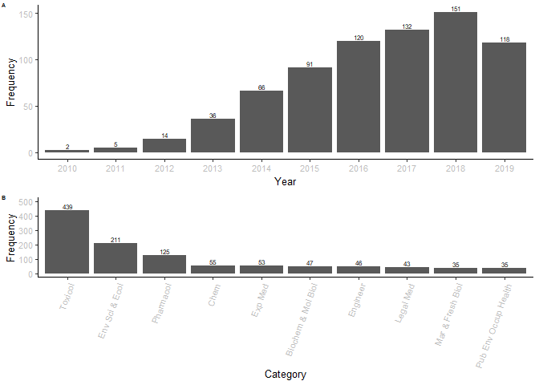

AOP bibliometric analysis
================
K. HIKI

### Read

``` r
require(bibliometrix)
require(ggplot2)
require(ggpubr)
require(igraph)
require(visNetwork)

D <- readFiles("WoS_1-500.txt","WoS_501-938.txt") #WoS...are text files taken from Web of Science
# If you use the latest version of bibliometrix (ver. > 3.0), use the following command: D <- c("WoS_1-500.txt","WoS_501-938.txt")
M <- convert2df(D, dbsource = "isi", format = "plaintext")
# If you use the latest version of bibliometrix (ver. > 3.0), use the following command: M <- convert2df(D, dbsource = "wos", format = "plaintext")
```

    ## 
    ## Converting your isi collection into a bibliographic dataframe
    ## 
    ## Articles extracted   100 
    ## Articles extracted   200 
    ## Articles extracted   300 
    ## Articles extracted   400 
    ## Articles extracted   500 
    ## Articles extracted   600 
    ## Articles extracted   700 
    ## Articles extracted   800 
    ## Articles extracted   900 
    ## Articles extracted   938 
    ## Done!
    ## 
    ## 
    ## Generating affiliation field tag AU_UN from C1:  Done!

``` r
dim(M)
```

    ## [1] 938  74

``` r
M<-M[M$PY != "2008",]
M<-M[M$PT != "R",] #exclude repository data 
dim(M)
```

    ## [1] 937  74

``` r
M<-M[M$DT != "MEETING ABSTRACT",] #exclude conference abstract
M<-M[M$DT != "PROCEEDINGS PAPER",]
M<-M[M$DT != "ARTICLE; PROCEEDINGS PAPER",]
M<-M[M$DT != "CORRECTION",]
M<-M[! is.na(M$DT) ,]
table(M$DT)
```

    ## 
    ##                          ARTICLE            ARTICLE; BOOK CHAPTER 
    ##                              510                               36 
    ##               EDITORIAL MATERIAL EDITORIAL MATERIAL; BOOK CHAPTER 
    ##                               36                                1 
    ##                           LETTER                        NEWS ITEM 
    ##                                8                                3 
    ##                           REVIEW             REVIEW; BOOK CHAPTER 
    ##                              140                                1

``` r
M[M$DT =="ARTICLE; BOOK CHAPTER","DT"] <- rep("ARTICLE",36)
M[M$DT =="ARTICLE; EARLY ACCESS","DT"] <- rep("ARTICLE",1)
M[M$DT =="REVIEW; BOOK CHAPTER","DT"] <- rep("REVIEW",1)
M[M$DT =="EDITORIAL MATERIAL","DT"] <- rep("OTHERS",36)
M[M$DT =="EDITORIAL MATERIAL; EARLY ACCESS","DT"] <- rep("OTHERS",1)
M[M$DT =="EDITORIAL MATERIAL; BOOK CHAPTER","DT"] <- rep("OTHERS",1)
M[M$DT =="NEWS ITEM","DT"] <- rep("OTHERS",3)
M[M$DT =="LETTER","DT"] <- rep("OTHERS",8)

table(M$DT)
```

    ## 
    ## ARTICLE  OTHERS  REVIEW 
    ##     546      48     141

``` r
dim(M)
```

    ## [1] 735  74

``` r
results <- biblioAnalysis(M, sep = ";")
plot(x = results, k = 10, pause = FALSE)
```

<!-- --><!-- --><!-- --><!-- --><!-- -->

``` r
# Top 5 papers
cbind(results$MostCitedPapers[1:5,],
DOI=M[as.numeric(rownames( results$MostCitedPapers[1:5,] )),"DI",],
DocumentType=M[as.numeric(rownames( results$MostCitedPapers[1:5,] )),"DT",],
Title=M[as.numeric(rownames( results$MostCitedPapers[1:5,] )),"DT",])  
```

    ##                              Paper           TC TCperYear
    ## 734   ANKLEY GT, 2010, ENVIRON TOXICOL CHEM 981  98.10000
    ## 618        VILLENEUVE DL, 2014, TOXICOL SCI 190  31.66667
    ## 689              VINKEN M, 2013, TOXICOLOGY 168  24.00000
    ## 732     SIPES NS, 2011, BIRTH DEFECTS RES C 144  16.00000
    ## 617 TOLLEFSEN KE, 2014, REGUL TOXICOL PHARM 122  20.33333
    ##                             DOI DocumentType   Title
    ## 734              10.1002/ETC.34      ARTICLE ARTICLE
    ## 618       10.1093/TOXSCI/KFU199      ARTICLE ARTICLE
    ## 689   10.1016/J.TOX.2013.08.011       REVIEW  REVIEW
    ## 732          10.1002/BDRC.20214       REVIEW  REVIEW
    ## 617 10.1016/J.YRTPH.2014.09.009      ARTICLE ARTICLE

``` r
results$Documents
```

    ## ARTICLE      OTHERS       REVIEW       
    ##          546           48          141

``` r
results$DE [1:10] # top 10 author's keywords 
```

    ## Tab
    ##     ADVERSE OUTCOME PATHWAY             RISK ASSESSMENT 
    ##                         163                          72 
    ##    ADVERSE OUTCOME PATHWAYS              MODE OF ACTION 
    ##                          52                          42 
    ##          SKIN SENSITIZATION ADVERSE OUTCOME PATHWAY AOP 
    ##                          37                          25 
    ##                         AOP                    IN VITRO 
    ##                          21                          21 
    ##       PREDICTIVE TOXICOLOGY        ENDOCRINE DISRUPTION 
    ##                          21                          18

``` r
par (mar = c(4,4,4,1))
Year <- data.frame( table( M$PY ) )
colnames(Year) <- c("Year","Frequency")
Year_plot <-  ggplot (Year) +geom_bar(aes(x=Year,y=Frequency),stat = "identity", position = "dodge")+  theme_classic(base_size = 10)+ theme(axis.text=element_text(colour = "grey"),legend.position = c(0.01, 1), legend.justification = c(0, 1))+labs(fill = "") + geom_text( aes(x=Year, y=Frequency,label=Frequency),vjust=-0.3,size=2,col="black")


par (mar = c(4,4,4,1))
YearDT <- data.frame( table( M$PY,M$DT ) )
colnames(YearDT) <-c("Year","Document","Frequency")
YearDT$Document <- factor(YearDT$Document, levels = c("ARTICLE","REVIEW","OTHERS") )
YearDT_plot <-  ggplot (YearDT) +geom_bar(aes(x=Year,y=Frequency,fill=Document),stat = "identity")+  theme_classic(base_size = 28)+ theme(axis.text=element_text(colour = "black"),legend.position = c(0.01, 1), legend.justification = c(0, 1))+labs(fill = "") + 
 scale_x_discrete(limits=c("2010", "2011", "2012", "2013","2014","2015","2016","2017","2018","2019"))


Area <- data.frame( sort(table( unlist(strsplit(M$SC,"; ") )) ,decreasing=TRUE))
colnames(Area) <- c("Category","Frequency")
Area[,1] <-as.character(Area[,1])
Area[1:10,1] <-  c("Toxicol","Env Sci & Ecol","Pharmacol","Chem","Exp Med","Biochem & Mol Biol","Engineer","Legal Med","Mar & Fresh Biol","Pub Env Occup Health") 
Area[,1] <-as.factor(Area[,1])
Area2 <- transform (Area, Category = factor(Category,levels=c("Toxicol","Env Sci & Ecol","Pharmacol","Chem","Exp Med","Biochem & Mol Biol","Engineer","Legal Med","Mar & Fresh Biol","Pub Env Occup Health")))
Area_plot <-  ggplot (Area2[1:10,]) + 
  geom_bar(aes(x=Category,y=Frequency),stat = "identity", position = "dodge")+
  theme_classic(base_size = 10)+
  theme( axis.text=element_text(colour = "grey"),axis.text.x=element_text(angle=70,hjust=1 ),legend.position = c(0.01, 1), legend.justification = c(0, 1) ) +
  labs(fill = "") + 
  ylim(0,500)+
  geom_text( aes(x=Category, y=Frequency, label=Frequency),vjust=-0.3,size=2,col="black")
 

 
Journal <- data.frame( results$Sources ) 
colnames(Journal) <-c("Journal","Frequency")
Journal[,1] <-as.character(Journal[,1])
Journal[1:10,1] <-  c("ETC","RTP","TS","Arch Toxicol","EST","ALTEX","Aquat Toxicol","CRT","Tiv","ALTA") 
Journal[,1] <-as.factor(Journal[,1])
Journal2 <- transform (Journal, Journal = factor(Journal,levels=c("ETC","RTP","TS","Arch Toxicol","EST","ALTEX","Aquat Toxicol","CRT","Tiv","ALTA")))

Journal_plot <- ggplot (Journal2[1:10,]) +geom_bar(aes(x=Journal,y=Frequency),stat = "identity", position = "dodge")+  theme_classic(base_size = 10)+ theme(axis.text=element_text(colour = "grey"),axis.text.x=element_text(angle=70,hjust=1 ),legend.position = c(0.01, 1), legend.justification = c(0, 1))+labs(fill = "")+
 geom_text( aes(x=Journal, y=Frequency, label=Frequency),vjust=-0.3,size=2,col="black")


ggpubr::ggarrange(Year_plot, Area_plot, nrow=2,ncol=1,labels=LETTERS, font.label=list(size=5))
```

<!-- -->

``` r
# Author coupling network
NetMatrix <- biblioNetwork(M, analysis = "coupling", network = "authors", sep = ";")
#net <- networkPlot(NetMatrix,  normalize = "salton", weighted=NULL, n = 100, Title = "Authors' Coupling", type = "fruchterman",size=5,size.cex=T,remove.multiple=TRUE,labelsize=0.8,label.n=10,label.cex=F) 


# Co-citation network
NetMatrix_co_cit <- biblioNetwork(M, analysis = "co-citation", network = "references", sep = ";")
net_co_cit <- networkPlot(NetMatrix_co_cit , n = 30, Title = "Co-Citation Network", type = "fruchterman", size=T, remove.multiple=FALSE, labelsize=0.75,edgesize = 3)
```

<!-- -->

``` r
#netstat_co_cit <- networkStat(NetMatrix_co_cit)
#summary(netstat_co_cit, k=10)

#Co-occurrences network
NetMatrix_co_occ <- biblioNetwork(M, analysis = "co-occurrences", network = "keywords", sep = ";")
net_co_occ <-  networkPlot(NetMatrix_co_occ , normalize="association", weighted=T, n = 47, Title = "Keyword Co-occurrences", type = "auto", size=T,edgesize = 3,labelsize=1.2)
```

<!-- -->

``` r
#plot using visNetwork
g <- net_co_occ$graph
V(g)$size<-V(g)$size*3
V(g)$label.color <- V(g)$color
V(g)$label.font <-2
visIgraph(g)
```

``` r
# Historical citation network
options(width=130)
histResults <- histNetwork(M, min.citations = 10, sep = ";")
```

    ## Articles analysed   100 
    ## Articles analysed   200 
    ## Articles analysed   281

``` r
net <- histPlot(histResults, n=25, size = 10, labelsize=5)
```

    ## Warning: The curvature argument has been deprecated in favour of strength

<!-- -->

    ## 
    ##  Legend
    ## 
    ##                                               Paper                               DOI Year LCS GCS
    ## 2010 - 1      ANKLEY GT, 2010, ENVIRON TOXICOL CHEM                    10.1002/ETC.34 2010 393 981
    ## 2011 - 5                 VOLZ DC, 2011, TOXICOL SCI             10.1093/TOXSCI/KFR185 2011  36  54
    ## 2013 - 26               VINKEN M, 2013, TOXICOL SCI             10.1093/TOXSCI/KFT177 2013  36  60
    ## 2013 - 27                VINKEN M, 2013, TOXICOLOGY         10.1016/J.TOX.2013.08.011 2013  71 168
    ## 2013 - 42      MACKAY C, 2013, ALTEX-ALTERN ANIM EX         10.14573/ALTEX.2013.4.473 2013  33  54
    ## 2014 - 48   TOLLEFSEN KE, 2014, REGUL TOXICOL PHARM       10.1016/J.YRTPH.2014.09.009 2014  69 122
    ## 2014 - 49          VILLENEUVE DL, 2014, TOXICOL SCI             10.1093/TOXSCI/KFU199 2014 133 190
    ## 2014 - 50        VILLENEUVE DL, 2014, TOXICOL SCI-a             10.1093/TOXSCI/KFU200 2014  93  93
    ## 2014 - 56     RUSSOM CL, 2014, ENVIRON TOXICOL CHEM                  10.1002/ETC.2662 2014  28  42
    ## 2014 - 64    PATLEWICZ G, 2014, REGUL TOXICOL PHARM       10.1016/J.YRTPH.2014.06.001 2014  29  56
    ## 2014 - 82         MAXWELL G, 2014, TOXICOL IN VITRO         10.1016/J.TIV.2013.10.013 2014  26  40
    ## 2014 - 89  VILLENEUVE D, 2014, ENVIRON TOXICOL CHEM                  10.1002/ETC.2403 2014  29  42
    ## 2014 - 94             MEEK ME, 2014, J APPL TOXICOL                  10.1002/JAT.2949 2014  59 116
    ## 2015 - 102            PERKINS EJ, 2015, TOXICOL SCI             10.1093/TOXSCI/KFV181 2015  27  30
    ## 2015 - 119   BECKER RA, 2015, REGUL TOXICOL PHARM-a       10.1016/J.YRTPH.2015.04.004 2015  66  76
    ## 2015 - 125   PATLEWICZ G, 2015, REGUL TOXICOL PHARM       10.1016/J.YRTPH.2015.03.015 2015  28  28
    ## 2015 - 131 PATLEWICZ G, 2015, REGUL TOXICOL PHARM-a       10.1016/J.YRTPH.2015.02.011 2015  38  45
    ## 2015 - 134     URBISCH D, 2015, REGUL TOXICOL PHARM       10.1016/J.YRTPH.2014.12.008 2015  35 108
    ## 2015 - 138               GROH KJ, 2015, CHEMOSPHERE 10.1016/J.CHEMOSPHERE.2014.10.006 2015  35  37
    ## 2015 - 140             GROH KJ, 2015, CHEMOSPHERE-a 10.1016/J.CHEMOSPHERE.2014.09.068 2015  35  74
    ## 2015 - 147     ROVIDA C, 2015, ALTEX-ALTERN ANIM EX            10.14573/ALTEX.1411011 2015  25  81
    ## 2016 - 208   EDWARDS SW, 2016, J PHARMACOL EXP THER           10.1124/JPET.115.228239 2016  45  65
    ## 2017 - 211              LEIST M, 2017, ARCH TOXICOL         10.1007/S00204-017-2045-3 2017  29  67
    ## 2017 - 236    CONOLLY RB, 2017, ENVIRON SCI TECHNOL           10.1021/ACS.EST.6B06230 2017  29  37
    ## 2017 - 249            WITTWEHR C, 2017, TOXICOL SCI             10.1093/TOXSCI/KFW207 2017  32  39

``` r
Rev <- M[M$DT == "REVIEW",]
Art <- M[M$DT == "ARTICLE",]


#Co-occurrences network
NetMatrix_co_occ_art <- biblioNetwork(Art, analysis = "co-occurrences", network = "keywords", sep = ";")
net_co_occ_art <-  networkPlot(NetMatrix_co_occ_art , normalize="association", weighted=T, n = 45, Title = "Keyword Co-occurrences", type = "fruchterman", size=T,edgesize = 3,labelsize=0.8)
```

<!-- -->
