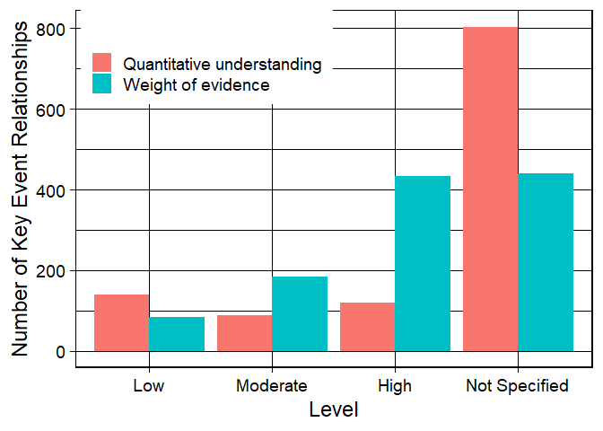
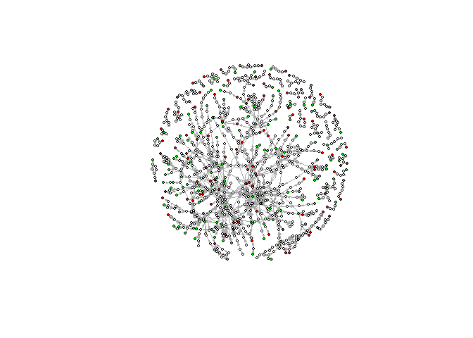
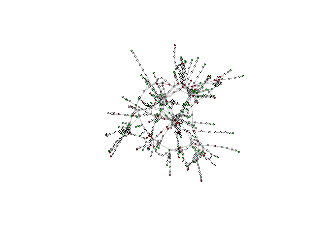
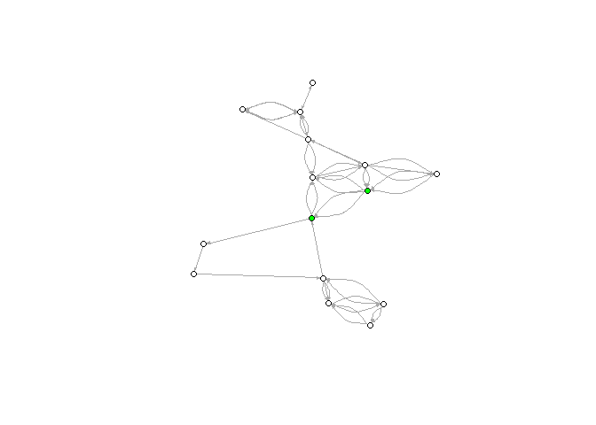

AOP wiki web scraping
================
Kyoshiro HIKI

``` r
knitr::opts_chunk$set(echo = TRUE, message=FALSE,fig.path = "AOPwiki_figs/AOPwiki-") #echo=TRUE
```

# Get the xml file from AOP wiki through the following web page.

<https://aopwiki.org/info_pages/5>

# Read xml file and make the dataset tidy

``` r
require(XML)
require(rlist)
require(tidyverse)
require(magrittr)
require(purrr)
require(ggplot2)


data.xml <- xmlInternalTreeParse("aop-wiki-xml-2019-07-01.xml") %>% xmlToList
length(data.xml)
```

    ## [1] 4083

``` r
table(rownames(summary(data.xml))) ## showing the summary of data.xml
```

    ## 
    ##                    aop      biological-action      biological-object 
    ##                    261                     11                    357 
    ##     biological-process               chemical              key-event 
    ##                    352                    283                   1022 
    ## key-event-relationship               stressor               taxonomy 
    ##                   1199                    430                    167 
    ##        vendor-specific 
    ##                      1

``` r
chemical <- data.xml %>% list.match("chemical")
aop <- data.xml %>% list.match("aop")
bioaction<- data.xml %>% list.match("biological-action")
bioprocess<- data.xml %>% list.match("biological-process")
bioobject<- data.xml %>% list.match("biological-object")
keyevent<- data.xml %>% list.match("key-event")
ker<- data.xml %>% list.match("key-event-relationship")
stressor<- data.xml %>% list.match("stressor")
taxonomy<- data.xml %>% list.match("taxonomy")
vendor<- data.xml %>% list.match("vendor-specific")

# Exclude Archived AOP 
length(aop)
```

    ## [1] 261

``` r
saaop <- aop %>% unlist %>% list.match("saaop-status")
table(saaop)
```

    ## saaop
    ##                   Archived Included in OECD Work Plan 
    ##                          6                         54 
    ##          Under Development 
    ##                        149

``` r
## Exclude empty AOP
empty_ke <- aop %>%
  map(~.$`key-events`, flatten_df)  %>%
  map_depth(.,2, unlist) %>%
  lapply(function(x) {names(x)}) %>%
  lapply( is.null ) %>% unlist
table(empty_ke)
```

    ## empty_ke
    ## FALSE  TRUE 
    ##   241    20

``` r
empty_ker <- aop %>%
  map(~.$`key-event-relationship`, flatten_df)  %>%
  map_depth(.,2, unlist) %>%
  lapply(function(x) {names(x)}) %>%
  lapply( is.null ) %>% unlist
table(empty_ker)
```

    ## empty_ker
    ## FALSE  TRUE 
    ##   225    36

``` r
aop <- aop [- c(which(empty_ker==TRUE),which(empty_ker==TRUE),which(saaop=="Archived") )  ]
names(aop) <- paste("aop",c(1:length(aop)))

#aop list check
length(aop)
```

    ## [1] 222

``` r
summary(aop[[1]])
```

    ##                             Length Class  Mode     
    ## title                       1      -none- character
    ## short-name                  1      -none- character
    ## authors                     1      -none- character
    ## status                      3      -none- list     
    ## oecd-project                1      -none- character
    ## abstract                    1      -none- character
    ## molecular-initiating-event  2      -none- list     
    ## adverse-outcome             2      -none- list     
    ## key-event-relationships     8      -none- list     
    ## essentiality-support        1      -none- character
    ## key-events                  5      -none- list     
    ## applicability               2      -none- list     
    ## overall-assessment          5      -none- list     
    ## potential-applications      1      -none- character
    ## aop-stressors               2      -none- list     
    ## references                  1      -none- character
    ## source                      1      -none- character
    ## creation-timestamp          1      -none- character
    ## last-modification-timestamp 1      -none- character
    ## .attrs                      1      -none- character

``` r
## KER as data.frame format
ker_df <-  ker %>% 
  purrr::map(magrittr::extract, c("title", ".attrs")) %>%
  purrr::map(., unlist) %>%
  do.call(rbind,.) 
rownames(ker_df) <- rep("relationship",nrow(ker_df) )

ker_df2 <- aop %>%
  map(~.$`key-event-relationships`, flatten_df)  %>%
  map_depth(.,2, unlist) %>%
  lapply( function(x) do.call (rbind, x)) %>%
  list.filter(., ncol(.) >= 2) %>% 
  do.call(rbind,.)

ker_all <- merge(ker_df, ker_df2)

# Quantitative understanding value
quv <- table(ker_all$'.attrs.id',ker_all$`quantitative-understanding-value`)
quv[quv==0]<-NA
quv[quv!=1]<-1
quv2 <- as.data.frame.matrix(quv)[which(  apply(as.data.frame.matrix(quv), 1,sum, na.rm=TRUE) ==1),]  #remove overlapped quv among multiple AOPs
quv3<- apply(as.data.frame.matrix(quv2), 2,sum, na.rm=TRUE)

# Evidence value
evi <- table(ker_all$'.attrs.id',ker_all$`evidence`)
evi[evi==0]<-NA
evi[evi!=1]<-1
evi2 <- as.data.frame.matrix(evi)[which(  apply(as.data.frame.matrix(evi), 1,sum, na.rm=TRUE) ==1),] #remove overlapped evi among multiple AOPs
evi3 <- apply(as.data.frame.matrix(evi2), 2,sum, na.rm=TRUE)

#Quantitative & Evidence
ker_level <-as.data.frame (t( rbind( evi3, quv3) ))
ker_level [,3] <- rownames(ker_level)
colnames(ker_level) <- c("Weight of evidence","Quantitative understanding","Level")
ker_level<-gather(ker_level,key=Type,value=value,'Weight of evidence','Quantitative understanding')
ker_level2 <- transform(ker_level, Level=factor(Level,levels=c("Low","Moderate","High","Not Specified")) )

ggplot(ker_level2) +
  geom_bar(aes(x=Level,y=value,fill=Type),stat = "identity", position = "dodge")+
  ylab("Number of Key Event Relationships")+
  theme_linedraw(base_size = 18)+
  theme(axis.text=element_text(colour = "black"),legend.position = c(0.01, 1), legend.justification = c(0, 1))+
  labs(fill = "")
```

<!-- -->

``` r
# KE as data.frame format
MIE <-  aop %>% 
   map(., function(x) c(x$"molecular-initiating-event"$'.attrs') ) %>% 
  unlist %>% 
  lapply (function(x) {data.frame(ID=x,Type="MIE")}) %>% 
  do.call(rbind,.)
AO <-  aop %>% 
   map(., function(x) c(x$"adverse-outcome"$'.attrs') ) %>% 
  unlist %>% 
  lapply (function(x) {data.frame(ID=x,Type="AO")}) %>% 
  do.call(rbind,.)
KE <- aop %>% 
   map(., function(x) c(x$"key-events") ) %>% 
  unlist %>% 
  lapply (function(x) {data.frame(ID=x,Type="KE")}) %>% 
  do.call(rbind,.)
ke_all <- rbind(MIE,KE,AO)
table(ke_all[,"Type"])
```

    ## 
    ##  MIE   KE   AO 
    ##  195 1089  216

``` r
KE_id <- keyevent %>%
  map(., function(x) c(x$".attrs"[1]) ) %>%
  unlist %>% 
  data.frame
KE_name<- keyevent %>%
  map(., function(x) c(x$"short-name"[1]) ) %>% 
  sapply(., function(x) ifelse(is.null(x), NA, x)) %>%
  unlist %>% 
  data.frame
KE_level <- keyevent %>%
  map(., function(x) c(x$"biological-organization-level"[1]) ) %>%
  sapply(., function(x) ifelse(is.null(x), NA, x)) %>%
  unlist %>% 
  data.frame
KE_list_pre <- data.frame(KE_id,KE_name,KE_level)  #includes KEs in archived AOPs
colnames(KE_list_pre) <- c("ID","Title","Level")


KE_list <- KE_list_pre[ match(ke_all$ID,KE_list_pre$ID),] # removes archived AOPs
KE_list$ID <- factor(KE_list$ID )
KE_list$Title <- factor(KE_list$Title )
KE_list$Level <- factor(KE_list$Level )
KE_list <- cbind(KE_list,Type=ke_all$Type)
head(KE_list)
```

    ##                                      ID
    ## 6  43b4c7ec-3f7d-4764-ade1-959581482b97
    ## 12 67d3c099-6a57-4961-8446-8cd035bbf6ad
    ## 27 1bb51018-0ccf-495c-bbcc-dffa02573469
    ## 34 0f37e11e-1f92-46d4-a3ab-c26ed51d4a1f
    ## 47 8b6d9a9c-f432-495f-9bba-c9a214e222bf
    ## 54 b6bc185d-56f2-41c4-953b-3f9247739c71
    ##                                                               Title
    ## 6  Binding of inhibitor, NADH-ubiquinone oxidoreductase (complex I)
    ## 12                                            Increase, EcR agonism
    ## 27                                Binding of antagonist, PPAR alpha
    ## 34        reduction in ovarian granulosa cells, Aromatase (Cyp19a1)
    ## 47              Binding at picrotoxin site, iGABAR chloride channel
    ## 54                            Binding of antagonist, NMDA receptors
    ##        Level Type
    ## 6  Molecular  MIE
    ## 12 Molecular  MIE
    ## 27 Molecular  MIE
    ## 34  Cellular  MIE
    ## 47 Molecular  MIE
    ## 54 Molecular  MIE

``` r
#Frequency of level of biological organization
table(KE_list$Level)
```

    ## 
    ##   Cellular Individual  Molecular      Organ Population     Tissue 
    ##        459        175        417        150         79        220

``` r
#most freqeunt MIE
head( sort( table(filter(KE_list,Type=="MIE")$Title),decreasing=TRUE ) )
```

    ## 
    ##              Activation, Nicotinic acetylcholine receptor 
    ##                                                         9 
    ##                       Inhibition, Cyclooxygenase activity 
    ##                                                         6 
    ## Inhibition, 5-hydroxytryptamine transporter (5-HTT; SERT) 
    ##                                                         5 
    ##                               Thyroperoxidase, Inhibition 
    ##                                                         5 
    ##                                           Activation, AhR 
    ##                                                         4 
    ##                                Inhibition, sodium channel 
    ##                                                         4

``` r
#Most frequent AO
head( sort( table(filter(KE_list,Type=="AO")$Title),decreasing=TRUE ) )
```

    ## 
    ##                          Death/Failure, Colony 
    ##                                             13 
    ##                Decrease, Population trajectory 
    ##                                             10 
    ##                           Increased, Mortality 
    ##                                              9 
    ##               Altered, Amphibian metamorphosis 
    ##                                              8 
    ##                            Decrease, Fecundity 
    ##                                              6 
    ## Increase, Adenomas/carcinomas (hepatocellular) 
    ##                                              5

``` r
#Number of unique KEs
length( sort( table(KE_list$ID),decreasing=TRUE ) )
```

    ## [1] 919

``` r
#Remove duplicated KEs and count the number again
KE_list_ident <- KE_list %>% distinct(ID,.keep_all=TRUE)
dim(KE_list_ident)
```

    ## [1] 919   4

``` r
table(KE_list_ident$Type)
```

    ## 
    ## MIE  KE  AO 
    ## 143 675 101

``` r
table(KE_list_ident$Level)
```

    ## 
    ##   Cellular Individual  Molecular      Organ Population     Tissue 
    ##        305         93        265         88         22        146

``` r
data.frame(No_of_AOP= length(aop), No_of_KE= nrow(ke_all), No_of_KER = nrow(ker_df2))
```

    ##   No_of_AOP No_of_KE No_of_KER
    ## 1       222     1500      1540

</br> </br>

# Statistics of AOP wiki

``` r
oecd <- aop %>% unlist %>% list.match("oecd-status")
table(oecd)
```

    ## oecd
    ##     EAGMST Approved EAGMST Under Review   TFHA/WNT Endorsed 
    ##                   7                  14                   9 
    ##   Under Development 
    ##                  19

``` r
wikistatus<- aop %>% unlist %>% list.match("wiki-status")
table(wikistatus)
```

    ## wikistatus
    ##                          Open for citation & comment 
    ##                                                   21 
    ##                        Open for comment. Do not cite 
    ##                                                   22 
    ## Under development: Not open for comment. Do not cite 
    ##                                                  179

``` r
aop.ke<- aop %>% unlist %>% list.match("key-event")

taxon <- taxonomy %>% unlist %>% list.match("name") 
table(taxon)
```

    ## taxon
    ##                               F344 rat 
    ##                                      1 
    ##                   Acipenser fulvescens 
    ##                                      1 
    ##                Acipenser transmontanus 
    ##                                      1 
    ##                   Acyrthosiphon kondoi 
    ##                                      1 
    ##                      Aegypius monachus 
    ##                                      1 
    ##                    African clawed frog 
    ##                                      1 
    ##                            all species 
    ##                                      1 
    ##                    Ambystoma mexicanum 
    ##                                      1 
    ##                       American kestrel 
    ##                                      1 
    ##                        Anodonta cygnea 
    ##                                      1 
    ##                      Arctica islandica 
    ##                                      1 
    ##                         Ardea herodias 
    ##                                      1 
    ##                   Argopecten irradians 
    ##                                      1 
    ##                     Atlantic killifish 
    ##                                      1 
    ##                                  birds 
    ##                                      1 
    ##                               bivalves 
    ##                                      1 
    ##                         bobwhite quail 
    ##                                      1 
    ##                       Bombus impatiens 
    ##                                      1 
    ##                             Bos taurus 
    ##                                      1 
    ##                                 bovine 
    ##                                      1 
    ##                        Bubalus bubalis 
    ##                                      1 
    ##                 Caenorhabditis elegans 
    ##                                      1 
    ##                 Canis lupus familiaris 
    ##                                      1 
    ##                    Carassius carassius 
    ##                                      1 
    ##                                    cat 
    ##                                      1 
    ##                                   cats 
    ##                                      1 
    ##                             CD-1 mouse 
    ##                                      1 
    ##             chaetanaphothrips orchidii 
    ##                                      1 
    ##                                chicken 
    ##                                      1 
    ##                               chickens 
    ##                                      1 
    ##               chickens, ducks, turkeys 
    ##                                      1 
    ##                       Chinese hamsters 
    ##                                      1 
    ##                    Colinus virginianus 
    ##                                      1 
    ##                        Common Starling 
    ##                                      1 
    ##                      Coturnix japonica 
    ##                                      1 
    ##                                    cow 
    ##                                      1 
    ##                            crustaceans 
    ##                                      1 
    ##                    Cynops pyrrhogaster 
    ##                                      1 
    ##                            Danio rerio 
    ##                                      1 
    ##                          Daphnia magna 
    ##                                      1 
    ##                          Daphnia pulex 
    ##                                      1 
    ##                                    dog 
    ##                                      1 
    ##                                   dogs 
    ##                                      1 
    ##                        domestic cattle 
    ##                                      1 
    ##               Double-crested cormorant 
    ##                                      1 
    ##                   Dreissena polymorpha 
    ##                                      1 
    ##                Drosophila melanogaster 
    ##                                      1 
    ##                       Eastern bluebird 
    ##                                      1 
    ##                 Echinogammarus marinus 
    ##                                      1 
    ##                         eisenia fetida 
    ##                                      1 
    ##                    Erinaceus europaeus 
    ##                                      1 
    ##                         fathead minnow 
    ##                                      1 
    ##                                 ferret 
    ##                                      1 
    ##                                   fish 
    ##                                      1 
    ##                              fruit fly 
    ##                                      1 
    ##                  Fundulus heteroclitus 
    ##                                      1 
    ##                          Gallus gallus 
    ##                                      1 
    ##                         Gammarus pulex 
    ##                                      1 
    ##                             gastropods 
    ##                                      1 
    ##                               goldfish 
    ##                                      1 
    ##                             guinea pig 
    ##                                      1 
    ##                         Gyps africanus 
    ##                                      1 
    ##                       Gyps bengalensis 
    ##                                      1 
    ##                       Gyps coprotheres 
    ##                                      1 
    ##                            Gyps fulvus 
    ##                                      1 
    ##                      Gyps himalayensis 
    ##                                      1 
    ##                           Gyps indicus 
    ##                                      1 
    ##                         Gyps rueppelli 
    ##                                      1 
    ##               Haliaeetus leucocephalus 
    ##                                      1 
    ##                                Hamster 
    ##                                      1 
    ##                        Helicoverpa zea 
    ##                                      1 
    ##                          Helix lucorum 
    ##                                      1 
    ##                           herring gull 
    ##                                      1 
    ##                           Homo sapiens 
    ##                                      1 
    ##                              Honey bee 
    ##                                      1 
    ##                               honeybee 
    ##                                      1 
    ##                                  human 
    ##                                      1 
    ##       human and other cells in culture 
    ##                                      1 
    ##                      human, mouse, rat 
    ##                                      1 
    ##                      Human, rat, mouse 
    ##                                      1 
    ##                                 humans 
    ##                                      1 
    ##                                  hydra 
    ##                                      1 
    ##                        Hydra attenuata 
    ##                                      1 
    ##                            hymenoptera 
    ##                                      1 
    ##                                insects 
    ##                                      1 
    ##                          Invertebrates 
    ##                                      1 
    ##                         Japanese quail 
    ##                                      1 
    ##                     Lampsilis fasciola 
    ##                                      1 
    ##                            Lemna gibba 
    ##                                      1 
    ##                            Lemna minor 
    ##                                      1 
    ##                            lepidoptera 
    ##                                      1 
    ##                     Liriomyza trifolii 
    ##                                      1 
    ##                      Lymnaea stagnalis 
    ##                                      1 
    ##                    Macaca fascicularis 
    ##                                      1 
    ##                         Macaca mulatta 
    ##                                      1 
    ##                  Mammalia sp. AVB-2011 
    ##                                      1 
    ##                                mammals 
    ##                                      1 
    ##                                 medaka 
    ##                                      1 
    ##                    Meleagris gallopavo 
    ##                                      1 
    ##                         Melibe leonine 
    ##                                      1 
    ##                  Mercenaria mercenaria 
    ##                                      1 
    ##                                   mice 
    ##                                      1 
    ##                      Microgadus tomcod 
    ##                                      1 
    ##                                 Monkey 
    ##                                      1 
    ##                             Monkey sp. 
    ##                                      1 
    ##                  Monodelphis domestica 
    ##                                      1 
    ##                                  mouse 
    ##                                      1 
    ##                        Mus musculoides 
    ##                                      1 
    ##                           Mus musculus 
    ##                                      1 
    ##                        Mus sp. 2000082 
    ##                                      1 
    ##              Mytilus galloprovincialis 
    ##                                      1 
    ##                               nematode 
    ##                                      1 
    ##                  northern leopard frog 
    ##                                      1 
    ##                  Nycticorax nycticorax 
    ##                                      1 
    ##                      Oncorhynchus keta 
    ##                                      1 
    ##                    Oncorhynchus mykiss 
    ##                                      1 
    ##                       Orius insidiosus 
    ##                                      1 
    ##                        orius isidiosus 
    ##                                      1 
    ##                  Oryctolagus cuniculus 
    ##                                      1 
    ##                        Oryzias latipes 
    ##                                      1 
    ##                                 osprey 
    ##                                      1 
    ##                             Ovis aries 
    ##                                      1 
    ##                           Pagrus major 
    ##                                      1 
    ##                        Pan troglodytes 
    ##                                      1 
    ##                    Phasianus colchicus 
    ##                                      1 
    ##                                    Pig 
    ##                                      1 
    ##                                   pigs 
    ##                                      1 
    ##                    Pimephales promelas 
    ##                                      1 
    ##              Primates sp. BOLD:AAA0001 
    ##                                      1 
    ##                     Radopholus similis 
    ##                                      1 
    ##                          rainbow trout 
    ##                                      1 
    ##                                    rat 
    ##                                      1 
    ##                                   rats 
    ##                                      1 
    ##                      Rattus norvegicus 
    ##                                      1 
    ##                          Rattus rattus 
    ##                                      1 
    ##                             Rattus sp. 
    ##                                      1 
    ##                  Rattus sp. ABTC 42503 
    ##                                      1 
    ##                         rhesus monkeys 
    ##                                      1 
    ##                   Ring-necked pheasant 
    ##                                      1 
    ##                               rodentia 
    ##                                      1 
    ##                          Rodentia spp. 
    ##                                      1 
    ##                                rodents 
    ##                                      1 
    ##               Saccharomyces cerevisiae 
    ##                                      1 
    ##                            Salmo salar 
    ##                                      1 
    ##                          salmonid fish 
    ##                                      1 
    ##                                 SD rat 
    ##                                      1 
    ##                         Sea urchin sp. 
    ##                                      1 
    ##                    Spisula solidissima 
    ##                                      1 
    ##                         Sprague-Dawley 
    ##                                      1 
    ##                             Sus scrofa 
    ##                                      1 
    ##                                  swine 
    ##                                      1 
    ##                  Syrian golden hamster 
    ##                                      1 
    ##                        Syrian hamsters 
    ##                                      1 
    ##                             tree shrew 
    ##                                      1 
    ##                      tritonea diomedea 
    ##                                      1 
    ##                                 turkey 
    ##                                      1 
    ##                            Vertebrates 
    ##                                      1 
    ##       Xenopus (Silurana) epitropicalis 
    ##                                      1 
    ## Xenopus (Silurana) n. sp. tetraploid-1 
    ##                                      1 
    ##                         Xenopus laevis 
    ##                                      1 
    ##                  Xenopus laevis laevis 
    ##                                      1 
    ##                     Xenopus tropicalis 
    ##                                      1 
    ##                                  yeast 
    ##                                      1 
    ##                            zebra danio 
    ##                                      1 
    ##                             zebra fish 
    ##                                      1 
    ##                              zebrafish 
    ##                                      1 
    ##                      Zoarces viviparus 
    ##                                      1

``` r
year <- aop %>% unlist %>% list.match("creation-timestamp") %>% str_sub(1,4)
table(year)
```

    ## year
    ## 2016 2017 2018 2019 
    ##  146   41   14   21

``` r
mod.year <- aop %>% unlist %>% list.match("last-modification-timestamp") %>% str_sub(1,4)
table(mod.year)
```

    ## mod.year
    ## 2016 2017 2018 2019 
    ##   20   35  102   65

# AOP network analysis

``` r
require(igraph)
require(sna)
require(statnet)
library(RColorBrewer)

g<- graph_from_data_frame(ker_all[,2:3],directed=TRUE)

## Add Keytype information to the nodes of graph (g)
V(g)$KE_type <- as.character( ke_all[match(V(g)$name,ke_all$ID),"Type"] )
V(g)$ color <- ifelse (  V(g)$KE_type == "MIE", "green",   ifelse( V(g)$KE_type == "KE", "white",  ifelse ( V(g)$KE_type == "AO", "red", "black" ) )  )
ker_all[,6] <- table (ker_all[,1]) [ match (  ker_all[,1] , names(table (ker_all[,1] )) )]
# V(g)$size <-rep(2,   length( V(g) )   )
V(g)$freq <-   table ( c(as.character(ker_all[,2]), as.character(ker_all[,3]))  )
#V(g)$size <- ifelse (V(g)$freq <= 5, 2, ifelse (V(g)$freq <= 10, 4, ifelse (V(g)$freq <= 20, 6, ifelse (V(g)$freq > 20, 9, 0 ) ) ) )


# Add information to the edges 
E(g)$name <- as.character( ker_all[,4] )
E(g)$ adj <- as.character  (ker_all[,"adjacency"])
E(g)$ evidence <- as.numeric(ker_all[,"evidence"])
#E(g) $ color  <- ifelse (E(g)$adj == "adjacet", "grey",   ifelse (E(g)$adj == "non-adjacent", "orange", "grey" ) )
#E(g) $ width  <- ifelse ( is.na ( E(g)$evidence) , 1 ,  ifelse(E(g)$evidence=="5",1,  ifelse(E(g)$evidence=="1",1, ifelse( E(g)$evidence=="2",2,ifelse(E(g)$evidence=="3",3,0) ))) )
#E(g) $ lty  <- ifelse (is.na (E(g)$evidence) ,  2 , 1 )


#Draw graph 
l <- layout_with_fr(g)
plot(g, vertex.label=NA, layout = l, edge.vertex.size=0.4, vertex.size=3,edge.arrow.size=0.2)
```

<!-- -->

``` r
# Distance
distance_table(g)
```

    ## $res
    ##  [1] 1193 1457 1648 1717 1625 1456 1341 1241 1145  982  761  611  400  189
    ## [15]  107   53   17   10    3    2
    ## 
    ## $unconnected
    ## [1] 857332

``` r
dist_g <- distances(g)

dist_g2 <- dist_g
dist_g2[!is.finite(dist_g2)] <- 0


# Weakly connected components
comp_g <- igraph::components(g,"weak")  # csize: size,no: No of components
comp_g$no
```

    ## [1] 39

``` r
comp_g$csize
```

    ##  [1]   9 666   7   8  14  17   8  11   4   8   8   6  10   6   8   8   7
    ## [18]   8   8   2   7   7  10   3   7   4   6   6   5   6   7   6   5   4
    ## [35]  10   5   5   5   4

``` r
m <- as_adjacency_matrix(g) %>% as.matrix
largest_g <-  sna::component.largest(m,result="graph",connected="weak")
largest_g<- graph_from_adjacency_matrix(largest_g)

# The largest weakly connected components
V(largest_g)$KE_type <- as.character( ke_all[match(V(largest_g)$name,ke_all$ID),"Type"] )
V(largest_g)$ color <- ifelse (  V(largest_g)$KE_type == "MIE", "green",   ifelse( V(largest_g)$KE_type == "KE", "white",  ifelse ( V(largest_g)$KE_type == "AO", "red", "black" ) )  )
# V(largest_g)$size <-rep(2,   length( V(largest_g) )   )

 l <- layout_with_fr(largest_g)
 plot(largest_g, vertex.label=NA, vertex.size=3, edge.arrow.size=0.1,  layout = l)
```

<!-- -->

``` r
dist_lg <- distances(largest_g)
dist_lg2 <- dist_lg
dist_lg2[!is.finite(dist_lg2)] <- 0
hist(dist_lg2)
```

<!-- -->

``` r
# Investigate KEs of the largest weakly connected components
na.exclude( KE_list_ident[match(V(largest_g)$name,KE_list_ident$ID),c("Title","Type","Level")] )
```

    ##                                                                                          Title
    ## 809                                                                       plasma retionic acid
    ## 890                                                                        Decrease, Fecundity
    ## 39                                                               demethylation, PPARg promoter
    ## 579                                                                   Increase, cilia movement
    ## 197                                                              Reduction, testosterone level
    ## 798                                                              Impaired inguinoscrotal phase
    ## 357                                                                  Increased, valve movement
    ## 619                                                               Activation, JAK/STAT pathway
    ## 112                                                              Serotonin 1A Receptor Agonism
    ## 450                                                              Induction, Microvesicular fat
    ## 316                                                             Reduced, Prostaglandins, ovary
    ## 785                                                               Occurrence, Cellular Seizure
    ## 18                                                         Inhibition, Cyclooxygenase activity
    ## 209                                              Reduction, Plasma vitellogenin concentrations
    ## 144                                    Inhibition, NADH-ubiquinone oxidoreductase  (complex I)
    ## 193                                                       Increased pro-inflammatory mediators
    ## 748                                                                 Dysfunction, Mitochondria 
    ## 326                                                            Impairment, Learning and memory
    ## 172                                                                              BDNF, Reduced
    ## 86                                                                    Inhibition, Deiodinase 3
    ## 78                             Activation of specific nuclear receptors, PPAR-gamma activation
    ## 297                                                                       Up Regulation, SCD-1
    ## 57                                                   Increase, Cytotoxicity (epithelial cells)
    ## 343                                                                      Reduced, Food storage
    ## 633                                                          p21 (CDKN1A) expression, increase
    ## 492                                                              Reduced, Swimming performance
    ## 283                                                  Increased, Intracellular Calcium overload
    ## 338                                                            Increased, Viral susceptibility
    ## 137                                                                           Increase in RONS
    ## 632                                                              Histone acetylation, increase
    ## 125                                                       Mitochondrial Complex III inhibition
    ## 743                                                                       Decrease, Glycolysis
    ## 91                                                               Activation, Estrogen receptor
    ## 508                                               Increased, secretion of local growth factors
    ## 791                                                                         Increase, Necrosis
    ## 420                                           Increase, Hyperplasia (tubular epithelial cells)
    ## 95                                                                      Inactivation of PPARγ
    ## 744                                                                           Decrease, OXPHOS
    ## 97                                                              Histone deacetylase inhibition
    ## 38                                                                      GR Agonist, Activation
    ## 281                                                                     N/A, Neurodegeneration
    ## 349                                                                         Reduced, feeding 1
    ## 320                                                                        activation of CEBPA
    ## 366                                                                      Decreased, locomotion
    ## 332                                                            impaired, Hive thermoregulation
    ## 509                                              Increased, proliferation of mesenchymal cells
    ## 87                                                                         Inhibition, Pendrin
    ## 797                                                                    Decrease, AR activation
    ## 364                                                  Decrease, histaminergic neuron excitation
    ## 724                                                                      Release of G Proteins
    ## 385                                                Increase, Cytotoxicity (renal tubular cell)
    ## 419                                       Increase, Hyperplasia (forestomach epithelial cells)
    ## 440                                               Occurrence, Cystic dilatation (renal tubule)
    ## 422                                Decrease, Incorporation of active iodide into iodotyrosines
    ## 96                                                                   Activation, NADPH Oxidase
    ## 190                                                                          Oxidative Stress 
    ## 662                                                                       Increased, glutamate
    ## 739                                                       Decrease, Chloroplast ATP production
    ## 155                                                     Decrease, Abdominal muscle contraction
    ## 74                                                                    Inhibition, Deiodinase 2
    ## 146                                                                     Impaired, Proteostasis
    ## 477                                                                  S-Glutathionylation, eNOS
    ## 347                                                                    Reduced, swimming speed
    ## 183                                                                        Increase, Mutations
    ## 615                                    Increase, Oxidative Stress / Activation, PMK-1 P38 MAPK
    ## 9                                                      Inhibition, Acetylcholinesterase (AchE)
    ## 550                                                                    Increased, inflammation
    ## 124                                                             Increase, Uncoupling of OXPHOS
    ## 362                                                                         Decreased, anxiety
    ## 556                                       Increased cellular proliferation and differentiation
    ## 116                                               Increase, Uncoupling of photophosphorylation
    ## 99                                                                    Increase, ROS production
    ## 261                                                                     Accumulation, Collagen
    ## 292          Decreased, PCK1 expression (control point for glycolysis/gluconeogenesis pathway)
    ## 772                                                             Decreased Na/K ATPase activity
    ## 561                                                                 Occurrence, renal ischemia
    ## 461                                                   Increased, blood uric acid concentration
    ## 703                                                                Increased, synaptic release
    ## 100                                                                 CYP7B activity, inhibition
    ## 437                                                               Decreased, Renal plasma flow
    ## 497                                                        Induction, Somatic muscle paralysis
    ## 628                                                                            Activation, JNK
    ## 647                                                              Decreased, packaged serotonin
    ## 294                                     Up Regulation, LDLR (low density lipoprotein receptor)
    ## 765                                                                              Increase, ROS
    ## 643                                                         Decreased, extracellular serotonin
    ## 442                                       Occurrence, Cytoplasmic vacuolization (Renal tubule)
    ## 655                                                                         Activation, 5-HT2A
    ## 355                                                          Increased, muscular waves in foot
    ## 305                                                                    Down Regulation, HMGCS2
    ## 214                                                     Decrease, Mitochondrial ATP production
    ## 167                                                    Reduction, Neuronal synaptic inhibition
    ## 799                                                              Increase, DNA hypomethylation
    ## 109                                                     Reduced, presynaptic neuron 2 activity
    ## 446                                                                       Injury, Mitochondria
    ## 614                                                                              ROS formation
    ## 377                           Reduced, Maturation inducing steroid receptor signalling, oocyte
    ## 40                                                Activation, Nicotinic acetylcholine receptor
    ## 184                                                                 N/A, Inadequate DNA repair
    ## 734                                                                 TGFbeta pathway activation
    ## 333                                                    Accumulation, Damaged mitochondrial DNA
    ## 714                                                                         Increased, seizure
    ## 323                                                                           decreased reward
    ## 482                                                                     Impaired, Vasodilation
    ## 300                                                          Increased, Triglyceride formation
    ## 380                               Upregulated, Spindle assembly checkpoint protein Mad2-oocyte
    ## 10                    Binding, SH/SeH proteins involved in protection against oxidative stress
    ## 435                                                         Decreased, Thyroxine (T4) in serum
    ## 642                                                         Increased, extracellular serotonin
    ## 494                                                   Reduced, Anterior swim bladder inflation
    ## 564                                                         Increased, Reactive oxygen species
    ## 418                   Increase, Regenerative cell proliferation (forestomach epithelial cells)
    ## 82                                                       Inhibition, Cyclooxygenase 1 activity
    ## 618                                                                                  Apoptosis
    ## 291                                        Inhibition, Mitochondrial fatty acid beta-oxidation
    ## 359                                                                 Increased, foot detachment
    ## 325                                     decreased methylation of dopamine transporter promoter
    ## 13                                                                             Activation, AhR
    ## 445                                                            Disturbance, Lysosomal function
    ## 67                                                                 Inhibition, Phospholipase A
    ## 412                                                                  hyperpolarisation, neuron
    ## 217                           Activation of specific nuclear receptors, Transcriptional change
    ## 24                                                            Decreased, PPAR-alpha activation
    ## 781                                                                    Proteasomal dysfunction
    ## 154                                                Decrease, Excitatory postsynaptic potential
    ## 842                                                              Reduced, Reproductive Success
    ## 299                                                            Increased, De Novo FA synthesis
    ## 354                                             Increased, Ataxia, paralysis, or hyperactivity
    ## 361                                                               Increased, serotonin (5-HT) 
    ## 322                                                                         decreased dopamine
    ## 695                                                   Dopamine release in the brain, decreased
    ## 491                                                  Reduced, Posterior swim bladder inflation
    ## 585                                                            Decreased, sodium conductance 2
    ## 2                                                                        Increase, EcR agonism
    ## 72                                                                           Peptide Oxidation
    ## 222                                                  Reduction, Prostaglandin E2 concentration
    ## 439                                                                Increased, Serum creatinine
    ## 667                                                         Activated, membrane depolarization
    ## 274                                                                    Reduction, Angiogenesis
    ## 600                                                                   Altered, Gene Expression
    ## 800                                                                  Increase, Gene expression
    ## 806                                                                Increase, DNA strand breaks
    ## 168                             Generation, Amplified excitatory postsynaptic potential (EPSP)
    ## 458                                                               Increase, Cell Proliferation
    ## 219                                                                          Release, Cytokine
    ## 698                                                                 Sexual behavior, decreased
    ## 23                                                                             Activation, LXR
    ## 213                                         Disruption, Mitochondrial electron transport chain
    ## 507                                                                    Increased, adipogenesis
    ## 766                                        Decrease in mitochondrial oxidative phosphorylation
    ## 441                                           Occurrence, Cytoplasmic vacuolization (podocyte)
    ## 104                                                  Decreased, serotonin transporter activity
    ## 360                                                                      Increased, locomotion
    ## 126                                                                          Blocking of IL-1R
    ## 37                                                                                inflammation
    ## 248                                                                            Activation, FAS
    ## 674                                                                        Increase, Apoptosis
    ## 478                                                                          Decrease, GTPCH-1
    ## 75                                                                    Inhibition, Deiodinase 1
    ## 414                                                                 Increased, Plasma tyrosine
    ## 149                                                                  Increase, E75b expression
    ## 449                                       Occurrence, Cytoplasmic vacuolization (kupffer cell)
    ## 138                                                             Increase, Oxidative DNA damage
    ## 824                                                                       Increased, Mortality
    ## 659                                                                       Activate, calmodulin
    ## 428                                                               Increased, HIF-1 heterodimer
    ## 303                                                                          Inhibition, FoxA2
    ## 637                                                                 Increased, Liver Steatosis
    ## 50                                      Inhibition, Pyruvate dehydrogenase kinase (PDK) enzyme
    ## 11                                                                          Activation, PPARα
    ## 591                                              Increased, Proliferation (Endothelial cells) 
    ## 417                                  Increase, Regenerative cell proliferation (corneal cells)
    ## 32                                          Binding of agonist, Ionotropic glutamate receptors
    ## 560                                    Decreased, Prostaglandin F2alpha concentration, plasma 
    ## 254                                                             Decreased, HSD17B10 expression
    ## 178                                                 Inhibition, Nuclear factor kappa B (NF-kB)
    ## 882                                                                  Increased, Male offspring
    ## 269                                                                     T4 in serum, Decreased
    ## 147                                                                     N/A, Neuroinflammation
    ## 444                                                                      Damage, Lipid bilayer
    ## 794                                                                 Reduction, androstenedione
    ## 308                                                                    Decreased, DHB4/HSD17B4
    ## 306                                                                     Decreased, Ketogenesis
    ## 182                                                                 Suppression, Immune system
    ## 66                                                                     TH synthesis, Decreased
    ## 189                                             Protection against oxidative stress, decreased
    ## 365                                                                              N/A, sedation
    ## 286                                                                   Hyperplasia, Leydig cell
    ## 752                                                                          General Apoptosis
    ## 740                                                            Decrease, Chlorophyll synthesis
    ## 735                                                                Inhibition of lysyl oxidase
    ## 145                                                           N/A, Mitochondrial dysfunction 1
    ## 351                                             prolonged, Depolarization of neuronal membrane
    ## 671                                                                  Activate, GABA-A receptor
    ## 132                                                             Inhibition of Cyp17A1 activity
    ## 56                              Inhibition, 4-hydroxyphenyl-pyruvate dioxygenase (HPPD) enzyme
    ## 452                                     Occurrence, Cytoplasmic vacuolization (Bile duct cell)
    ## 650                                                                         Inactivated, 5-HTR
    ## 790                                                         Activation, hepatic stellate cells
    ## 702                                                              Increased, packaged serotonin
    ## 436                                                           Decreased, Glomerular filtration
    ## 490                                                  Decreased, Triiodothyronine (T3) in serum
    ## 150                                                                Increase, Ftz-f1 expression
    ## 133                                                                  5α-reductase, inhibition
    ## 656                                                                              Activate, PLC
    ## 202                                                                     dimerization, AHR/ARNT
    ## 363                                                                      Decreased, sheltering
    ## 448                                           Occurrence, Ballooning degeneration (hepatocyte)
    ## 386                       Increase, Regenerative cell proliferation (tubular epithelial cells)
    ## 392                                         Altered expression of  hepatic CAR-dependent genes
    ## 716                                                        Reduced, GABA-A receptor activation
    ## 14                                                                  Agonism, Androgen receptor
    ## 384             Increased, Accumulation of alpha2u microglobulin (proximal tubular epithelium)
    ## 287                                                       Increase proliferation, Leydig cell 
    ## 151                                                                  Decrease, Circulating ETH
    ## 177                                                  Reduced, Presynaptic release of glutamate
    ## 672                                                             Activate, presynaptic neuron 2
    ## 657                                                            Increase, inositol triphosphate
    ## 272                                                              Hippocampal anatomy, Altered 
    ## 553                                                          Recruitment of inflammatory cells
    ## 103                                                  Increased, serotonin transporter activity
    ## 285                                                        Increase, Luteinizing hormone (LH) 
    ## 704                                                                           Decreased, 5-HT3
    ## 127                                                                    Inhibition, IKK complex
    ## 413                                                   N/A, Ataxia, paralysis, or hyperactivity
    ## 745                                                                Decrease, Leaf cell mitosis
    ## 324                                          decreased DNA methylation of tyrosine hydroxylase
    ## 4                                    reduction in ovarian granulosa cells, Aromatase (Cyp19a1)
    ## 646                                                         Decreased, intracellular serotonin
    ## 644                                                      Increased, intracellular sodium (Na+)
    ## 257                                   modulation, Genes/proteins that regulate hepatocyte fate
    ## 802                                                                 Reduction of L-Dopaquinone
    ## 713                                                 Increased, hippocampal hyperdepolarization
    ## 496                                               Increased, Inhibitory postsynaptic potential
    ## 98                                                     Inhibition of fatty acid beta oxidation
    ## 594                                                             Increased, Ductal Hyperplasia 
    ## 175                                                                 Synaptogenesis, Decreased 
    ## 220                                                                     Increase, Inflammation
    ## 749                                                                  Oxidative Stress in Brain
    ## 41                                                                  Inhibition, sodium channel
    ## 8                                                                              Alkylation, DNA
    ## 44                                   Inhibition, 5-hydroxytryptamine transporter (5-HTT; SERT)
    ## 148                          Degeneration of dopaminergic neurons of the nigrostriatal pathway
    ## 694                                  7α-hydroxypregnenolone synthesis in the brain, decreased
    ## 288                                                                Thyroidal Iodide, Decreased
    ## 122                                                                      Increase, SUR binding
    ## 304                                                                     Down Regulation, CPT1A
    ## 443                                                   Decreased, Renal ability to dilute urine
    ## 400                                  Increase, Hypertrophy and proliferation (follicular cell)
    ## 282                                                                     Overactivation, NMDARs
    ## 328                                                                           Weakened, Colony
    ## 381                                                      Increased, Chromosome misseggregation
    ## 447                                         Occurrence, Cytoplasmic vacuolization (hepatocyte)
    ## 429                                                        Decreased, Aromatase (Cyp19a1) mRNA
    ## 557                                                  Increased extracellular matrix deposition
    ## 250                                                                      Synthesis, De Novo FA
    ## 136                                                                       Increase, DNA Damage
    ## 60                                                        Increase, Cytotoxicity (hepatocytes)
    ## 275                                                            Impairment, Endothelial network
    ## 345                                          Desensitization, Nicotinic acetylcholine receptor
    ## 455                                                                           Inhibition, UROD
    ## 663                                                                   Activated, NMDA receptor
    ## 156                                                               Increase, Incomplete ecdysis
    ## 369                                                                 Reduced, Spawning behavior
    ## 572                                                Increased, Triiodothyronine (T3) in tissues
    ## 358                                                                 Depletion, energy reserves
    ## 340                                                 Decreased, Glucose oxidase enzyme activity
    ## 438                                                             Decreased, Sodium reabsorption
    ## 701                                                         Increased, intracellular serotonin
    ## 736                                                         Reduction of collagen crosslinking
    ## 776                                                              Activation, Caspase 8 pathway
    ## 394                                                                     Increase, Cytotoxicity
    ## 803                                                                 Reduction in melanin level
    ## 845                                                               impaired, Larval development
    ## 319                     Decreased sperm quantity or quality in the adult, Decreased fertility 
    ## 49                                                Activation, Constitutive androstane receptor
    ## 660                                               Increase, myosin light chain phosphorylation
    ## 173                                                                     N/A, Cell injury/death
    ## 225                                                                                   N/A, Gap
    ## 652                                                                 Decreased, neuroplasticity
    ## 55                                                Activation, Glutamate-gated chloride channel
    ## 907                                                                            Necrotic Tissue
    ## 198                                                      Decrease, Translocator protein (TSPO)
    ## 180                                                                     Decreased, Lymphocytes
    ## 43                                                                  modulation, sodium channel
    ## 715                                                                            Decreased, GABA
    ## 589                                          Increased, ER binding to DNA (classical pathway) 
    ## 330                                                         Abnormal, Roll change within caste
    ## 256                                 Decreased, 3-hydroxyacyl-CoA dehydrogenase type-2 activity
    ## 346                                                            Decreased, Sodium conductance 1
    ## 372                                        Decreased, Prostaglandin F2alpha synthesis, ovary  
    ## 16                                                                     Inhibition, Ca++ ATPase
    ## 170                                                                         Inhibition, NMDARs
    ## 763                                                                              PSII activity
    ## 376                                               Reduced, Maturation inducing steroid, plasma
    ## 253                                                                   Accumulation, Fatty acid
    ## 244                                                                        Up Regulation, CD36
    ## 484                                                                Decrease, AKT/eNOS activity
    ## 215                                                                    Decreased, Nitric Oxide
    ## 63                                                             Inhibition, Prolyl hydroxylases
    ## 697                                                            Decreased, Reproductive Success
    ## 416                                                     Increase, Inflammation (corneal cells)
    ## 101                                                                       Activation of Cyp2E1
    ## 68                                                                  Decrease, Intracellular pH
    ## 185                                                    Accumulation, Acetylcholine in synapses
    ## 415                                                     Increase, Cytotoxicity (corneal cells)
    ## 805                                                         Reduction fo Pigmentation pattern 
    ## 760                                                                Increase, Premature molting
    ## 119                                                                          CYP2E1 Activation
    ## 727                                                     Inhibition of neurotransmitter release
    ## 7                                                          Activation, Glucocorticoid Receptor
    ## 601                                                                Altered, Protein Production
    ## 500                                                     Induction, pharyngeal muscle paralysis
    ## 613                                                                                        EMT
    ## 383                                                               Increased, cardiac arrthymia
    ## 603                                                     Increased, Second Messenger Production
    ## 559                                                Decreased, Triiodothyronine (T3) in tissues
    ## 742                                                                   Decrease, Photosynthesis
    ## 717                                                          Decreased, intracellular chloride
    ## 587                                            Increase, Cell Proliferation (Epithelial Cells)
    ## 6                                                        Binding of antagonist, NMDA receptors
    ## 605                                                         Induction, Male reproductive tract
    ## 634                                                                      cell cycle, disrupted
    ## 117                                 Inhibition, mitochondrial DNA polymerase gamma (Pol gamma)
    ## 174                                                             Aberrant, Dendritic morphology
    ## 480                                                                           Uncoupling, eNOS
    ## 35                                                                         Activation, PXR/SXR
    ## 459                                               Increase, Respiratory or Squamous Metaplasia
    ## 846                                                            Decrease, Number of worker bees
    ## 142                                                                              TR Antagnoism
    ## 350                                                                       Increased, predation
    ## 617                                                               Increased, DNA Damage-Repair
    ## 181                                                          Induction, IKB inhibitory protein
    ## 653                                                                        Increase, cortisone
    ## 327                                                   Abnormal, Foraging activity and behavior
    ## 696                                                              Locomotor activity, decreased
    ## 610                                                                   Mitochondrial impairment
    ## 762                                                     Increase, Cell membrane depolarization
    ## 467                                                                       Disruption, Lysosome
    ## 549                                            persistent, cytotoxicity (pleura or peritoneum)
    ## 411                                                            Increased, Chloride conductance
    ## 676                                                               Increase, Follicular atresia
    ## 298                                                                         Activation, SREBF1
    ## 493                                                            Reduced, Young of year survival
    ## 395                                       Increased, Induction of pyruvate dehydrogenase (PDH)
    ## 47                                               Increased, Binding of chemicals to 2u (serum)
    ## 17                                                  Inhibition, Bile Salt Export Pump (ABCB11)
    ## 206                                       Reduction, Gonadotropins, circulating concentrations
    ## 1                             Binding of inhibitor, NADH-ubiquinone oxidoreductase (complex I)
    ## 468                                                           Leukocyte recruitment/activation
    ## 29                                                                 Thyroperoxidase, Inhibition
    ## 186                                          Increased, Atrioventricular block and bradycardia
    ## 188                                             Induction, Ataxia, paralysis, or hyperactivity
    ## 645                                                    Increased, intracellular chloride (Cl-)
    ## 58                                           Increase, Cytotoxicity (tubular epithelial cells)
    ## 25                                                                         Alkylation, Protein
    ## 164                                          Reduction, Plasma 17beta-estradiol concentrations
    ## 273                                                            Hippocampal Physiology, Altered
    ## 792                                                              Increase,Oxidative DNA damage
    ## 782                                                                   Airway epithelial injury
    ## 700                                                                Regenerative Proliferation 
    ## 187                                                     Increased, Respiratory distress/arrest
    ## 259 Increase, Clonal Expansion / Cell Proliferatin to form Pre-Neoplastic Altered Hepatic Foci
    ## 401                                                   Increase, Hyperplasia (follicular cells)
    ## 777                                          Activation, Tissue resident cells (Kuppfer cells)
    ## 245                                                                        Increase, FA Influx
    ## 118                                                  Binding of substrate, endocytic receptor 
    ## 379                                                  Increased, cyclic adenosine monophosphate
    ## 387                                                Increase, Hyperplasia (renal tubular cells)
    ## 15                                                                       Inhibition, Aromatase
    ## 153                                                        Decrease, Ecdysis motoneuron bursts
    ## 774                                                                 Impaired T cell activation
    ## 255                                         Decreased, Mitochondrial fatty acid beta-oxidation
    ## 337                                                             Increased, Appetite and hunger
    ## 889                                                                          Increase, seizure
    ## 608                                                                   increased mantel display
    ## 725                                                                   Opening of GIRK channels
    ## 609                                                                        Induced parturition
    ## 593                                                           Increased, Non-genomic signaling
    ## 750                                                                         Lipid Peroxidation
    ## 36                                                                            Activation, NRF2
    ## 430                                                       Increased, HIF-1 alpha transcription
    ## 801                                               Decrease,  Transgenerational DNA methylation
    ## 249                                                                          Activation, SCD-1
    ## 454                                                                Oxidation, Uroporphyrinogen
    ## 796                                                                        Decrease, DHT level
    ## 629                                                                           Activation, FOXO
    ## 733                                                             Differentiation of fibroblasts
    ## 664                                                    Activated, voltage-gated sodium channel
    ## 611                                                             Activation of TGF-β signaling
    ## 604                                                                 Induction, Doublesex1 gene
    ## 675                                                                        Decrease, Oogenesis
    ## 246                                                                         Activation, ChREBP
    ## 462                                                Occurrence, renal proximal tubular necrosis
    ## 77                                               Activation, Glutamate-gated chloride channels
    ## 804                                                              Reduction of melanosome level
    ## 191                                                                   Glutamate dyshomeostasis
    ## 382                                                                  Altered, Action Potential
    ## 212                                                             Increase, Ca++ (intracellular)
    ## 20                                                               Antagonism, Estrogen receptor
    ## 356                                                         Increased, water retention in foot
    ## 770                                                                Reduced collagen production
    ## 166                           Reduction, Ionotropic GABA receptor chloride channel conductance
    ## 463                                                   Increased, blood potassium concentration
    ## 495                                                                           Reduced, Hearing
    ## 558                                                       Decreased, Thyroxine (T4) in tissues
    ## 208                                                 Reduction, Vitellogenin synthesis in liver
    ## 402                                                Increase, Thyroid-stimulating hormone (TSH)
    ## 631                                                                    Defect of Embryogenesis
    ## 849                                                                        Increase, predation
    ## 373                                      Reduced, Prostaglandin E2 concentration, hypothalamus
    ## 52                                                       Decreased, Uptake of inorganic iodide
    ## 368                                          Reduced, Prostaglandin F2alpha synthesis, ovary  
    ## 115                                                                      Thiol protein adducts
    ## 195                                           Reduction, Cholesterol transport in mitochondria
    ## 661                                               Increase, vascular smooth muscle contraction
    ## 342                                                   Reduced, Antiseptic incorporated in food
    ## 139                                                                Retinaldehyde dehydrogenase
    ## 5                                          Binding at picrotoxin site, iGABAR chloride channel
    ## 789                                                           Accumulation, misfolded proteins
    ## 33                                                          Inhibition, Na+/I- symporter (NIS)
    ## 196                                          Reduction, Testosterone synthesis in Leydig cells
    ## 751                                                                 Unfolded Prortein Response
    ## 353                                                         Overactivation, muscle contraction
    ## 498                                                    Increased, Neuronal synaptic inhibition
    ## 76                                       Activation, ionotropic GABA Receptor chloride channel
    ## 108                                                            Activated, presynaptic neuron 1
    ## 223                                            Reduction, Ca and HCO3 transport to shell gland
    ## 630                                                                    Inhibition, Wnt pathway
    ## 746                                                                 Decrease, Leaf development
    ## 83                                                                                Unknown, MIE
    ## 485                                                      reduced dimerization, ARNT/HIF1-alpha
    ## 737                                                                       Weak collagen matrix
    ## 588                                                    Decreased, Apoptosis (Epithelial Cells)
    ## 30                                                                          Inhibition, VegfR2
    ## 620                                                               Activation, TGF-beta pathway
    ## 917                                                                        Decline, Population
    ## 578                                                            Increased, Reproductive Success
    ## 636                                                             Increase, cytosolic fatty acid
    ## 451                                                                    Formation, Mallory body
    ## 111                                                                 Mu Opioid Receptor Agonism
    ## 577                                                                           induced spawning
    ## 315                                                                        Decrease, Ovulation
    ## 669                                                                        Increased, RDX dose
    ## 352                                                 Overactivation, Neuronotransmitter release
    ## 204                                               Altered, Cardiovascular development/function
    ## 247                                                                       Activation, SREBP-1c
    ## 210            Reduction, Vitellogenin accumulation into oocytes and oocyte growth/development
    ## 783                                                          Fibroproliferative airway lesions
    ## 276                                                                    Insufficiency, Vascular
    ## 808                                                                              retinoic acid
    ## 141                                                                    Increase, SAM depletion
    ## 616                                                                          Activation, HIF-1
    ## 635                                                                     spermatocyte depletion
    ## 171                                                                  Decreased, Calcium influx
    ## 165                           Reduction, 17beta-estradiol synthesis by ovarian granulosa cells
    ## 203                                                                 Increase, COX-2 expression
    ## 649                                                                           Increased, 5-HT3
    ## 592                                                   Increased, Migration (Endothelial Cells)
    ## 258                                       Increase, Mitogenic cell proliferation (hepatocytes)
    ## 344                                                         Abnormal, Role change within caste
    ## 317                                             Repressed expression of steroidogenic enzymes 
    ## 307                                                                            Activation, SHP
    ## 85                                                   Inhibition, Iodotyrosine deiodinase (IYD)
    ## 252                                                                     Damaging, Mitochondria
    ## 179                                                        Suppression, Inflammatory cytokines
    ## 466                                                                Increased, Oxidative Stress
    ## 129                                         Interaction of α-diketones with arginine residues
    ## 551                                                Increased, Cell Proliferation (mesothelium)
    ## 339                                                                      impaired, Development
    ## 271                                                      Hippocampal gene expression, Altered 
    ## 224                                                              Reduction, Eggshell thickness
    ## 367                                      Reduced, Prostaglandin F2alpha concentration, plasma 
    ## 795                                                               Decrease, testosterone level
    ## 499                                                                        Inhibition, Feeding
    ## 374                                      Reduced, Gonadotropin releasing hormone, hypothalamus
    ## 69                                              Inhibition, organic anion transporter 1 (OAT1)
    ## 726                                                                  Inhibition of Ca Channels
    ## 251                                                                 Accumulation, Triglyceride
    ## 403                                                    Decrease, Serum thyroid hormone (T4/T3)
    ## 651                                                                    Reduce expression, BDNF
    ## 284                                        Decreased, Neuronal network function in adult brain
    ## 321                                                                     increased adipogenesis
    ## 314                                                                           Activation, AKT2
    ## 169                                                Occurrence, A paroxysmal depolarizing shift
    ## 421                                    Increase, Regenerative cell proliferation (hepatocytes)
    ## 270                                                           T4 in neuronal tissue, Decreased
    ## 34                                        Suppression, Constitutive androstane receptor, NR1l3
    ## 293                                                                       Increased, FA Influx
    ## 102                                                Increased, glucocorticoid receptor activity
    ## 318                                               Increased apoptosis, decreased Leydig Cells 
    ## 673                                                                             Increase, GABA
    ## 370                                                 Reduced, Ability to attract spawning mates
    ## 465                                                             Occurrence, cardiac arrhythmia
    ## 456                                               Accumulation, Highly carboxylated porphyrins
    ## 134                                                                  Increase, DNMT inhibition
    ## 348                                                                               N/A, hypoxia
    ## 194                                    Decrease, Steroidogenic acute regulatory protein (STAR)
    ## 114                                                                        TGFbeta1 activation
    ## 552                                                        Increased proinflammatory mediators
    ## 336                                 Increase, Energetic demands and therefore metabolic stress
    ## 486                                                                   reduced production, VEGF
    ## 481                                                                    Depletion, Nitric Oxide
    ## 771                                                                    Altered differentiation
    ## 59                                                               Activation, Androgen receptor
    ## 741                                                           Decrease, Light harvest capacity
    ## 176                                                       Neuronal network function, Decreased
    ## 638                                                                increased, oncotic necrosis
    ## 309                                                                      Activation, LXR alpha
    ## 121                                                                   Increase, CHS inhibition
    ## 393                                                 Increase, Preneoplastic foci (hepatocytes)
    ## 396                                                             Increase, Oxidative metabolism
    ## 554                                              Loss of alveolar capillary membrane integrity
    ## 295                                                                      Increased, LDL uptake
    ## 590                               Increased, ER binding to T.F. to DNA (non-classical pathway)
    ## 341                                                    Decreased, Hydrogen peroxide production
    ## 192                                                            Tissue resident cell activation
    ## 612                                                                        Collagen Deposition
    ## 648                                                                Decreased, synaptic release
    ## 602                                                                        Increased, Motility
    ## 759                                                       Decrease, Cuticular chitin synthesis
    ## 738                                                                     Notochord malformation
    ## 807                                                                Optical elements of the eye
    ## 131                                                       Inhibition of N-linked glycosylation
    ## 123                                                                        D1 protein blockage
    ## 64                                                                         modulation, Unknown
    ## 152                                                                 Decrease, Circulating CCAP
    ## 464                                                       Occurrence, tophi (urate) deposition
    ## 786                                                              Occurrence, Epileptic seizure
    ## 761                                     Increase, Opening of voltage-dependent calcium channel
    ## 460                                                      Increase, Mutations in Critical Genes
    ## 301                                                                         Up Regulation, FAS
    ## 135                                                                                tyrosinase 
    ## 562                                                      Increased, Deformed Wing Virus levels
    ## 810                                                                          Visual impairment
    ## 378                                 Reduced, Meiotic prophase I/metaphase I transition, oocyte
    ## 453                                                                   Induction, CYP1A2/CYP1A5
    ## 563                                Increased, Energetic demands and therefore metabolic stress
    ## 302                                            Up Regulation, Acetyl-CoA carboxylase-1 (ACC-1)
    ## 81                                                          Interaction with the cell membrane
    ## 555                                                                    Activation of Th2 cells
    ## 654                                                                              Reduced, BDNF
    ## 218                                                  Bile accumulation, Pathological condition
    ## 769                                                        Reduced neural crest cell migration
    ## 658                                                            Increase, intracellular calcium
    ## 334                                                                         Accelerated, Aging
    ## 483                                                              Increase, Vascular Resistance
    ## 211                                               Reduction, Cumulative fecundity and spawning
    ## 221                                                        Production, Reactive oxygen species
    ## 289                                                          GABAergic interneurons, Decreased
    ## 335                                           Overwhelmed, Mitochondrial DNA repair mechanisms
    ## 371                                                                 Reduced, Pheromone release
    ## 793                                                                            Reduction, DHEA
    ## 576                                                               Increased, oocyte maturation
    ## 260                                                                 Activation, Stellate cells
    ## 699                                                                         Hepatocytotoxicity
    ## 88                                                                    Inhibition, Dual oxidase
    ## 92                                                       Activation, Juvenile hormone receptor
    ## 775                                                                     Impaired Ab production
    ## 290                                                                Suppression, VLDL secretion
    ## 479                                                              Decrease, Tetrahydrobiopterin
    ## 329                                     Altered, Ca2+-calmodulin activated signal transduction
    ## 747                                                                          Depletion, mtDNA 
    ## 784                                             Activation, Muscarinic Acetylcholine Receptors
    ## 42                            Inhibition, Ether-a-go-go (ERG) voltage-gated potassium channel 
    ## 207                                   Reduction, Testosterone synthesis by ovarian theca cells
    ## 46                                                                      impaired, ion channels
    ## 375                                                 Reduced, Luteinizing hormone (LH), plasma 
    ## 331                                                                        Reduced, Brood care
    ## 773                                             Decreased proximal tubular vectorial transport
    ## 457                                         Increase, Tissue Degeneration, Necrosis & Atrophy 
    ## 94                                                                      Decompartmentalization
    ## 767                                    Increased reactive oxygen species (in the mitochondria)
    ## 45                                                         Antagonism, Histamine Receptor (H2)
    ## 70                                                                                 endocytosis
    ## 826                                                            Decrease, Population trajectory
    ## 916                                                               Malformation, cryptorchidism
    ## 861                                                                  Formation, Liver fibrosis
    ## 510                                                                   Increased, IGF-1 (mouse)
    ## 157                                                                        Increase, Mortality
    ## 851                                              Increase, Adenomas/carcinomas (renal tubular)
    ## 881                                                                         N/A, Breast Cancer
    ## 512                                                                     Increased, liposarcoma
    ## 857                                           Increase, Papillomas/carcinomas (squamous cells)
    ## 834                                                                        N/A, Liver fibrosis
    ## 860                                                                Occurrence, Kidney toxicity
    ## 513                                                                  Increased, hemagiosarcoma
    ## 898                                                                        Increased, epilepsy
    ## 764                                                                                     Growth
    ## 843                                                                                    obesity
    ## 848                                                                          Reduced, survival
    ## 900                                                                                  Analgesia
    ## 828                                                                     Cholestasis, Pathology
    ## 586                                                                    Decreased, GABA release
    ## 640                                                              Decreased, extracellular Na+ 
    ## 892                                                           Decreased, Population trajectory
    ## 599                                                                    Increased, Angiogenesis
    ## 821                                                                        impaired, Fertility
    ## 905                                                                          Neurodegeneration
    ## 915                                                                               Liver Injury
    ## 823                                                 Increase, Heritable mutations in offspring
    ## 819                                                                Parkinsonian motor deficits
    ## 296                                                                      Up Regulation, CYP1A1
    ## 844                                                                      Death/Failure, Colony
    ## 863                                                     Increase, Site of Contact Nasal Tumors
    ## 876                                                                         Pulmonary fibrosis
    ## 877                                                           Altered, Amphibian metamorphosis
    ## 894                                                                      Increased, depression
    ## 216                                                    Decreased, Long-term potentiation (LTP)
    ## 885                                                                       Reproductive failure
    ## 838                                                             Cognitive Function, Decreased 
    ## 850                                                                        Decreased, survival
    ## 668                                                          Inactive, membrane depolarization
    ## 893                                                                               Liver Cancer
    ## 833                                             Increase, Adenomas/carcinomas (hepatocellular)
    ## 854                                            Increase, Adenomas/carcinomas (follicular cell)
    ## 778                                             Increase, proinflammatory mediators (TNFalpha)
    ## 901                                                                   Anti-depressant Activity
    ## 903                                                                          Growth, reduction
    ## 908                          Smaller and morphologically distorted facial cartilage structures
    ## 841                                                                  Accumulation, Liver lipid
    ## 896                                                                     Increase, hypertension
    ## 641                                                    Decreased, extracellular chloride (Cl-)
    ## 904                                                                Increase, Growth inhibition
    ## 879                                                                      Increased, Population
    ## 205                                                       Increase, Early Life Stage Mortality
    ## 913                                                                   Bronchiolitis obliterans
    ## 839                                                           Increased, Developmental Defects
    ## 887                                                                        testicular toxicity
    ## 310                                                                        Inhibition, SREBP1c
    ## 875                                                                   Increased, mesotheliomas
    ## 829                                                                  N/A, Reproductive failure
    ## 511                                                                   Increased, Firbrosarcoma
    ## 862                                                                               Uroporphyria
    ## 847                                                                     Increased, amputations
    ## 864                                                                           Increase, Cancer
    ## 909                                                                        Neural tube defects
    ## 888                                                                            steatohepatitis
    ## 884                                                                              Lung fibrosis
    ## 596                                                                        Increased, Invasion
    ## 827                                                                Increased, Oxidative damage
    ## 895                                                                       Increased, agitation
    ## 866                                                                               Hypertension
    ## 911                                            Increase, Increased susceptibility to infection
    ## 910                                                          Chemical induced Fanconi syndrome
    ##     Type      Level
    ## 809   KE     Tissue
    ## 890   AO Individual
    ## 39   MIE  Molecular
    ## 579   KE     Tissue
    ## 197   KE     Tissue
    ## 798   KE      Organ
    ## 357   KE     Tissue
    ## 619   KE   Cellular
    ## 112  MIE  Molecular
    ## 450   KE     Tissue
    ## 316   KE      Organ
    ## 785   KE   Cellular
    ## 18   MIE  Molecular
    ## 209   KE      Organ
    ## 144   KE   Cellular
    ## 193   KE     Tissue
    ## 748   KE   Cellular
    ## 326   KE Individual
    ## 172   KE  Molecular
    ## 86   MIE  Molecular
    ## 78   MIE  Molecular
    ## 297   KE  Molecular
    ## 57   MIE   Cellular
    ## 343   KE Population
    ## 633   KE   Cellular
    ## 492   KE Individual
    ## 283   KE   Cellular
    ## 338   KE Individual
    ## 137  MIE  Molecular
    ## 632   KE   Cellular
    ## 125  MIE  Molecular
    ## 743   KE   Cellular
    ## 91   MIE  Molecular
    ## 508   KE   Cellular
    ## 791   KE     Tissue
    ## 420   KE   Cellular
    ## 95   MIE  Molecular
    ## 744   KE   Cellular
    ## 97   MIE  Molecular
    ## 38   MIE  Molecular
    ## 281   KE     Tissue
    ## 349   KE Individual
    ## 320   KE  Molecular
    ## 366   KE Individual
    ## 332   KE Population
    ## 509   KE   Cellular
    ## 87   MIE  Molecular
    ## 797   KE   Cellular
    ## 364   KE   Cellular
    ## 724   KE   Cellular
    ## 385   KE   Cellular
    ## 419   KE   Cellular
    ## 440   KE      Organ
    ## 422   KE   Cellular
    ## 96   MIE  Molecular
    ## 190   KE  Molecular
    ## 662   KE  Molecular
    ## 739   KE   Cellular
    ## 155   KE     Tissue
    ## 74   MIE  Molecular
    ## 146   KE   Cellular
    ## 477   KE  Molecular
    ## 347   KE Individual
    ## 183   KE  Molecular
    ## 615   KE   Cellular
    ## 9    MIE   Cellular
    ## 550   KE   Cellular
    ## 124  MIE   Cellular
    ## 362   KE Individual
    ## 556   KE     Tissue
    ## 116  MIE   Cellular
    ## 99   MIE  Molecular
    ## 261   KE     Tissue
    ## 292   KE   Cellular
    ## 772   KE   Cellular
    ## 561   KE     Tissue
    ## 461   KE     Tissue
    ## 703   KE   Cellular
    ## 100  MIE  Molecular
    ## 437   KE     Tissue
    ## 497   KE     Tissue
    ## 628   KE   Cellular
    ## 647   KE  Molecular
    ## 294   KE  Molecular
    ## 765   KE  Molecular
    ## 643   KE  Molecular
    ## 442   KE      Organ
    ## 655   KE  Molecular
    ## 355   KE      Organ
    ## 305   KE  Molecular
    ## 214   KE   Cellular
    ## 167   KE   Cellular
    ## 799   KE  Molecular
    ## 109  MIE   Cellular
    ## 446   KE   Cellular
    ## 614   KE  Molecular
    ## 377   KE     Tissue
    ## 40   MIE  Molecular
    ## 184   KE   Cellular
    ## 734   KE  Molecular
    ## 333   KE   Cellular
    ## 714   KE Individual
    ## 323   KE Individual
    ## 482   KE      Organ
    ## 300   KE   Cellular
    ## 380   KE  Molecular
    ## 10   MIE  Molecular
    ## 435   KE     Tissue
    ## 642   KE  Molecular
    ## 494   KE      Organ
    ## 564   KE   Cellular
    ## 418   KE   Cellular
    ## 82   MIE  Molecular
    ## 618   KE   Cellular
    ## 291   KE  Molecular
    ## 359   KE Individual
    ## 325   KE   Cellular
    ## 13   MIE  Molecular
    ## 445   KE   Cellular
    ## 67   MIE  Molecular
    ## 412   KE   Cellular
    ## 217   KE   Cellular
    ## 24   MIE  Molecular
    ## 781   KE  Molecular
    ## 154   KE     Tissue
    ## 842   AO Individual
    ## 299   KE   Cellular
    ## 354   KE      Organ
    ## 361   KE   Cellular
    ## 322   KE  Molecular
    ## 695   KE     Tissue
    ## 491   KE      Organ
    ## 585   KE   Cellular
    ## 2    MIE  Molecular
    ## 72   MIE  Molecular
    ## 222   KE     Tissue
    ## 439   KE      Organ
    ## 667   KE   Cellular
    ## 274   KE  Molecular
    ## 600   KE  Molecular
    ## 800   KE  Molecular
    ## 806   KE  Molecular
    ## 168   KE   Cellular
    ## 458   KE   Cellular
    ## 219   KE   Cellular
    ## 698   KE Individual
    ## 23   MIE  Molecular
    ## 213   KE   Cellular
    ## 507   KE   Cellular
    ## 766   KE   Cellular
    ## 441   KE      Organ
    ## 104  MIE  Molecular
    ## 360   KE Individual
    ## 126  MIE  Molecular
    ## 37   MIE      Organ
    ## 248   KE  Molecular
    ## 674   KE   Cellular
    ## 478   KE   Cellular
    ## 75   MIE  Molecular
    ## 414   KE     Tissue
    ## 149   KE  Molecular
    ## 449   KE   Cellular
    ## 138  MIE  Molecular
    ## 824   AO Population
    ## 659   KE  Molecular
    ## 428   KE   Cellular
    ## 303   KE  Molecular
    ## 637   KE      Organ
    ## 50   MIE   Cellular
    ## 11   MIE  Molecular
    ## 591   KE   Cellular
    ## 417   KE   Cellular
    ## 32   MIE  Molecular
    ## 560   KE     Tissue
    ## 254   KE   Cellular
    ## 178   KE  Molecular
    ## 882   AO Population
    ## 269   KE     Tissue
    ## 147   KE     Tissue
    ## 444   KE   Cellular
    ## 794   KE   Cellular
    ## 308   KE  Molecular
    ## 306   KE   Cellular
    ## 182   KE Individual
    ## 66   MIE   Cellular
    ## 189   KE   Cellular
    ## 365   KE Individual
    ## 286   KE   Cellular
    ## 752   KE   Cellular
    ## 740   KE   Cellular
    ## 735   KE   Cellular
    ## 145   KE   Cellular
    ## 351   KE   Cellular
    ## 671   KE  Molecular
    ## 132  MIE  Molecular
    ## 56   MIE  Molecular
    ## 452   KE   Cellular
    ## 650   KE  Molecular
    ## 790   KE   Cellular
    ## 702   KE   Cellular
    ## 436   KE     Tissue
    ## 490   KE     Tissue
    ## 150   KE  Molecular
    ## 133  MIE  Molecular
    ## 656   KE  Molecular
    ## 202   KE  Molecular
    ## 363   KE Individual
    ## 448   KE   Cellular
    ## 386   KE   Cellular
    ## 392   KE   Cellular
    ## 716   KE  Molecular
    ## 14   MIE  Molecular
    ## 384   KE     Tissue
    ## 287   KE   Cellular
    ## 151   KE     Tissue
    ## 177   KE  Molecular
    ## 672   KE  Molecular
    ## 657   KE  Molecular
    ## 272   KE     Tissue
    ## 553   KE   Cellular
    ## 103  MIE   Cellular
    ## 285   KE   Cellular
    ## 704   KE     Tissue
    ## 127  MIE  Molecular
    ## 413   KE      Organ
    ## 745   KE     Tissue
    ## 324   KE   Cellular
    ## 4    MIE   Cellular
    ## 646   KE  Molecular
    ## 644   KE  Molecular
    ## 257   KE   Cellular
    ## 802   KE   Cellular
    ## 713   KE  Molecular
    ## 496   KE   Cellular
    ## 98   MIE  Molecular
    ## 594   KE     Tissue
    ## 175   KE   Cellular
    ## 220   KE   Cellular
    ## 749   KE  Molecular
    ## 41   MIE  Molecular
    ## 8    MIE  Molecular
    ## 44   MIE  Molecular
    ## 148   KE      Organ
    ## 694   KE   Cellular
    ## 288   KE   Cellular
    ## 122  MIE  Molecular
    ## 304   KE  Molecular
    ## 443   KE      Organ
    ## 400   KE   Cellular
    ## 282   KE  Molecular
    ## 328   KE Population
    ## 381   KE   Cellular
    ## 447   KE   Cellular
    ## 429   KE   Cellular
    ## 557   KE     Tissue
    ## 250   KE   Cellular
    ## 136  MIE  Molecular
    ## 60   MIE   Cellular
    ## 275   KE   Cellular
    ## 345   KE  Molecular
    ## 455   KE  Molecular
    ## 663   KE  Molecular
    ## 156   KE Individual
    ## 369   KE Individual
    ## 572   KE     Tissue
    ## 358   KE Individual
    ## 340   KE  Molecular
    ## 438   KE      Organ
    ## 701   KE   Cellular
    ## 736   KE     Tissue
    ## 776   KE  Molecular
    ## 394   KE   Cellular
    ## 803   KE   Cellular
    ## 845   AO Population
    ## 319   KE Individual
    ## 49   MIE  Molecular
    ## 660   KE  Molecular
    ## 173   KE   Cellular
    ## 225   KE     Tissue
    ## 652   KE  Molecular
    ## 55   MIE  Molecular
    ## 907   AO     Tissue
    ## 198   KE   Cellular
    ## 180   KE Individual
    ## 43   MIE  Molecular
    ## 715   KE   Cellular
    ## 589   KE  Molecular
    ## 330   KE Population
    ## 256   KE   Cellular
    ## 346   KE   Cellular
    ## 372   KE      Organ
    ## 16   MIE  Molecular
    ## 170   KE  Molecular
    ## 763   KE  Molecular
    ## 376   KE     Tissue
    ## 253   KE      Organ
    ## 244   KE  Molecular
    ## 484   KE   Cellular
    ## 215   KE   Cellular
    ## 63   MIE   Cellular
    ## 697   KE Individual
    ## 416   KE   Cellular
    ## 101  MIE  Molecular
    ## 68   MIE   Cellular
    ## 185   KE   Cellular
    ## 415   KE   Cellular
    ## 805   KE Individual
    ## 760   KE Individual
    ## 119  MIE  Molecular
    ## 727   KE   Cellular
    ## 7    MIE  Molecular
    ## 601   KE   Cellular
    ## 500   KE     Tissue
    ## 613   KE   Cellular
    ## 383   KE      Organ
    ## 603   KE   Cellular
    ## 559   KE     Tissue
    ## 742   KE   Cellular
    ## 717   KE   Cellular
    ## 587   KE   Cellular
    ## 6    MIE  Molecular
    ## 605   KE      Organ
    ## 634   KE   Cellular
    ## 117  MIE  Molecular
    ## 174   KE   Cellular
    ## 480   KE   Cellular
    ## 35   MIE  Molecular
    ## 459   KE     Tissue
    ## 846   AO Population
    ## 142  MIE  Molecular
    ## 350   KE Population
    ## 617   KE   Cellular
    ## 181   KE   Cellular
    ## 653   KE  Molecular
    ## 327   KE Individual
    ## 696   KE Individual
    ## 610   KE  Molecular
    ## 762   KE   Cellular
    ## 467   KE   Cellular
    ## 549   KE   Cellular
    ## 411   KE   Cellular
    ## 676   KE     Tissue
    ## 298   KE  Molecular
    ## 493   KE Individual
    ## 395   KE  Molecular
    ## 47   MIE  Molecular
    ## 17   MIE  Molecular
    ## 206   KE      Organ
    ## 1    MIE  Molecular
    ## 468   KE   Cellular
    ## 29   MIE  Molecular
    ## 186   KE      Organ
    ## 188   KE      Organ
    ## 645   KE  Molecular
    ## 58   MIE   Cellular
    ## 25   MIE  Molecular
    ## 164   KE      Organ
    ## 273   KE     Tissue
    ## 792   KE  Molecular
    ## 782   KE   Cellular
    ## 700   KE   Cellular
    ## 187   KE      Organ
    ## 259   KE   Cellular
    ## 401   KE   Cellular
    ## 777   KE   Cellular
    ## 245   KE   Cellular
    ## 118  MIE  Molecular
    ## 379   KE     Tissue
    ## 387   KE   Cellular
    ## 15   MIE  Molecular
    ## 153   KE     Tissue
    ## 774   KE   Cellular
    ## 255   KE  Molecular
    ## 337   KE Individual
    ## 889   AO Individual
    ## 608   KE      Organ
    ## 725   KE   Cellular
    ## 609   KE Individual
    ## 593   KE   Cellular
    ## 750   KE  Molecular
    ## 36   MIE  Molecular
    ## 430   KE   Cellular
    ## 801   KE  Molecular
    ## 249   KE  Molecular
    ## 454   KE   Cellular
    ## 796   KE   Cellular
    ## 629   KE   Cellular
    ## 733   KE   Cellular
    ## 664   KE  Molecular
    ## 611   KE   Cellular
    ## 604   KE  Molecular
    ## 675   KE   Cellular
    ## 246   KE  Molecular
    ## 462   KE     Tissue
    ## 77   MIE  Molecular
    ## 804   KE     Tissue
    ## 191   KE   Cellular
    ## 382   KE   Cellular
    ## 212   KE   Cellular
    ## 20   MIE  Molecular
    ## 356   KE      Organ
    ## 770   KE     Tissue
    ## 166   KE   Cellular
    ## 463   KE     Tissue
    ## 495   KE      Organ
    ## 558   KE     Tissue
    ## 208   KE     Tissue
    ## 402   KE     Tissue
    ## 631   KE     Tissue
    ## 849   AO Population
    ## 373   KE     Tissue
    ## 52   MIE   Cellular
    ## 368   KE      Organ
    ## 115  MIE  Molecular
    ## 195   KE   Cellular
    ## 661   KE  Molecular
    ## 342   KE Population
    ## 139  MIE  Molecular
    ## 5    MIE  Molecular
    ## 789   KE   Cellular
    ## 33   MIE  Molecular
    ## 196   KE   Cellular
    ## 751   KE  Molecular
    ## 353   KE     Tissue
    ## 498   KE   Cellular
    ## 76   MIE  Molecular
    ## 108  MIE  Molecular
    ## 223   KE     Tissue
    ## 630   KE   Cellular
    ## 746   KE      Organ
    ## 83   MIE  Molecular
    ## 485   KE  Molecular
    ## 737   KE     Tissue
    ## 588   KE   Cellular
    ## 30   MIE  Molecular
    ## 620   KE   Cellular
    ## 917   AO Population
    ## 578   KE Individual
    ## 636   KE   Cellular
    ## 451   KE   Cellular
    ## 111  MIE  Molecular
    ## 577   KE Individual
    ## 315   KE      Organ
    ## 669   KE  Molecular
    ## 352   KE  Molecular
    ## 204   KE      Organ
    ## 247   KE  Molecular
    ## 210   KE   Cellular
    ## 783   KE     Tissue
    ## 276   KE  Molecular
    ## 808   KE   Cellular
    ## 141  MIE  Molecular
    ## 616   KE   Cellular
    ## 635   KE     Tissue
    ## 171   KE   Cellular
    ## 165   KE   Cellular
    ## 203   KE  Molecular
    ## 649   KE  Molecular
    ## 592   KE   Cellular
    ## 258   KE   Cellular
    ## 344   KE Population
    ## 317   KE   Cellular
    ## 307   KE  Molecular
    ## 85   MIE  Molecular
    ## 252   KE   Cellular
    ## 179   KE Individual
    ## 466   KE   Cellular
    ## 129  MIE  Molecular
    ## 551   KE   Cellular
    ## 339   KE Individual
    ## 271   KE     Tissue
    ## 224   KE     Tissue
    ## 367   KE Individual
    ## 795   KE   Cellular
    ## 499   KE Individual
    ## 374   KE     Tissue
    ## 69   MIE  Molecular
    ## 726   KE   Cellular
    ## 251   KE   Cellular
    ## 403   KE     Tissue
    ## 651   KE  Molecular
    ## 284   KE      Organ
    ## 321   KE     Tissue
    ## 314   KE  Molecular
    ## 169   KE     Tissue
    ## 421   KE   Cellular
    ## 270   KE      Organ
    ## 34   MIE  Molecular
    ## 293   KE   Cellular
    ## 102  MIE  Molecular
    ## 318   KE   Cellular
    ## 673   KE  Molecular
    ## 370   KE Individual
    ## 465   KE      Organ
    ## 456   KE      Organ
    ## 134  MIE  Molecular
    ## 348   KE     Tissue
    ## 194   KE   Cellular
    ## 114  MIE  Molecular
    ## 552   KE   Cellular
    ## 336   KE Individual
    ## 486   KE   Cellular
    ## 481   KE   Cellular
    ## 771   KE   Cellular
    ## 59   MIE  Molecular
    ## 741   KE   Cellular
    ## 176   KE      Organ
    ## 638   KE     Tissue
    ## 309   KE  Molecular
    ## 121  MIE  Molecular
    ## 393   KE   Cellular
    ## 396   KE   Cellular
    ## 554   KE     Tissue
    ## 295   KE   Cellular
    ## 590   KE  Molecular
    ## 341   KE  Molecular
    ## 192   KE   Cellular
    ## 612   KE     Tissue
    ## 648   KE  Molecular
    ## 602   KE   Cellular
    ## 759   KE     Tissue
    ## 738   KE      Organ
    ## 807   KE      Organ
    ## 131  MIE  Molecular
    ## 123  MIE  Molecular
    ## 64   MIE  Molecular
    ## 152   KE     Tissue
    ## 464   KE     Tissue
    ## 786   KE Individual
    ## 761   KE   Cellular
    ## 460   KE  Molecular
    ## 301   KE  Molecular
    ## 135  MIE  Molecular
    ## 562   KE Individual
    ## 810   KE Individual
    ## 378   KE   Cellular
    ## 453   KE  Molecular
    ## 563   KE Individual
    ## 302   KE  Molecular
    ## 81   MIE  Molecular
    ## 555   KE     Tissue
    ## 654   KE  Molecular
    ## 218   KE   Cellular
    ## 769   KE   Cellular
    ## 658   KE   Cellular
    ## 334   KE Individual
    ## 483   KE      Organ
    ## 211   KE Individual
    ## 221   KE     Tissue
    ## 289   KE   Cellular
    ## 335   KE   Cellular
    ## 371   KE Individual
    ## 793   KE   Cellular
    ## 576   KE      Organ
    ## 260   KE   Cellular
    ## 699   KE   Cellular
    ## 88   MIE  Molecular
    ## 92   MIE  Molecular
    ## 775   KE   Cellular
    ## 290   KE   Cellular
    ## 479   KE   Cellular
    ## 329   KE   Cellular
    ## 747   KE   Cellular
    ## 784   KE  Molecular
    ## 42   MIE  Molecular
    ## 207   KE   Cellular
    ## 46   MIE   Cellular
    ## 375   KE     Tissue
    ## 331   KE Population
    ## 773   KE     Tissue
    ## 457   KE     Tissue
    ## 94   MIE   Cellular
    ## 767   KE   Cellular
    ## 45   MIE  Molecular
    ## 70   MIE  Molecular
    ## 826   AO Population
    ## 916   AO      Organ
    ## 861   AO     Tissue
    ## 510   KE   Cellular
    ## 157   KE Individual
    ## 851   AO     Tissue
    ## 881   AO Individual
    ## 512   KE     Tissue
    ## 857   AO   Cellular
    ## 834   AO      Organ
    ## 860   AO      Organ
    ## 513   KE     Tissue
    ## 898   AO Individual
    ## 764   KE Individual
    ## 843   AO Individual
    ## 848   AO Population
    ## 900   AO Individual
    ## 828   AO Individual
    ## 586   KE   Cellular
    ## 640   KE  Molecular
    ## 892   AO Population
    ## 599   KE   Cellular
    ## 821   AO Individual
    ## 905   AO      Organ
    ## 915   AO      Organ
    ## 823   AO Individual
    ## 819   AO Individual
    ## 296   KE  Molecular
    ## 844   AO Population
    ## 863   AO      Organ
    ## 876   AO      Organ
    ## 877   AO      Organ
    ## 894   AO Individual
    ## 216   KE      Organ
    ## 885   AO Individual
    ## 838   AO Individual
    ## 850   AO Population
    ## 668   KE  Molecular
    ## 893   AO      Organ
    ## 833   AO     Tissue
    ## 854   AO     Tissue
    ## 778   KE  Molecular
    ## 901   AO Individual
    ## 903   AO Individual
    ## 908   AO     Tissue
    ## 841   AO      Organ
    ## 896   AO Individual
    ## 641   KE  Molecular
    ## 904   AO Individual
    ## 879   AO Population
    ## 205   KE Individual
    ## 913   AO Individual
    ## 839   AO  Molecular
    ## 887   AO      Organ
    ## 310   KE  Molecular
    ## 875   AO     Tissue
    ## 829   AO Individual
    ## 511   KE     Tissue
    ## 862   AO Individual
    ## 847   AO Individual
    ## 864   AO     Tissue
    ## 909   AO     Tissue
    ## 888   AO      Organ
    ## 884   AO      Organ
    ## 596   KE   Cellular
    ## 827   AO Individual
    ## 895   AO  Molecular
    ## 866   AO Individual
    ## 911   AO Individual
    ## 910   AO Individual

``` r
# Strongly connected components
comp_gs <- igraph::components(g,"strong") 
comp_gs$no 
```

    ## [1] 911

``` r
comp_gs$csize[which(comp_gs$csize!=1)]
```

    ## [1]  4  2  4  2  2 15  2

``` r
ms <- as_adjacency_matrix(g) %>% as.matrix
largest_gs <-  sna::component.largest(ms,result="graph",connected="strong")
```

    ## Node 1, Reach 8, Total 8
    ## Node 2, Reach 5, Total 13
    ## Node 3, Reach 2, Total 15
    ## Node 4, Reach 3, Total 18
    ## Node 5, Reach 102, Total 120
    ## Node 6, Reach 9, Total 129
    ## Node 7, Reach 7, Total 136
    ## Node 8, Reach 2, Total 138
    ## Node 9, Reach 13, Total 151
    ## Node 10, Reach 89, Total 240
    ## Node 11, Reach 3, Total 243
    ## Node 12, Reach 12, Total 255
    ## Node 13, Reach 2, Total 257
    ## Node 14, Reach 4, Total 261
    ## Node 15, Reach 5, Total 266
    ## Node 16, Reach 98, Total 364
    ## Node 17, Reach 26, Total 390
    ## Node 18, Reach 4, Total 394
    ## Node 19, Reach 102, Total 496
    ## Node 20, Reach 78, Total 574
    ## Node 21, Reach 3, Total 577
    ## Node 22, Reach 21, Total 598
    ## Node 23, Reach 15, Total 613
    ## Node 24, Reach 82, Total 695
    ## Node 25, Reach 3, Total 698
    ## Node 26, Reach 12, Total 710
    ## Node 27, Reach 92, Total 802
    ## Node 28, Reach 107, Total 909
    ## Node 29, Reach 3, Total 912
    ## Node 30, Reach 14, Total 926
    ## Node 31, Reach 3, Total 929
    ## Node 32, Reach 8, Total 937
    ## Node 33, Reach 5, Total 942
    ## Node 34, Reach 3, Total 945
    ## Node 35, Reach 97, Total 1042
    ## Node 36, Reach 8, Total 1050
    ## Node 37, Reach 78, Total 1128
    ## Node 38, Reach 86, Total 1214
    ## Node 39, Reach 104, Total 1318
    ## Node 40, Reach 7, Total 1325
    ## Node 41, Reach 25, Total 1350
    ## Node 42, Reach 83, Total 1433
    ## Node 43, Reach 7, Total 1440
    ## Node 44, Reach 8, Total 1448
    ## Node 45, Reach 2, Total 1450
    ## Node 46, Reach 3, Total 1453
    ## Node 47, Reach 2, Total 1455
    ## Node 48, Reach 2, Total 1457
    ## Node 49, Reach 15, Total 1472
    ## Node 50, Reach 24, Total 1496
    ## Node 51, Reach 90, Total 1586
    ## Node 52, Reach 5, Total 1591
    ## Node 53, Reach 11, Total 1602
    ## Node 54, Reach 78, Total 1680
    ## Node 55, Reach 4, Total 1684
    ## Node 56, Reach 13, Total 1697
    ## Node 57, Reach 4, Total 1701
    ## Node 58, Reach 3, Total 1704
    ## Node 59, Reach 4, Total 1708
    ## Node 60, Reach 115, Total 1823
    ## Node 61, Reach 3, Total 1826
    ## Node 62, Reach 6, Total 1832
    ## Node 63, Reach 17, Total 1849
    ## Node 64, Reach 11, Total 1860
    ## Node 65, Reach 6, Total 1866
    ## Node 66, Reach 2, Total 1868
    ## Node 67, Reach 6, Total 1874
    ## Node 68, Reach 6, Total 1880
    ## Node 69, Reach 5, Total 1885
    ## Node 70, Reach 12, Total 1897
    ## Node 71, Reach 2, Total 1899
    ## Node 72, Reach 83, Total 1982
    ## Node 73, Reach 10, Total 1992
    ## Node 74, Reach 97, Total 2089
    ## Node 75, Reach 3, Total 2092
    ## Node 76, Reach 29, Total 2121
    ## Node 77, Reach 3, Total 2124
    ## Node 78, Reach 12, Total 2136
    ## Node 79, Reach 79, Total 2215
    ## Node 80, Reach 6, Total 2221
    ## Node 81, Reach 8, Total 2229
    ## Node 82, Reach 5, Total 2234
    ## Node 83, Reach 6, Total 2240
    ## Node 84, Reach 5, Total 2245
    ## Node 85, Reach 10, Total 2255
    ## Node 86, Reach 106, Total 2361
    ## Node 87, Reach 2, Total 2363
    ## Node 88, Reach 9, Total 2372
    ## Node 89, Reach 21, Total 2393
    ## Node 90, Reach 5, Total 2398
    ## Node 91, Reach 3, Total 2401
    ## Node 92, Reach 30, Total 2431
    ## Node 93, Reach 94, Total 2525
    ## Node 94, Reach 3, Total 2528
    ## Node 95, Reach 5, Total 2533
    ## Node 96, Reach 86, Total 2619
    ## Node 97, Reach 3, Total 2622
    ## Node 98, Reach 79, Total 2701
    ## Node 99, Reach 87, Total 2788
    ## Node 100, Reach 7, Total 2795
    ## Node 101, Reach 78, Total 2873
    ## Node 102, Reach 13, Total 2886
    ## Node 103, Reach 9, Total 2895
    ## Node 104, Reach 2, Total 2897
    ## Node 105, Reach 5, Total 2902
    ## Node 106, Reach 5, Total 2907
    ## Node 107, Reach 20, Total 2927
    ## Node 108, Reach 3, Total 2930
    ## Node 109, Reach 87, Total 3017
    ## Node 110, Reach 80, Total 3097
    ## Node 111, Reach 3, Total 3100
    ## Node 112, Reach 18, Total 3118
    ## Node 113, Reach 6, Total 3124
    ## Node 114, Reach 7, Total 3131
    ## Node 115, Reach 8, Total 3139
    ## Node 116, Reach 7, Total 3146
    ## Node 117, Reach 87, Total 3233
    ## Node 118, Reach 20, Total 3253
    ## Node 119, Reach 100, Total 3353
    ## Node 120, Reach 5, Total 3358
    ## Node 121, Reach 9, Total 3367
    ## Node 122, Reach 2, Total 3369
    ## Node 123, Reach 8, Total 3377
    ## Node 124, Reach 11, Total 3388
    ## Node 125, Reach 7, Total 3395
    ## Node 126, Reach 87, Total 3482
    ## Node 127, Reach 2, Total 3484
    ## Node 128, Reach 2, Total 3486
    ## Node 129, Reach 9, Total 3495
    ## Node 130, Reach 10, Total 3505
    ## Node 131, Reach 6, Total 3511
    ## Node 132, Reach 2, Total 3513
    ## Node 133, Reach 5, Total 3518
    ## Node 134, Reach 3, Total 3521
    ## Node 135, Reach 6, Total 3527
    ## Node 136, Reach 3, Total 3530
    ## Node 137, Reach 5, Total 3535
    ## Node 138, Reach 5, Total 3540
    ## Node 139, Reach 83, Total 3623
    ## Node 140, Reach 4, Total 3627
    ## Node 141, Reach 85, Total 3712
    ## Node 142, Reach 9, Total 3721
    ## Node 143, Reach 12, Total 3733
    ## Node 144, Reach 2, Total 3735
    ## Node 145, Reach 7, Total 3742
    ## Node 146, Reach 81, Total 3823
    ## Node 147, Reach 3, Total 3826
    ## Node 148, Reach 81, Total 3907
    ## Node 149, Reach 6, Total 3913
    ## Node 150, Reach 86, Total 3999
    ## Node 151, Reach 5, Total 4004
    ## Node 152, Reach 5, Total 4009
    ## Node 153, Reach 117, Total 4126
    ## Node 154, Reach 100, Total 4226
    ## Node 155, Reach 103, Total 4329
    ## Node 156, Reach 7, Total 4336
    ## Node 157, Reach 4, Total 4340
    ## Node 158, Reach 2, Total 4342
    ## Node 159, Reach 89, Total 4431
    ## Node 160, Reach 15, Total 4446
    ## Node 161, Reach 4, Total 4450
    ## Node 162, Reach 4, Total 4454
    ## Node 163, Reach 2, Total 4456
    ## Node 164, Reach 86, Total 4542
    ## Node 165, Reach 2, Total 4544
    ## Node 166, Reach 4, Total 4548
    ## Node 167, Reach 24, Total 4572
    ## Node 168, Reach 5, Total 4577
    ## Node 169, Reach 7, Total 4584
    ## Node 170, Reach 8, Total 4592
    ## Node 171, Reach 2, Total 4594
    ## Node 172, Reach 10, Total 4604
    ## Node 173, Reach 23, Total 4627
    ## Node 174, Reach 5, Total 4632
    ## Node 175, Reach 9, Total 4641
    ## Node 176, Reach 2, Total 4643
    ## Node 177, Reach 5, Total 4648
    ## Node 178, Reach 6, Total 4654
    ## Node 179, Reach 78, Total 4732
    ## Node 180, Reach 3, Total 4735
    ## Node 181, Reach 9, Total 4744
    ## Node 182, Reach 99, Total 4843
    ## Node 183, Reach 3, Total 4846
    ## Node 184, Reach 14, Total 4860
    ## Node 185, Reach 5, Total 4865
    ## Node 186, Reach 108, Total 4973
    ## Node 187, Reach 95, Total 5068
    ## Node 188, Reach 9, Total 5077
    ## Node 189, Reach 86, Total 5163
    ## Node 190, Reach 6, Total 5169
    ## Node 191, Reach 33, Total 5202
    ## Node 192, Reach 5, Total 5207
    ## Node 193, Reach 90, Total 5297
    ## Node 194, Reach 95, Total 5392
    ## Node 195, Reach 11, Total 5403
    ## Node 196, Reach 9, Total 5412
    ## Node 197, Reach 7, Total 5419
    ## Node 198, Reach 12, Total 5431
    ## Node 199, Reach 5, Total 5436
    ## Node 200, Reach 5, Total 5441
    ## Node 201, Reach 5, Total 5446
    ## Node 202, Reach 9, Total 5455
    ## Node 203, Reach 5, Total 5460
    ## Node 204, Reach 4, Total 5464
    ## Node 205, Reach 10, Total 5474
    ## Node 206, Reach 3, Total 5477
    ## Node 207, Reach 2, Total 5479
    ## Node 208, Reach 5, Total 5484
    ## Node 209, Reach 7, Total 5491
    ## Node 210, Reach 4, Total 5495
    ## Node 211, Reach 11, Total 5506
    ## Node 212, Reach 90, Total 5596
    ## Node 213, Reach 6, Total 5602
    ## Node 214, Reach 82, Total 5684
    ## Node 215, Reach 26, Total 5710
    ## Node 216, Reach 104, Total 5814
    ## Node 217, Reach 6, Total 5820
    ## Node 218, Reach 2, Total 5822
    ## Node 219, Reach 5, Total 5827
    ## Node 220, Reach 2, Total 5829
    ## Node 221, Reach 98, Total 5927
    ## Node 222, Reach 4, Total 5931
    ## Node 223, Reach 80, Total 6011
    ## Node 224, Reach 88, Total 6099
    ## Node 225, Reach 88, Total 6187
    ## Node 226, Reach 3, Total 6190
    ## Node 227, Reach 3, Total 6193
    ## Node 228, Reach 96, Total 6289
    ## Node 229, Reach 3, Total 6292
    ## Node 230, Reach 78, Total 6370
    ## Node 231, Reach 8, Total 6378
    ## Node 232, Reach 14, Total 6392
    ## Node 233, Reach 4, Total 6396
    ## Node 234, Reach 87, Total 6483
    ## Node 235, Reach 9, Total 6492
    ## Node 236, Reach 2, Total 6494
    ## Node 237, Reach 86, Total 6580
    ## Node 238, Reach 5, Total 6585
    ## Node 239, Reach 3, Total 6588
    ## Node 240, Reach 9, Total 6597
    ## Node 241, Reach 114, Total 6711
    ## Node 242, Reach 84, Total 6795
    ## Node 243, Reach 5, Total 6800
    ## Node 244, Reach 2, Total 6802
    ## Node 245, Reach 2, Total 6804
    ## Node 246, Reach 28, Total 6832
    ## Node 247, Reach 9, Total 6841
    ## Node 248, Reach 85, Total 6926
    ## Node 249, Reach 7, Total 6933
    ## Node 250, Reach 3, Total 6936
    ## Node 251, Reach 7, Total 6943
    ## Node 252, Reach 4, Total 6947
    ## Node 253, Reach 16, Total 6963
    ## Node 254, Reach 6, Total 6969
    ## Node 255, Reach 4, Total 6973
    ## Node 256, Reach 4, Total 6977
    ## Node 257, Reach 7, Total 6984
    ## Node 258, Reach 6, Total 6990
    ## Node 259, Reach 2, Total 6992
    ## Node 260, Reach 14, Total 7006
    ## Node 261, Reach 2, Total 7008
    ## Node 262, Reach 2, Total 7010
    ## Node 263, Reach 4, Total 7014
    ## Node 264, Reach 9, Total 7023
    ## Node 265, Reach 8, Total 7031
    ## Node 266, Reach 13, Total 7044
    ## Node 267, Reach 3, Total 7047
    ## Node 268, Reach 7, Total 7054
    ## Node 269, Reach 9, Total 7063
    ## Node 270, Reach 4, Total 7067
    ## Node 271, Reach 4, Total 7071
    ## Node 272, Reach 8, Total 7079
    ## Node 273, Reach 4, Total 7083
    ## Node 274, Reach 5, Total 7088
    ## Node 275, Reach 7, Total 7095
    ## Node 276, Reach 4, Total 7099
    ## Node 277, Reach 12, Total 7111
    ## Node 278, Reach 3, Total 7114
    ## Node 279, Reach 7, Total 7121
    ## Node 280, Reach 3, Total 7124
    ## Node 281, Reach 7, Total 7131
    ## Node 282, Reach 18, Total 7149
    ## Node 283, Reach 5, Total 7154
    ## Node 284, Reach 6, Total 7160
    ## Node 285, Reach 8, Total 7168
    ## Node 286, Reach 3, Total 7171
    ## Node 287, Reach 89, Total 7260
    ## Node 288, Reach 2, Total 7262
    ## Node 289, Reach 6, Total 7268
    ## Node 290, Reach 24, Total 7292
    ## Node 291, Reach 4, Total 7296
    ## Node 292, Reach 4, Total 7300
    ## Node 293, Reach 3, Total 7303
    ## Node 294, Reach 4, Total 7307
    ## Node 295, Reach 89, Total 7396
    ## Node 296, Reach 2, Total 7398
    ## Node 297, Reach 4, Total 7402
    ## Node 298, Reach 5, Total 7407
    ## Node 299, Reach 10, Total 7417
    ## Node 300, Reach 3, Total 7420
    ## Node 301, Reach 6, Total 7426
    ## Node 302, Reach 5, Total 7431
    ## Node 303, Reach 10, Total 7441
    ## Node 304, Reach 3, Total 7444
    ## Node 305, Reach 21, Total 7465
    ## Node 306, Reach 7, Total 7472
    ## Node 307, Reach 5, Total 7477
    ## Node 308, Reach 5, Total 7482
    ## Node 309, Reach 4, Total 7486
    ## Node 310, Reach 10, Total 7496
    ## Node 311, Reach 7, Total 7503
    ## Node 312, Reach 4, Total 7507
    ## Node 313, Reach 84, Total 7591
    ## Node 314, Reach 2, Total 7593
    ## Node 315, Reach 17, Total 7610
    ## Node 316, Reach 13, Total 7623
    ## Node 317, Reach 12, Total 7635
    ## Node 318, Reach 2, Total 7637
    ## Node 319, Reach 16, Total 7653
    ## Node 320, Reach 10, Total 7663
    ## Node 321, Reach 25, Total 7688
    ## Node 322, Reach 78, Total 7766
    ## Node 323, Reach 8, Total 7774
    ## Node 324, Reach 115, Total 7889
    ## Node 325, Reach 5, Total 7894
    ## Node 326, Reach 4, Total 7898
    ## Node 327, Reach 6, Total 7904
    ## Node 328, Reach 87, Total 7991
    ## Node 329, Reach 2, Total 7993
    ## Node 330, Reach 3, Total 7996
    ## Node 331, Reach 97, Total 8093
    ## Node 332, Reach 2, Total 8095
    ## Node 333, Reach 3, Total 8098
    ## Node 334, Reach 4, Total 8102
    ## Node 335, Reach 10, Total 8112
    ## Node 336, Reach 2, Total 8114
    ## Node 337, Reach 10, Total 8124
    ## Node 338, Reach 78, Total 8202
    ## Node 339, Reach 4, Total 8206
    ## Node 340, Reach 3, Total 8209
    ## Node 341, Reach 5, Total 8214
    ## Node 342, Reach 7, Total 8221
    ## Node 343, Reach 18, Total 8239
    ## Node 344, Reach 3, Total 8242
    ## Node 345, Reach 8, Total 8250
    ## Node 346, Reach 3, Total 8253
    ## Node 347, Reach 3, Total 8256
    ## Node 348, Reach 2, Total 8258
    ## Node 349, Reach 4, Total 8262
    ## Node 350, Reach 2, Total 8264
    ## Node 351, Reach 4, Total 8268
    ## Node 352, Reach 8, Total 8276
    ## Node 353, Reach 2, Total 8278
    ## Node 354, Reach 15, Total 8293
    ## Node 355, Reach 8, Total 8301
    ## Node 356, Reach 79, Total 8380
    ## Node 357, Reach 7, Total 8387
    ## Node 358, Reach 4, Total 8391
    ## Node 359, Reach 2, Total 8393
    ## Node 360, Reach 6, Total 8399
    ## Node 361, Reach 2, Total 8401
    ## Node 362, Reach 6, Total 8407
    ## Node 363, Reach 3, Total 8410
    ## Node 364, Reach 6, Total 8416
    ## Node 365, Reach 9, Total 8425
    ## Node 366, Reach 3, Total 8428
    ## Node 367, Reach 78, Total 8506
    ## Node 368, Reach 4, Total 8510
    ## Node 369, Reach 3, Total 8513
    ## Node 370, Reach 14, Total 8527
    ## Node 371, Reach 11, Total 8538
    ## Node 372, Reach 2, Total 8540
    ## Node 373, Reach 87, Total 8627
    ## Node 374, Reach 5, Total 8632
    ## Node 375, Reach 7, Total 8639
    ## Node 376, Reach 5, Total 8644
    ## Node 377, Reach 2, Total 8646
    ## Node 378, Reach 10, Total 8656
    ## Node 379, Reach 10, Total 8666
    ## Node 380, Reach 4, Total 8670
    ## Node 381, Reach 8, Total 8678
    ## Node 382, Reach 8, Total 8686
    ## Node 383, Reach 79, Total 8765
    ## Node 384, Reach 5, Total 8770
    ## Node 385, Reach 87, Total 8857
    ## Node 386, Reach 13, Total 8870
    ## Node 387, Reach 2, Total 8872
    ## Node 388, Reach 6, Total 8878
    ## Node 389, Reach 8, Total 8886
    ## Node 390, Reach 7, Total 8893
    ## Node 391, Reach 97, Total 8990
    ## Node 392, Reach 7, Total 8997
    ## Node 393, Reach 84, Total 9081
    ## Node 394, Reach 98, Total 9179
    ## Node 395, Reach 8, Total 9187
    ## Node 396, Reach 85, Total 9272
    ## Node 397, Reach 95, Total 9367
    ## Node 398, Reach 5, Total 9372
    ## Node 399, Reach 2, Total 9374
    ## Node 400, Reach 12, Total 9386
    ## Node 401, Reach 4, Total 9390
    ## Node 402, Reach 3, Total 9393
    ## Node 403, Reach 84, Total 9477
    ## Node 404, Reach 8, Total 9485
    ## Node 405, Reach 5, Total 9490
    ## Node 406, Reach 105, Total 9595
    ## Node 407, Reach 2, Total 9597
    ## Node 408, Reach 2, Total 9599
    ## Node 409, Reach 4, Total 9603
    ## Node 410, Reach 4, Total 9607
    ## Node 411, Reach 2, Total 9609
    ## Node 412, Reach 2, Total 9611
    ## Node 413, Reach 13, Total 9624
    ## Node 414, Reach 3, Total 9627
    ## Node 415, Reach 87, Total 9714
    ## Node 416, Reach 88, Total 9802
    ## Node 417, Reach 94, Total 9896
    ## Node 418, Reach 78, Total 9974
    ## Node 419, Reach 4, Total 9978
    ## Node 420, Reach 5, Total 9983
    ## Node 421, Reach 2, Total 9985
    ## Node 422, Reach 90, Total 10075
    ## Node 423, Reach 8, Total 10083
    ## Node 424, Reach 4, Total 10087
    ## Node 425, Reach 81, Total 10168
    ## Node 426, Reach 2, Total 10170
    ## Node 427, Reach 26, Total 10196
    ## Node 428, Reach 6, Total 10202
    ## Node 429, Reach 6, Total 10208
    ## Node 430, Reach 85, Total 10293
    ## Node 431, Reach 4, Total 10297
    ## Node 432, Reach 7, Total 10304
    ## Node 433, Reach 23, Total 10327
    ## Node 434, Reach 18, Total 10345
    ## Node 435, Reach 4, Total 10349
    ## Node 436, Reach 5, Total 10354
    ## Node 437, Reach 102, Total 10456
    ## Node 438, Reach 4, Total 10460
    ## Node 439, Reach 5, Total 10465
    ## Node 440, Reach 4, Total 10469
    ## Node 441, Reach 5, Total 10474
    ## Node 442, Reach 3, Total 10477
    ## Node 443, Reach 7, Total 10484
    ## Node 444, Reach 89, Total 10573
    ## Node 445, Reach 95, Total 10668
    ## Node 446, Reach 6, Total 10674
    ## Node 447, Reach 5, Total 10679
    ## Node 448, Reach 9, Total 10688
    ## Node 449, Reach 8, Total 10696
    ## Node 450, Reach 5, Total 10701
    ## Node 451, Reach 3, Total 10704
    ## Node 452, Reach 2, Total 10706
    ## Node 453, Reach 4, Total 10710
    ## Node 454, Reach 92, Total 10802
    ## Node 455, Reach 80, Total 10882
    ## Node 456, Reach 2, Total 10884
    ## Node 457, Reach 13, Total 10897
    ## Node 458, Reach 6, Total 10903
    ## Node 459, Reach 93, Total 10996
    ## Node 460, Reach 2, Total 10998
    ## Node 461, Reach 25, Total 11023
    ## Node 462, Reach 8, Total 11031
    ## Node 463, Reach 3, Total 11034
    ## Node 464, Reach 40, Total 11074
    ## Node 465, Reach 11, Total 11085
    ## Node 466, Reach 4, Total 11089
    ## Node 467, Reach 103, Total 11192
    ## Node 468, Reach 78, Total 11270
    ## Node 469, Reach 121, Total 11391
    ## Node 470, Reach 2, Total 11393
    ## Node 471, Reach 3, Total 11396
    ## Node 472, Reach 7, Total 11403
    ## Node 473, Reach 7, Total 11410
    ## Node 474, Reach 2, Total 11412
    ## Node 475, Reach 5, Total 11417
    ## Node 476, Reach 91, Total 11508
    ## Node 477, Reach 2, Total 11510
    ## Node 478, Reach 7, Total 11517
    ## Node 479, Reach 8, Total 11525
    ## Node 480, Reach 2, Total 11527
    ## Node 481, Reach 10, Total 11537
    ## Node 482, Reach 14, Total 11551
    ## Node 483, Reach 2, Total 11553
    ## Node 484, Reach 6, Total 11559
    ## Node 485, Reach 2, Total 11561
    ## Node 486, Reach 2, Total 11563
    ## Node 487, Reach 5, Total 11568
    ## Node 488, Reach 6, Total 11574
    ## Node 489, Reach 2, Total 11576
    ## Node 490, Reach 4, Total 11580
    ## Node 491, Reach 2, Total 11582
    ## Node 492, Reach 10, Total 11592
    ## Node 493, Reach 101, Total 11693
    ## Node 494, Reach 7, Total 11700
    ## Node 495, Reach 4, Total 11704
    ## Node 496, Reach 3, Total 11707
    ## Node 497, Reach 4, Total 11711
    ## Node 498, Reach 3, Total 11714
    ## Node 499, Reach 3, Total 11717
    ## Node 500, Reach 2, Total 11719
    ## Node 501, Reach 4, Total 11723
    ## Node 502, Reach 10, Total 11733
    ## Node 503, Reach 2, Total 11735
    ## Node 504, Reach 2, Total 11737
    ## Node 505, Reach 5, Total 11742
    ## Node 506, Reach 3, Total 11745
    ## Node 507, Reach 86, Total 11831
    ## Node 508, Reach 5, Total 11836
    ## Node 509, Reach 7, Total 11843
    ## Node 510, Reach 2, Total 11845
    ## Node 511, Reach 8, Total 11853
    ## Node 512, Reach 8, Total 11861
    ## Node 513, Reach 7, Total 11868
    ## Node 514, Reach 80, Total 11948
    ## Node 515, Reach 11, Total 11959
    ## Node 516, Reach 6, Total 11965
    ## Node 517, Reach 108, Total 12073
    ## Node 518, Reach 5, Total 12078
    ## Node 519, Reach 5, Total 12083
    ## Node 520, Reach 12, Total 12095
    ## Node 521, Reach 4, Total 12099
    ## Node 522, Reach 3, Total 12102
    ## Node 523, Reach 4, Total 12106
    ## Node 524, Reach 11, Total 12117
    ## Node 525, Reach 4, Total 12121
    ## Node 526, Reach 6, Total 12127
    ## Node 527, Reach 4, Total 12131
    ## Node 528, Reach 5, Total 12136
    ## Node 529, Reach 12, Total 12148
    ## Node 530, Reach 4, Total 12152
    ## Node 531, Reach 2, Total 12154
    ## Node 532, Reach 6, Total 12160
    ## Node 533, Reach 4, Total 12164
    ## Node 534, Reach 6, Total 12170
    ## Node 535, Reach 5, Total 12175
    ## Node 536, Reach 14, Total 12189
    ## Node 537, Reach 5, Total 12194
    ## Node 538, Reach 5, Total 12199
    ## Node 539, Reach 95, Total 12294
    ## Node 540, Reach 78, Total 12372
    ## Node 541, Reach 4, Total 12376
    ## Node 542, Reach 5, Total 12381
    ## Node 543, Reach 4, Total 12385
    ## Node 544, Reach 14, Total 12399
    ## Node 545, Reach 3, Total 12402
    ## Node 546, Reach 79, Total 12481
    ## Node 547, Reach 5, Total 12486
    ## Node 548, Reach 96, Total 12582
    ## Node 549, Reach 6, Total 12588
    ## Node 550, Reach 13, Total 12601
    ## Node 551, Reach 2, Total 12603
    ## Node 552, Reach 4, Total 12607
    ## Node 553, Reach 8, Total 12615
    ## Node 554, Reach 2, Total 12617
    ## Node 555, Reach 101, Total 12718
    ## Node 556, Reach 5, Total 12723
    ## Node 557, Reach 3, Total 12726
    ## Node 558, Reach 4, Total 12730
    ## Node 559, Reach 3, Total 12733
    ## Node 560, Reach 88, Total 12821
    ## Node 561, Reach 5, Total 12826
    ## Node 562, Reach 2, Total 12828
    ## Node 563, Reach 5, Total 12833
    ## Node 564, Reach 4, Total 12837
    ## Node 565, Reach 6, Total 12843
    ## Node 566, Reach 2, Total 12845
    ## Node 567, Reach 3, Total 12848
    ## Node 568, Reach 2, Total 12850
    ## Node 569, Reach 3, Total 12853
    ## Node 570, Reach 11, Total 12864
    ## Node 571, Reach 6, Total 12870
    ## Node 572, Reach 7, Total 12877
    ## Node 573, Reach 10, Total 12887
    ## Node 574, Reach 9, Total 12896
    ## Node 575, Reach 3, Total 12899
    ## Node 576, Reach 2, Total 12901
    ## Node 577, Reach 6, Total 12907
    ## Node 578, Reach 5, Total 12912
    ## Node 579, Reach 7, Total 12919
    ## Node 580, Reach 102, Total 13021
    ## Node 581, Reach 6, Total 13027
    ## Node 582, Reach 10, Total 13037
    ## Node 583, Reach 116, Total 13153
    ## Node 584, Reach 8, Total 13161
    ## Node 585, Reach 9, Total 13170
    ## Node 586, Reach 5, Total 13175
    ## Node 587, Reach 8, Total 13183
    ## Node 588, Reach 6, Total 13189
    ## Node 589, Reach 14, Total 13203
    ## Node 590, Reach 98, Total 13301
    ## Node 591, Reach 3, Total 13304
    ## Node 592, Reach 4, Total 13308
    ## Node 593, Reach 6, Total 13314
    ## Node 594, Reach 3, Total 13317
    ## Node 595, Reach 2, Total 13319
    ## Node 596, Reach 82, Total 13401
    ## Node 597, Reach 7, Total 13408
    ## Node 598, Reach 7, Total 13415
    ## Node 599, Reach 3, Total 13418
    ## Node 600, Reach 3, Total 13421
    ## Node 601, Reach 4, Total 13425
    ## Node 602, Reach 7, Total 13432
    ## Node 603, Reach 2, Total 13434
    ## Node 604, Reach 2, Total 13436
    ## Node 605, Reach 2, Total 13438
    ## Node 606, Reach 83, Total 13521
    ## Node 607, Reach 2, Total 13523
    ## Node 608, Reach 3, Total 13526
    ## Node 609, Reach 12, Total 13538
    ## Node 610, Reach 3, Total 13541
    ## Node 611, Reach 3, Total 13544
    ## Node 612, Reach 4, Total 13548
    ## Node 613, Reach 3, Total 13551
    ## Node 614, Reach 3, Total 13554
    ## Node 615, Reach 11, Total 13565
    ## Node 616, Reach 6, Total 13571
    ## Node 617, Reach 2, Total 13573
    ## Node 618, Reach 11, Total 13584
    ## Node 619, Reach 3, Total 13587
    ## Node 620, Reach 3, Total 13590
    ## Node 621, Reach 2, Total 13592
    ## Node 622, Reach 2, Total 13594
    ## Node 623, Reach 6, Total 13600
    ## Node 624, Reach 6, Total 13606
    ## Node 625, Reach 7, Total 13613
    ## Node 626, Reach 2, Total 13615
    ## Node 627, Reach 83, Total 13698
    ## Node 628, Reach 9, Total 13707
    ## Node 629, Reach 3, Total 13710
    ## Node 630, Reach 3, Total 13713
    ## Node 631, Reach 2, Total 13715
    ## Node 632, Reach 2, Total 13717
    ## Node 633, Reach 3, Total 13720
    ## Node 634, Reach 4, Total 13724
    ## Node 635, Reach 3, Total 13727
    ## Node 636, Reach 9, Total 13736
    ## Node 637, Reach 2, Total 13738
    ## Node 638, Reach 116, Total 13854
    ## Node 639, Reach 7, Total 13861
    ## Node 640, Reach 11, Total 13872
    ## Node 641, Reach 7, Total 13879
    ## Node 642, Reach 9, Total 13888
    ## Node 643, Reach 78, Total 13966
    ## Node 644, Reach 16, Total 13982
    ## Node 645, Reach 2, Total 13984
    ## Node 646, Reach 5, Total 13989
    ## Node 647, Reach 4, Total 13993
    ## Node 648, Reach 2, Total 13995
    ## Node 649, Reach 5, Total 14000
    ## Node 650, Reach 6, Total 14006
    ## Node 651, Reach 13, Total 14019
    ## Node 652, Reach 7, Total 14026
    ## Node 653, Reach 4, Total 14030
    ## Node 654, Reach 10, Total 14040
    ## Node 655, Reach 79, Total 14119
    ## Node 656, Reach 4, Total 14123
    ## Node 657, Reach 3, Total 14126
    ## Node 658, Reach 9, Total 14135
    ## Node 659, Reach 5, Total 14140
    ## Node 660, Reach 3, Total 14143
    ## Node 661, Reach 2, Total 14145
    ## Node 662, Reach 4, Total 14149
    ## Node 663, Reach 6, Total 14155
    ## Node 664, Reach 2, Total 14157
    ## Node 665, Reach 16, Total 14173
    ## Node 666, Reach 2, Total 14175
    ## Node 667, Reach 94, Total 14269
    ## Node 668, Reach 98, Total 14367
    ## Node 669, Reach 3, Total 14370
    ## Node 670, Reach 3, Total 14373
    ## Node 671, Reach 87, Total 14460
    ## Node 672, Reach 2, Total 14462
    ## Node 673, Reach 114, Total 14576
    ## Node 674, Reach 2, Total 14578
    ## Node 675, Reach 86, Total 14664
    ## Node 676, Reach 5, Total 14669
    ## Node 677, Reach 9, Total 14678
    ## Node 678, Reach 4, Total 14682
    ## Node 679, Reach 3, Total 14685
    ## Node 680, Reach 4, Total 14689
    ## Node 681, Reach 4, Total 14693
    ## Node 682, Reach 4, Total 14697
    ## Node 683, Reach 2, Total 14699
    ## Node 684, Reach 6, Total 14705
    ## Node 685, Reach 2, Total 14707
    ## Node 686, Reach 10, Total 14717
    ## Node 687, Reach 10, Total 14727
    ## Node 688, Reach 2, Total 14729
    ## Node 689, Reach 89, Total 14818
    ## Node 690, Reach 11, Total 14829
    ## Node 691, Reach 4, Total 14833
    ## Node 692, Reach 7, Total 14840
    ## Node 693, Reach 8, Total 14848
    ## Node 694, Reach 6, Total 14854
    ## Node 695, Reach 2, Total 14856
    ## Node 696, Reach 4, Total 14860
    ## Node 697, Reach 2, Total 14862
    ## Node 698, Reach 6, Total 14868
    ## Node 699, Reach 5, Total 14873
    ## Node 700, Reach 27, Total 14900
    ## Node 701, Reach 16, Total 14916
    ## Node 702, Reach 2, Total 14918
    ## Node 703, Reach 2, Total 14920
    ## Node 704, Reach 87, Total 15007
    ## Node 705, Reach 4, Total 15011
    ## Node 706, Reach 9, Total 15020
    ## Node 707, Reach 2, Total 15022
    ## Node 708, Reach 24, Total 15046
    ## Node 709, Reach 5, Total 15051
    ## Node 710, Reach 86, Total 15137
    ## Node 711, Reach 4, Total 15141
    ## Node 712, Reach 79, Total 15220
    ## Node 713, Reach 2, Total 15222
    ## Node 714, Reach 7, Total 15229
    ## Node 715, Reach 4, Total 15233
    ## Node 716, Reach 78, Total 15311
    ## Node 717, Reach 2, Total 15313
    ## Node 718, Reach 5, Total 15318
    ## Node 719, Reach 5, Total 15323
    ## Node 720, Reach 2, Total 15325
    ## Node 721, Reach 19, Total 15344
    ## Node 722, Reach 2, Total 15346
    ## Node 723, Reach 3, Total 15349
    ## Node 724, Reach 3, Total 15352
    ## Node 725, Reach 6, Total 15358
    ## Node 726, Reach 4, Total 15362
    ## Node 727, Reach 11, Total 15373
    ## Node 728, Reach 3, Total 15376
    ## Node 729, Reach 99, Total 15475
    ## Node 730, Reach 3, Total 15478
    ## Node 731, Reach 4, Total 15482
    ## Node 732, Reach 3, Total 15485
    ## Node 733, Reach 13, Total 15498
    ## Node 734, Reach 7, Total 15505
    ## Node 735, Reach 6, Total 15511
    ## Node 736, Reach 78, Total 15589
    ## Node 737, Reach 97, Total 15686
    ## Node 738, Reach 3, Total 15689
    ## Node 739, Reach 4, Total 15693
    ## Node 740, Reach 105, Total 15798
    ## Node 741, Reach 2, Total 15800
    ## Node 742, Reach 4, Total 15804
    ## Node 743, Reach 87, Total 15891
    ## Node 744, Reach 8, Total 15899
    ## Node 745, Reach 6, Total 15905
    ## Node 746, Reach 3, Total 15908
    ## Node 747, Reach 3, Total 15911
    ## Node 748, Reach 3, Total 15914
    ## Node 749, Reach 5, Total 15919
    ## Node 750, Reach 4, Total 15923
    ## Node 751, Reach 5, Total 15928
    ## Node 752, Reach 7, Total 15935
    ## Node 753, Reach 87, Total 16022
    ## Node 754, Reach 2, Total 16024
    ## Node 755, Reach 2, Total 16026
    ## Node 756, Reach 8, Total 16034
    ## Node 757, Reach 2, Total 16036
    ## Node 758, Reach 4, Total 16040
    ## Node 759, Reach 4, Total 16044
    ## Node 760, Reach 3, Total 16047
    ## Node 761, Reach 5, Total 16052
    ## Node 762, Reach 4, Total 16056
    ## Node 763, Reach 39, Total 16095
    ## Node 764, Reach 3, Total 16098
    ## Node 765, Reach 3, Total 16101
    ## Node 766, Reach 5, Total 16106
    ## Node 767, Reach 3, Total 16109
    ## Node 768, Reach 5, Total 16114
    ## Node 769, Reach 2, Total 16116
    ## Node 770, Reach 2, Total 16118
    ## Node 771, Reach 24, Total 16142
    ## Node 772, Reach 18, Total 16160
    ## Node 773, Reach 5, Total 16165
    ## Node 774, Reach 7, Total 16172
    ## Node 775, Reach 2, Total 16174
    ## Node 776, Reach 4, Total 16178
    ## Node 777, Reach 14, Total 16192
    ## Node 778, Reach 4, Total 16196
    ## Node 779, Reach 4, Total 16200
    ## Node 780, Reach 4, Total 16204
    ## Node 781, Reach 3, Total 16207
    ## Node 782, Reach 5, Total 16212
    ## Node 783, Reach 115, Total 16327
    ## Node 784, Reach 6, Total 16333
    ## Node 785, Reach 3, Total 16336
    ## Node 786, Reach 2, Total 16338
    ## Node 787, Reach 2, Total 16340
    ## Node 788, Reach 2, Total 16342
    ## Node 789, Reach 2, Total 16344
    ## Node 790, Reach 2, Total 16346
    ## Node 791, Reach 6, Total 16352
    ## Node 792, Reach 16, Total 16368
    ## Node 793, Reach 3, Total 16371
    ## Node 794, Reach 22, Total 16393
    ## Node 795, Reach 99, Total 16492
    ## Node 796, Reach 14, Total 16506
    ## Node 797, Reach 10, Total 16516
    ## Node 798, Reach 6, Total 16522
    ## Node 799, Reach 5, Total 16527
    ## Node 800, Reach 9, Total 16536
    ## Node 801, Reach 7, Total 16543
    ## Node 802, Reach 2, Total 16545
    ## Node 803, Reach 3, Total 16548
    ## Node 804, Reach 2, Total 16550
    ## Node 805, Reach 5, Total 16555
    ## Node 806, Reach 9, Total 16564
    ## Node 807, Reach 3, Total 16567
    ## Node 808, Reach 85, Total 16652
    ## Node 809, Reach 18, Total 16670
    ## Node 810, Reach 6, Total 16676
    ## Node 811, Reach 93, Total 16769
    ## Node 812, Reach 1, Total 16770
    ## Node 813, Reach 1, Total 16771
    ## Node 814, Reach 1, Total 16772
    ## Node 815, Reach 1, Total 16773
    ## Node 816, Reach 1, Total 16774
    ## Node 817, Reach 1, Total 16775
    ## Node 818, Reach 1, Total 16776
    ## Node 819, Reach 1, Total 16777
    ## Node 820, Reach 1, Total 16778
    ## Node 821, Reach 1, Total 16779
    ## Node 822, Reach 1, Total 16780
    ## Node 823, Reach 1, Total 16781
    ## Node 824, Reach 1, Total 16782
    ## Node 825, Reach 1, Total 16783
    ## Node 826, Reach 1, Total 16784
    ## Node 827, Reach 1, Total 16785
    ## Node 828, Reach 1, Total 16786
    ## Node 829, Reach 1, Total 16787
    ## Node 830, Reach 1, Total 16788
    ## Node 831, Reach 1, Total 16789
    ## Node 832, Reach 1, Total 16790
    ## Node 833, Reach 1, Total 16791
    ## Node 834, Reach 1, Total 16792
    ## Node 835, Reach 1, Total 16793
    ## Node 836, Reach 1, Total 16794
    ## Node 837, Reach 1, Total 16795
    ## Node 838, Reach 1, Total 16796
    ## Node 839, Reach 1, Total 16797
    ## Node 840, Reach 1, Total 16798
    ## Node 841, Reach 1, Total 16799
    ## Node 842, Reach 1, Total 16800
    ## Node 843, Reach 1, Total 16801
    ## Node 844, Reach 1, Total 16802
    ## Node 845, Reach 1, Total 16803
    ## Node 846, Reach 1, Total 16804
    ## Node 847, Reach 1, Total 16805
    ## Node 848, Reach 1, Total 16806
    ## Node 849, Reach 1, Total 16807
    ## Node 850, Reach 1, Total 16808
    ## Node 851, Reach 1, Total 16809
    ## Node 852, Reach 1, Total 16810
    ## Node 853, Reach 1, Total 16811
    ## Node 854, Reach 1, Total 16812
    ## Node 855, Reach 1, Total 16813
    ## Node 856, Reach 1, Total 16814
    ## Node 857, Reach 1, Total 16815
    ## Node 858, Reach 1, Total 16816
    ## Node 859, Reach 1, Total 16817
    ## Node 860, Reach 1, Total 16818
    ## Node 861, Reach 1, Total 16819
    ## Node 862, Reach 1, Total 16820
    ## Node 863, Reach 1, Total 16821
    ## Node 864, Reach 1, Total 16822
    ## Node 865, Reach 1, Total 16823
    ## Node 866, Reach 1, Total 16824
    ## Node 867, Reach 1, Total 16825
    ## Node 868, Reach 1, Total 16826
    ## Node 869, Reach 1, Total 16827
    ## Node 870, Reach 1, Total 16828
    ## Node 871, Reach 1, Total 16829
    ## Node 872, Reach 1, Total 16830
    ## Node 873, Reach 1, Total 16831
    ## Node 874, Reach 1, Total 16832
    ## Node 875, Reach 1, Total 16833
    ## Node 876, Reach 1, Total 16834
    ## Node 877, Reach 1, Total 16835
    ## Node 878, Reach 1, Total 16836
    ## Node 879, Reach 1, Total 16837
    ## Node 880, Reach 1, Total 16838
    ## Node 881, Reach 1, Total 16839
    ## Node 882, Reach 1, Total 16840
    ## Node 883, Reach 1, Total 16841
    ## Node 884, Reach 1, Total 16842
    ## Node 885, Reach 1, Total 16843
    ## Node 886, Reach 1, Total 16844
    ## Node 887, Reach 1, Total 16845
    ## Node 888, Reach 1, Total 16846
    ## Node 889, Reach 1, Total 16847
    ## Node 890, Reach 1, Total 16848
    ## Node 891, Reach 1, Total 16849
    ## Node 892, Reach 1, Total 16850
    ## Node 893, Reach 1, Total 16851
    ## Node 894, Reach 1, Total 16852
    ## Node 895, Reach 1, Total 16853
    ## Node 896, Reach 1, Total 16854
    ## Node 897, Reach 1, Total 16855
    ## Node 898, Reach 1, Total 16856
    ## Node 899, Reach 1, Total 16857
    ## Node 900, Reach 1, Total 16858
    ## Node 901, Reach 1, Total 16859
    ## Node 902, Reach 1, Total 16860
    ## Node 903, Reach 1, Total 16861
    ## Node 904, Reach 1, Total 16862
    ## Node 905, Reach 1, Total 16863
    ## Node 906, Reach 1, Total 16864
    ## Node 907, Reach 1, Total 16865
    ## Node 908, Reach 1, Total 16866
    ## Node 909, Reach 1, Total 16867
    ## Node 910, Reach 1, Total 16868
    ## Node 911, Reach 1, Total 16869
    ## Node 912, Reach 1, Total 16870
    ## Node 913, Reach 1, Total 16871
    ## Node 914, Reach 1, Total 16872
    ## Node 915, Reach 1, Total 16873
    ## Node 916, Reach 1, Total 16874
    ## Node 917, Reach 1, Total 16875
    ## Node 918, Reach 1, Total 16876
    ## Node 919, Reach 1, Total 16877
    ## Node 920, Reach 1, Total 16878
    ## Node 921, Reach 1, Total 16879
    ## Node 922, Reach 1, Total 16880
    ## Node 923, Reach 1, Total 16881
    ## Node 924, Reach 1, Total 16882
    ## Node 925, Reach 1, Total 16883
    ## Node 926, Reach 1, Total 16884
    ## Node 927, Reach 1, Total 16885
    ## Node 928, Reach 1, Total 16886
    ## Node 929, Reach 1, Total 16887
    ## Node 930, Reach 1, Total 16888
    ## Node 931, Reach 1, Total 16889
    ## Node 932, Reach 1, Total 16890
    ## Node 933, Reach 1, Total 16891
    ## Node 934, Reach 1, Total 16892
    ## Node 935, Reach 1, Total 16893

``` r
largest_gs <- graph_from_adjacency_matrix(largest_gs)
middle_gs1 <- names(which(comp_gs$membership==which(comp_gs$csize!=1)[1]))
middle_gs1 <- induced_subgraph(g,middle_gs1)
middle_gs2 <- names(which(comp_gs$membership==which(comp_gs$csize!=1)[2]))
middle_gs2 <- induced_subgraph(g,middle_gs2)
  

# The largest strongly connected components
V(largest_gs)$KE_type <- as.character( ke_all[match(V(largest_gs)$name,ke_all$ID),"Type"] )
V(largest_gs)$ color <- ifelse (  V(largest_gs)$KE_type == "MIE", "green",   ifelse( V(largest_gs)$KE_type == "KE", "white",  ifelse ( V(largest_gs)$KE_type == "AO", "red", "black" ) )  )
# V(largest_gs)$size <-rep(2,   length( V(largest_gs) )   )

l <- layout_with_fr(largest_gs)
plot(largest_gs, vertex.label=NA, vertex.size=5, edge.arrow.size=0.2,  layout = l)
```

<!-- -->

``` r
dist_lgs <- distances(largest_gs)
dist_lgs2 <- dist_lgs
dist_lgs2[!is.finite(dist_lgs2)] <- 0
hist(dist_lgs2)
```

<!-- -->

``` r
# Draw graph again, but with the largest strongly connected components
# The following R code is based on the code by Pollesch et al. (2019)
g2 <- g
ntcomps<-which(comp_gs$csize>1) 
V(g2)$scc <- comp_gs$membership
V(g2)$scc_col<-rgb(1,1,1,alpha=0)
E(g2)$scc_col<-rgb(1,1,1,alpha=0)
sccPal<-hsv(0.59, 0.85, 0.95,alpha=0.6)

for(i in 1:length(ntcomps)){
  V(g2)$scc_col[V(g2)$scc==ntcomps[i]]<- sccPal
  subG<-induced_subgraph(g2, V(g2)[V(g2)$scc==ntcomps[i]])
  E<-as.character(as.vector(t(as_edgelist(subG))))
  E(g2, P=E)$scc_col<- sccPal
}
l2 <- layout_with_fr(g2)
plot(g2, vertex.label=NA, layout=l2, edge.vertex.size=0.4,edge.width=3, vertex.size=3, edge.arrow.size=0.2)
plot(g2, vertex.size=3, vertex.color=V(g2)$scc_col, vertex.frame.color=V(g2)$scc_col, vertex.label=NA,
     edge.width=5, edge.color=E(g2)$scc_col, edge.arrow.size=0, layout=l2, add=TRUE)
```

<!-- -->

``` r
# Investigate KEs of the largest strongly connected components
na.exclude( KE_list_ident[match(V(largest_gs)$name,KE_list_ident$ID),c("Title","Type","Level")] )
```

    ##                                                                 Title Type
    ## 193                              Increased pro-inflammatory mediators   KE
    ## 137                                                  Increase in RONS  MIE
    ## 281                                            N/A, Neurodegeneration   KE
    ## 461                          Increased, blood uric acid concentration   KE
    ## 600                                          Altered, Gene Expression   KE
    ## 147                                            N/A, Neuroinflammation   KE
    ## 148 Degeneration of dopaminergic neurons of the nigrostriatal pathway   KE
    ## 136                                              Increase, DNA Damage  MIE
    ## 173                                            N/A, Cell injury/death   KE
    ## 601                                       Altered, Protein Production   KE
    ## 468                                  Leukocyte recruitment/activation   KE
    ## 462                       Occurrence, renal proximal tubular necrosis   KE
    ## 466                                       Increased, Oxidative Stress   KE
    ## 192                                   Tissue resident cell activation   KE
    ## 464                              Occurrence, tophi (urate) deposition   KE
    ##         Level
    ## 193    Tissue
    ## 137 Molecular
    ## 281    Tissue
    ## 461    Tissue
    ## 600 Molecular
    ## 147    Tissue
    ## 148     Organ
    ## 136 Molecular
    ## 173  Cellular
    ## 601  Cellular
    ## 468  Cellular
    ## 462    Tissue
    ## 466  Cellular
    ## 192  Cellular
    ## 464    Tissue

``` r
# Investigate KEs of other strongly connected components
na.exclude( KE_list_ident[match(V(middle_gs1)$name,KE_list_ident$ID),c("Title","Type","Level")] )
```

    ##                                                      Title Type      Level
    ## 323                                       decreased reward   KE Individual
    ## 325 decreased methylation of dopamine transporter promoter   KE   Cellular
    ## 322                                     decreased dopamine   KE  Molecular
    ## 324      decreased DNA methylation of tyrosine hydroxylase   KE   Cellular

``` r
aop[[45]]$title
```

    ## [1] "Epigenetic modification of PPARG leading to adipogenesis"
